# **UNITY FOR GAMES E-BOOK**

# U S E R I N T E R F A C E D E S I G N A N D I M P L E M E N T A T I O N IN UNITY

2021 LTS EDITION

# **Contents**

| Introduction 6                       |
|--------------------------------------|
| Contributors 8                       |
| UI and game design 9                 |
| Crafting immersive experiences 10    |
| The fourth wall 12                   |
| UI design patterns 14                |
| UI development and implementation 16 |
| Wireframing 18                       |
| UI art creation 20                   |
| Moodboard 20                         |
| UI mockups and fonts 21              |
| UI style guide 24                    |
| UI asset preparation 25              |
| UI implementation work 26            |
| Functional grey-boxing 26            |
| Placeholder assets 27                |
| Asset import 27                      |
| Setting up the UI in-engine 28       |
| UI and input controls 29             |
| Playtesting the UI 29                |
| Marketing and live content UI 30     |
| Asset preparation 31                 |
| Target screen resolution 32          |
| Sprite resolution in Unity 33        |

| Unity units 33                                        |
|-------------------------------------------------------|
| 2D camera and sprite sizes 34                         |
| Exporting graphics from DCC tools 36                  |
| Exporting from Adobe Photoshop 37                     |
| Exporting from Adobe Illustrator 40                   |
| Exporting from Affinity Photo or Affinity Designer 40 |
| Exporting from Krita 43                               |
| Sprite Editor and settings 44                         |
| Sprite settings 45                                    |
| Sprite Renderer vs Canvas Renderer 47                 |
| Faster workflows with PSD Importer 48                 |
| Sprite Atlas 50                                       |
| Variant Sprite Atlas 52                               |
| Unity UI 53                                           |
| Designing with Unity UI 54                            |
| The building block: Canvas 54                         |
| Layout and prebuilt UI elements 57                    |
| Auto Layout system 59                                 |
| Canvas Scaler 59                                      |
| Constant Pixel Size 60                                |
| Constant Physical Size 60                             |
| Scale with Screen Size 61                             |
| Customizing visuals with the Image component 62       |
| Text with TextMesh Pro 64                             |
| Reusable UI elements: Prefabs 65                      |
| Creating and editing Prefabs 65                       |
| Nested Prefabs 67                                     |
| Prefab Variants 67                                    |

| Animation integration 67                       |
|------------------------------------------------|
| Grey-boxing with Unity UI 68                   |
| Unity Events 68                                |
| UI Toolkit: Introduction and Flexbox Layout 72 |
| UI Toolkit workflow 74                         |
| Flexbox basics 75                              |
| Visual elements 76                             |
| Positioning visual elements 78                 |
| Size settings 80                               |
| Flex settings 80                               |
| Align settings 83                              |
| Margin and Padding settings 83                 |
| Background and images 84                       |
| Variable or fixed measuring units 85           |
| More resources 86                              |
| UI Toolkit: Styling 87                         |
| UI Builder 88                                  |
| Canvas background 89                           |
| Viewport settings 90                           |
| USS Selectors 90                               |
| Overriding styles 94                           |
| Naming conventions 96                          |
| Animation and effects 98                       |
| Transition Animations 98                       |
| Camera Render Texture 100                      |
| Themes 102                                     |
| More resources 103                             |

| Fonts in Unity 104                          |
|---------------------------------------------|
| Source font file 105                        |
| Font asset settings 107                     |
| Rich Text 109                               |
| Text Style Sheets 110                       |
| Font Asset Variant 111                      |
| Sprite Asset 111                            |
| Color gradient 113                          |
| Exploring the UI Toolkit sample project 114 |
| The menu bar 118                            |
| The home screen 119                         |
| The character screen 119                    |
| The inventory 120                           |
| The shop screen 121                         |
| The mail screen 122                         |
| The settings screen 123                     |
| The main menu 123                           |
| The game screen 125                         |
| Reference 126                               |
| Custom UI elements 128                      |
| USS transitions 129                         |
| What's next for UI Toolkit 132              |
| Game consulting services 132                |
| More resources 132                          |
| Timberborn: Made with UI Toolkit 133        |
| Migrating from Unity UI to UI Toolkit 135   |
| Coding and using UI Builder together 136    |

# INTRODUCTION

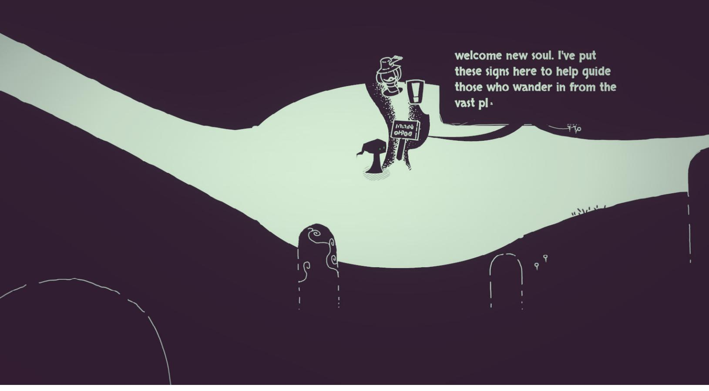

*[Hauntii](https://www.moonloop.games/hauntii)* (2022) by Moonloop Games LLC: An example of a UI that blends into the game's mood and style

The best UI is the one you don't notice.

User interface is a critical part of any game. Done well, it's invisible and carefully woven into your application. If done poorly, however, it can frustrate users and detract from the gameplay experience.

A solid graphical user interface (GUI) is an extension of a game's visual identity. Modern audiences crave refined, intuitive GUIs that seamlessly integrate with your application. Whether it's displaying a character's vital statistics or the game world's economy, the interface is your players' gateway to key information.

As UIs become more sophisticated, so does the artistry behind them. UI design mainly depends on two types of specialists:

- **UI artists:** They master the fundamentals of design, color, shape, typography, and layout. UI artists design for the target audience of the game world. Their eye for detail motivates them to create "pixel perfect" UI.
- **UX designers:** They research user behavior and the broader needs of the end user. UX designers control how someone interacts with a digital product. They build navigation flows with the intent of making the experience as intuitive and delightful as possible.

These roles work closely together, alongside other 2D or 3D artists and designers. It's through this collaboration that stronger, more effective UIs come about.

In this guide, we demonstrate how UI artists and designers can build better interfaces in Unity. If your background is in graphic design and Digital Content Creation (DCC) tools, you'll learn how to bring your creative ideas into Unity's UI systems. If you're a developer who wants to further explore interface creation, this guide will help you exercise your design chops using Unity's available UI workflows.

This e-book covers workflows for the two UI systems available in Unity, but the primary focus is on Unity UI Toolkit for Unity 2021 LTS and beyond. UI Toolkit is a unified collection of features, resources, and tools for building adaptive UIs across a wide range of game applications and Editor extensions. Our [newly](https://assetstore.unity.com/packages/essentials/tutorial-projects/ui-toolkit-sample-dragon-crashers-231178?utm_source=demand-gen&utm_medium=pdf&utm_campaign=authoring-optimizing-ui&utm_content=ui-design-ebook)  [released sample project](https://assetstore.unity.com/packages/essentials/tutorial-projects/ui-toolkit-sample-dragon-crashers-231178?utm_source=demand-gen&utm_medium=pdf&utm_campaign=authoring-optimizing-ui&utm_content=ui-design-ebook), inspired by our previous *Dragon Crashers* demo, depicts how you can leverage UI Toolkit's power for your runtime UIs.

Let's begin.

#### Contributors

The main contributors to this guide and the UI Toolkit sample project are Michael Desharnais, lead UI artist at Ludia, Wilmer Lin, a veteran 3D and visual effects artist, developer, and educator, and Eduardo Oriz, a senior content marketing manager at Unity, graphic designer, and indie game developer.

Other significant contributors include Benoit Dupuis, senior technical product manager of the UI Toolkit team at Unity, Antoine Lassauzay, senior engineering manager of the UI Toolkit team, Christo Nobbs, a senior technical game designer specializing in system game design in Unity, and Stefania Valoroso, senior product designer on the UI Toolkit team.

# U I A N D GAME DESIGN

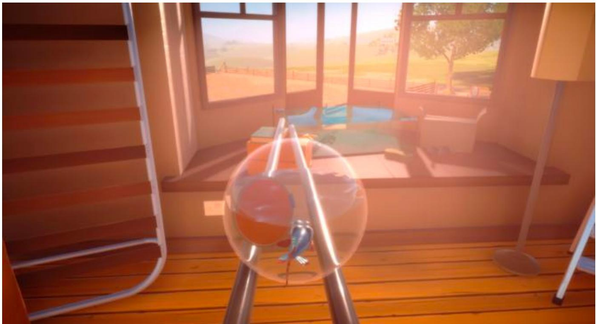

An example of diegetic UI design in *[I Am Fish](https://resources.unity.com/games/i-am-fish-case-study?ungated=true)* (2021) by Bossa Studios: The glass fish container cracks to indicate that the player's health is low.

Let's start by looking at how a user interface fits into the bigger picture of game design. In this section, Christo Nobbs, veteran game designer and contributing author to the *[The Unity Game Designer Playbook](http://resources.unity.com/games/game-designer-playbook?ungated=true?utm_source=demand-gen&utm_medium=pdf&utm_campaign=authoring-optimizing-ui&utm_content=ui-design-ebook)*, examines the interplay between UI and game design.

#### Crafting immersive experiences

Successful games are usually immersive. Whether it's a VR simulation or mobile role-playing game (RPG), a great game can transport us to a different world.

Immersion requires a delicate balance of UI and game design. The UI needs to be functional – but within the confines of the game's art direction and overall identity. The trick is using the right UI for the right situation.

Should you show an onscreen icon when a player picks up an item or defeats an enemy, or is that too distracting? Could a misplaced pop-up take the viewer out of the action? These are the kinds of questions you'll need to consider as a UI designer and artist in the larger context of your game.

One current trend is [diegetic UI.](https://en.wikipedia.org/wiki/Diegesis) Today's game players inherently recognize traditional extra-diegetic UIs, such as health bars or menu screens, as conventions of the medium. They're artificial devices plastered on the "fourth wall" to communicate with the user. But diegetic UIs, conversely, embed themselves into the story and narrative. They make parts of the game world function as a user interface.

Imagine a game character that pulls out an empty weapon magazine in a scripted Timeline sequence. That animation can replace a head-up display (HUD)-based ammo counter.

*[Dead Space 3](https://www.ea.com/en-gb/games/dead-space/dead-space-3)* (2013), developed by Visceral Games and published by Electronic Arts, shows each player's health status levels on their back, where they can be seen during even the most intense gameplay sequences.

The *[Dead Space](https://en.wikipedia.org/wiki/Dead_Space_(series))* series is often cited as a prime example of diegetic interface. Here, the player dons a sci-fi survival suit, which motivates the game's UI. The suit's holographic display projects in-game statistics and inventory, as well as colored lights on its spine that double as a health indicator. The result is a builtin UI seamlessly integrated into the story.

In *[iRacing](https://www.iracing.com/)* by iRacing.com Motorsport Simulations, realistic in-car dashboard indicators show damage, which also affects the car's handling. The player understands there's something wrong with the vehicle through audio and visual cues, rather than an explicitly flashing vignette or HUD icon.

On the flip side, if a game is too immersive, the designer can build an "out." A horror game can give the player a "safe word" with a pause button. This intentionally breaks immersion if scenes become too intense.

Experienced designers understand that the UI must fit with the game's identity. The interface needs to be clean, readable, and appropriate for the situation. With today's hardware, you can realize advanced UIs that support the story you are trying to tell.

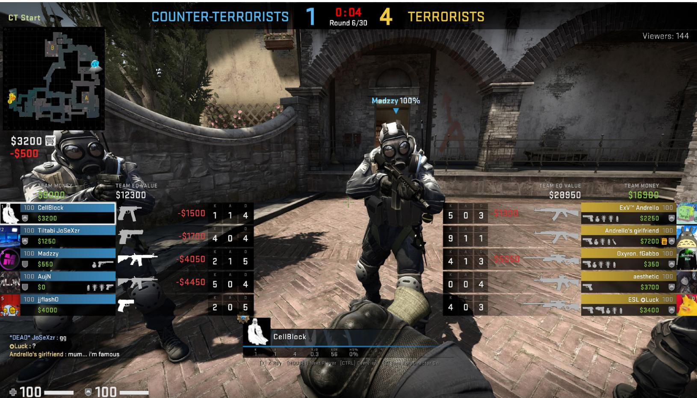

An image from *[Counter-Strike: Global Offensive](https://store.steampowered.com/app/730/CounterStrike_Global_Offensive/)* or *CS:GO* (2012), by Valve and Hidden Path Entertainment, courtesy of interfaceingame.com: The UI prematch start screen in spectator mode shows team composition, economy and arsenal, minimap and scores, all with detailed information, alongside data on the spectated player and number of viewers.

# The fourth wall

At the other end of the spectrum, competitive games like *Counter-Strike: Global Offensive (CS:GO), Overwatch*, and *League of Legends* depend on UIs that gather information. They use HUDs that must be efficient and assist in gameplay. Diegetic interfaces are less appropriate here. Breaking that fourth wall can actually make for a better game.

Since the players have a keen awareness that they are participating in a planned experience, the interface helps them assess the "playing field" – remaining time, team rosters, vitals, minimaps, etc. In some ways, this reflects a sporting event, where the broadcast UI updates its spectators.

Whether they're showing team positions or illuminating players through walls, these UIs have the effect of enhancing strategy and tactics. They can also build suspense for the player and heighten the experience. Thanks to the UI, being a spectator after losing an online match can sometimes be as entertaining as playing.

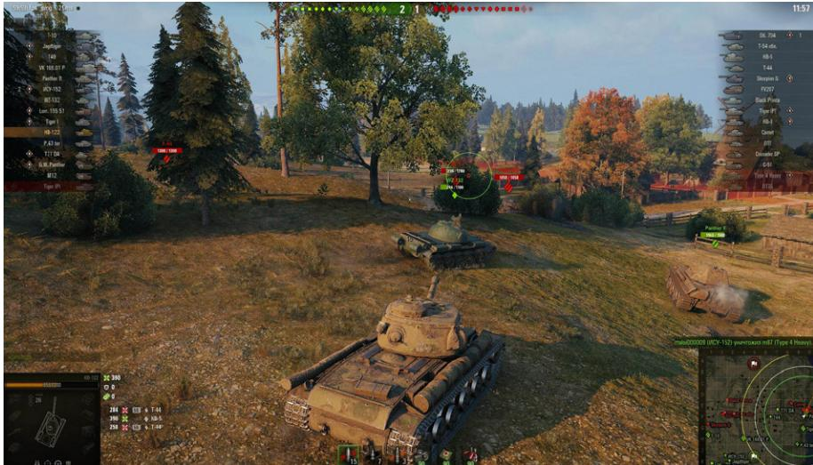

An image from *[World of Tanks](https://worldoftanks.eu/)* (2010) by Wargaming: After a player dies in the game, they can continue to follow the action with the help of different UI elements.

In *World of Tanks*, the spatial UI elements appear above each player's tank to relay information about teammates and enemies; things like their name, tier, health, and tank icon. The HUD point bar, navigation elements, and minimap all share a clean and direct visual language.

By working with your designer, you can better understand the game's UI needs. Gameplay is a balance between challenging your players and sharpening their skills. Ideally, this will pass through the Flow channel (see the chart below).

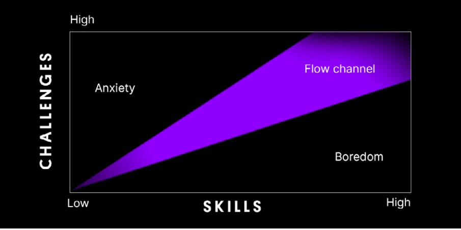

The Skills vs Challenges chart highlights an ideal sweet spot in game design. Read more about it in [this community article](http://whats-in-a-game.com/controlling-flow/).

Tilt too far to one side and you risk boring your players. To alleviate that, reduce UI elements and increase the challenge level. Then you can force the player to puzzle through the gameplay without too much assistance.

Making the game too difficult, on the other hand, can result in anxiety. In this case, adding UIs can lessen gameplay confusion and get your target complexity back on track.

Think of UI as a design device meant to steer your game into this Flow channel. An interface shouldn't waste the viewer's time. It should clearly communicate its content (e.g., load out, health, etc.), but nothing else. Your designer will likely go through numerous iterations as the product evolves into its shippable form. Let the players – and the gameplay – work out the rest.

#### **Tip: UI text**

You might want to use less text in your interfaces to improve their focus. Small adjustments to icons, fonts, and layout can all impact game pacing. Less text, where appropriate, can also make it easier to localize your game.

For more UI text tips, see Joseph Humfrey's 2018 GDC talk, [Designing text](https://www.youtube.com/watch?v=x4G8UNiE560)  [UX for effortless reading](https://www.youtube.com/watch?v=x4G8UNiE560).

# UI design patterns

Interface designers today have a vast library of game applications to learn from. You can explore them through the [Game UI Database](https://www.gameuidatabase.com/index.php). This massive, searchable site allows you to filter by HUD element, type, style, and feature, among other categories. Use it to pore over hundreds of published games and study their ingame menus and screens.

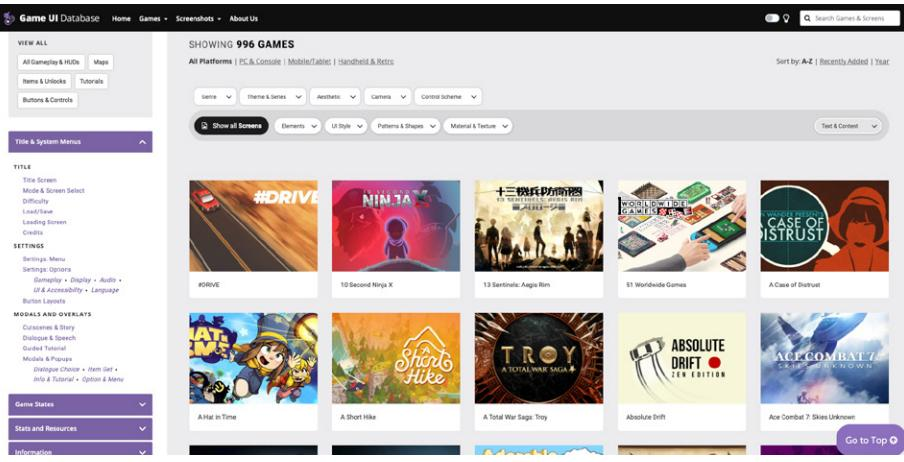

Game UI Database website

Another great resource is [Interface in Game.](https://interfaceingame.com/games/) It features video clips of UI elements you can browse. Use this database to search a wide range of titles by platform and genre. Need to polish up some visual effects or UI details? You're likely to find a reference here.

As you examine more game interfaces, you'll begin to perceive patterns, especially by genre. In a first-person shooter (FPS), for example, we expect to see the health stats at the bottom of the screen. It's almost an established convention, since so many applications have done it this way.

When designing a UI, it's important to capture the genre's visual language. If you're building an RPG, look at how other RPGs handle inventories, skill trees, leveling up, etc. Make something that players are already familiar with, so they can jump right into the gameplay with an understanding of the established style.

UI design patterns aren't random. They've evolved over time through a sort of collaborative effort. Designers have already figured out what works, and new designs are simply building on an existing game canon. Learn from these past design decisions. You'll not only save yourself time, but appease your players as well, who will be expecting certain patterns and visuals in the game.

#### **Tip: UI design patterns**

For more information on UI design patterns, read [Best practices for](https://www.gamesindustry.biz/articles/2021-03-04-best-practices-for-designing-an-effective-video-game-ui)  [designing an effective user interface](https://www.gamesindustry.biz/articles/2021-03-04-best-practices-for-designing-an-effective-video-game-ui) by Edd Coates, a senior UI artist from Double Eleven.

# U I D E V E L O P M E N T AND IMPLEMENTATION

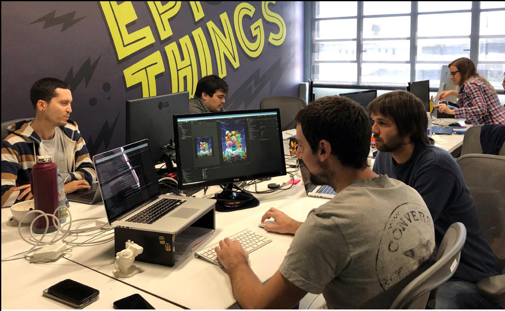

Creating UI is a collaboration – think of *[Trivia Crack 2](https://unity.com/case-study/trivia-crack-2?utm_source=demand-gen&utm_medium=pdf&utm_campaign=authoring-optimizing-ui&utm_content=ui-design-ebook)* (2018), a UI-based mobile game.

Developing UI is a collaboration between creators from several disciplines, working together toward a shared vision. It's an iterative process with little milestones along the way.

Typically there are many stakeholders participating in the process. On a larger production, UI artists may need to work closely with other designers, an art director, and UI programmer. On a smaller team, some of these roles will overlap.

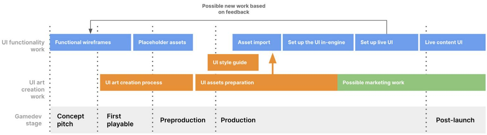

This timeline lays out a possible game UI development process for a midsized studio.

Tasks here generally fall into:

- UI design through wireframing
- Art asset creation
- Implementing the UI in the actual game engine

### Wireframing

During wireframing, the UI team works with the game design team to lay out the content for each of the game's interfaces. On a large project, a game designer with strong experience in UX design can assume this responsibility. On smaller productions, this task often falls on a UI artist.

Early sketches of a UI flow for a Unity demo in [Miro](https://miro.com/): There are many wireframing tools available online, such as [Figma,](https://www.figma.com/) [Justinmind,](https://www.justinmind.com/) [Proto.io](https://proto.io/), and [Moqups.](https://moqups.com/)

The objective is to align with the design team's vision for each feature of the game. This is when you'll validate everything that is functional on each screen. At this time, you'll also work out navigation flows, so that your users don't get stuck in a menu they can't exit.

Just as with most other aspects of game development, decisions you make about the UI will be driven by the platforms that your game will run on, so choose your target devices early on in the production process. Is it a mobile game? Do you want your users to play in landscape or portrait mode? What's the lowest end device you want to support? Answering these questions will give you a base resolution to work with. From there, you can start planning how to lay out all of your game's interfaces.

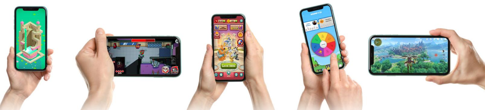

Think about how you intend the game to be played on target platforms early on. You can find a comparison table of many different smartphones in this [Wikipedia article](https://en.wikipedia.org/wiki/Comparison_of_high-definition_smartphone_displays).

At this stage you'll also need to consider how users will interact with your game. For instance, anticipate their hand placement.

If you are working on a mobile game, players will usually tap their fingers on the screen. This might require placing UI elements closer to the sides (landscape mode) or bottom (portrait mode) of the screen, to make them more accessible to thumb input.

If you're building a console game, users will typically use a controller. This might require specific control menus at the bottom of the screen, plus support for mouse input. These are just some of the details that can direct your wireframing.

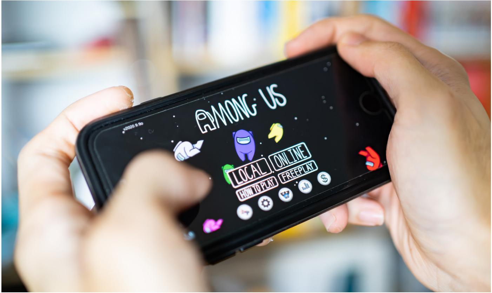

*[Among Us](https://www.innersloth.com/)* (2018) by Innersloth is a Made with Unity title that can be played on mobile, PC, and console.

Wireframing will force you to think about the size of your UI elements. In mobile game production, this is important because everything must be readable on a small display. Some wireframing tools, such as Adobe XD, Figma, and Miro allow you to review your wireframes directly on a mobile device. This can help you get a quick preview of how the interaction feels on a phone or tablet.

Examples from the UI Toolkit sample project, using art from the *Dragon Crashers* demo, built with wireframes in Adobe XD to test navigation flows and share feedback

# UI art creation

Like any other element in game design, UI development evolves organically in stages. The following sections outline what's involved in each stage.

#### **Moodboard**

At this preliminary stage, you gather concept art and source material from other references. The moodboard assembles this into a collage, which serves as a starting point to align the team.

Elements of inspiration can come from graphic design, a movie, or even a product line. The moodboard explores color scheme, style, fonts, and layouts. Useful moodboard tools include [PureRef,](https://www.pureref.com/) [Mural](http://mural.ly/), [Matboard,](https://www.behance.net/gallery/21923391/The-Matboard) and [Evernote](https://evernote.com/). When it comes to online solutions, check out [Behance](https://www.behance.net/), [Game UI Database,](https://www.gameuidatabase.com/) [Dribble](https://dribbble.com/), or [Pinterest.](https://www.pinterest.com/)

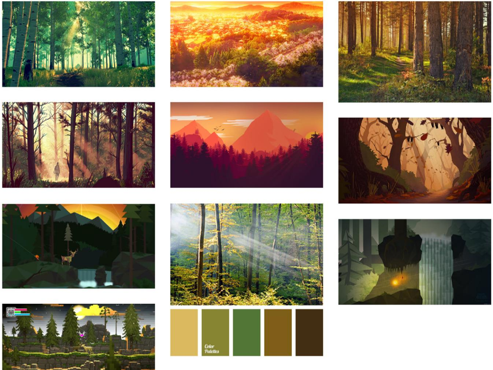

Example of a moodboard from [Go Moodboard](http://www.gomoodboard.com/boards/HpIMCs7U/share)

#### **UI mockups and fonts**

Now you can apply the UI theme onto a series of key screens that mimic the context of the game. The art doesn't need to be final, but the screens should look polished enough to test in front of a player.

It's important to consider the art direction of the game while defining the style of the UI. Keep in mind that the UI is also a major part of the game's branding and visual aesthetic.

If you're making a casual, cartoony match-three game, you might want to take a more illustrated approach. A realistic sci-fi FPS, meanwhile, might work better with a minimalist, flat art style. You can compare similarly styled products as visual references.

The UI Toolkit sample project is based on the original *Dragon Crashers* project, a medieval-themed idle RPG.

Declutter the graphics to make texts and icons stand out. The visual hierarchy should steer the player's eyes to the most important things in each game interface. After all, a good UI should be visually attractive while also guiding the player.

The size of your assets and how a player interacts with them will naturally differ for each device. A button with a hover state on a desktop computer makes sense, but won't work on mobile as there is no hover. At the same time, the size of a button or toggle on a small handheld device needs to be big enough for a finger to interact with – without blocking other elements. This consideration is totally different for a pointer.

An example of visual hierarchy: Use a call to action, like the green purchase button, in order to stand out. Here, the button is more important than the name of the item itself.

When defining your UI style, be conscious of optimization. Avoid importing dozens of huge textures in the game. Your UI should be quick to load and highly responsive.

Use symmetry on the big banner graphics and 9-slice stretching for frames to save texture space.

Create your UI using the fewest textures possible. Unity offers options like tiling and [9-slice](https://docs.unity3d.com/Manual/9SliceSprites.html?utm_source=demand-gen&utm_medium=pdf&utm_campaign=authoring-optimizing-ui&utm_content=ui-design-ebook) stretching for this purpose. Use these systems while mocking up your interfaces, and implement stretched gradients or tiled textures to fill up empty spaces. The clever use of symmetry can cut the texture size in half.

Screens with many elements are particularly sensitive when designing for mobile. Previsualizing the mockups on the actual screen can help you adjust them to the right size.

Lastly, be sure to test those mockup screens in a target screen representative of the final experience. Then request feedback based on those tests.

These popular DCC softwares are also suitable for mockups: [Adobe Photoshop](https://www.adobe.com/products/photoshop.html), [Adobe Illustrator,](https://www.adobe.com/dk/products/illustrator.html?mv=search&mv=search&sdid=KCJMVLF6&ef_id=CjwKCAjwjZmTBhB4EiwAynRmD4duRo1YGRKuxm3eIBhuDlfjuYlJDl7tDSJLuB0C8ji-07xoEVd-RhoC0rMQAvD_BwE:G:s&s_kwcid=AL!3085!3!340839992152!e!!g!!illustrator!1480122684!60147185994&gclid=CjwKCAjwjZmTBhB4EiwAynRmD4duRo1YGRKuxm3eIBhuDlfjuYlJDl7tDSJLuB0C8ji-07xoEVd-RhoC0rMQAvD_BwE) [Affinity Photo](https://affinity.serif.com/en-gb/photo/), [Affinity Designer,](https://affinity.serif.com/en-gb/) and [Krita.](https://krita.org/en/) Some websites for accessing font resources include [Dafont](https://www.dafont.com/), [Google Fonts](https://fonts.google.com/), [Typodermic Fonts,](https://typodermicfonts.com/public-domain/) and [WhatFontIs.](https://www.whatfontis.com/)

#### **UI style guide**

Just as you might have a game or technical design document for your project, we recommend you similarly maintain a UI style guide. This guide should capture the essence of the product's UI to ensure consistency among the artists working on a project, as well as new collaborators being onboarded.

The style guide can even establish rules for adding new interfaces to the game. For example, it might specify color palette and permitted fonts (size and style). The style guide also gives an overview of the UI look, including pop-ups, buttons, and icons.

On [Behance,](https://www.behance.net/) you can find inspiration from artists sharing style guides for *[League](https://www.behance.net/gallery/57207157/League-of-Legends-In-Game-UI-Style-Guide-2016?tracking_source=search_projects%7CGame%20UI%20style%20guide)  [of Legends](https://www.behance.net/gallery/57207157/League-of-Legends-In-Game-UI-Style-Guide-2016?tracking_source=search_projects%7CGame%20UI%20style%20guide)*, *[Apex Legends mobile](https://www.behance.net/gallery/139505201/APEX-Legends-mobile-MOBA-game-UI-concept-design?tracking_source=search_projects%7CGame%20UI%20style%20guide)*, *[Doom](https://www.behance.net/gallery/43401251/DOOM-id-Software-%28published-by-Bethesda-Softworks%29)*, and *[Days Gone](https://www.behance.net/gallery/82390101/DAYS-GONE-UI-DESIGN)*.

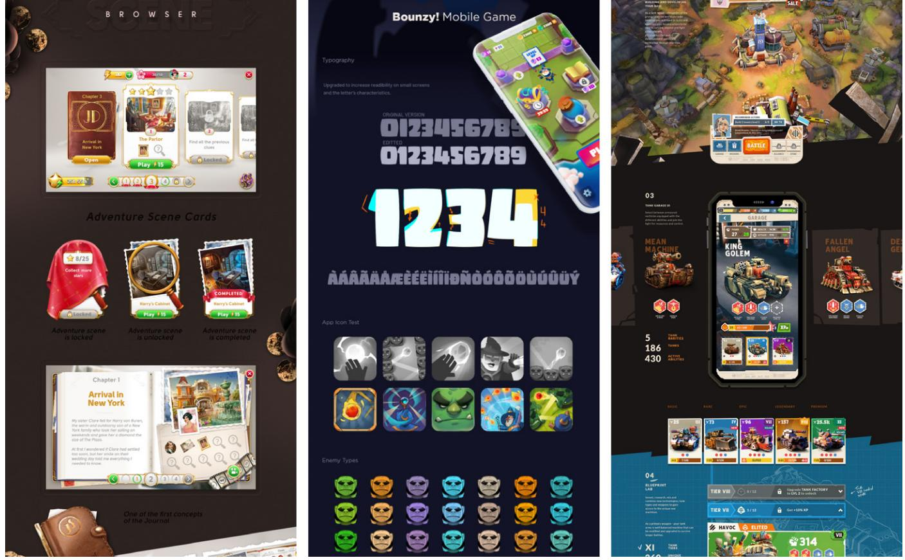

More examples of UI style guides on Behance from *[June's Journey](https://www.behance.net/gallery/59043919/Junes-Journey)*, *[Bounzy! mobile](https://www.behance.net/gallery/67432489/Bounzy-Mobile-Game)*, and *[Battle Tanks](https://www.behance.net/gallery/99404721/Battle-Tanks)*

#### **UI asset preparation**

This is where you'll spend the bulk of your production time, preparing and integrating visual elements into your game, and polishing final artwork to follow your target specifications. All assets need to adhere to guidelines for pixel resolution, texture budget, and file organization.

Reduce the visual elements down to their simplest state. For example, you might remove static placeholder text to make room for the dynamic text elements in the live UIs. Think of what can be reused: common buttons, frames, or backgrounds for dialog boxes and pop-ups. Export unique elements, like icons, as separate objects.

Final production assets from the UI Toolkit sample – *Dragon Crashers* in the Project view and Inspector window

#### **Tip: Scaling visual elements**

Remember that gradients or blurred out elements can be used at a scale larger than 100%, without losing too much quality. However, very sharp or detailed elements will look pixelated if scaled up by more than around 115%.

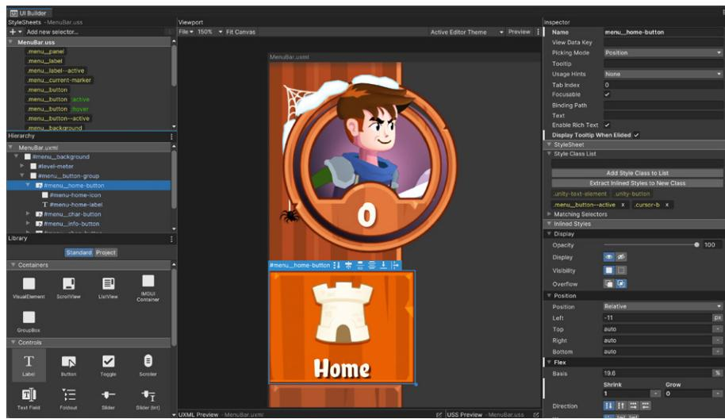

Implementation of UI graphics with UI Toolkit and UI Builder

# UI implementation work

Implementing the UI in Unity can vary from team to team. It can be a more specialized task on larger teams and require dedicated UI developers, or directly involve UI artists within the process on smaller teams, as discussed in the following sections.

#### **Functional grey-boxing**

In the early stages, grey-boxing the UI is similar to grey-boxing a game level. The objective is to block out UI elements and connect them to the gameplay.

You will normally grey-box the UI in the game engine, which requires experimentation to get right. Grey-boxing can ultimately help you work out the navigation flows and layout issues.

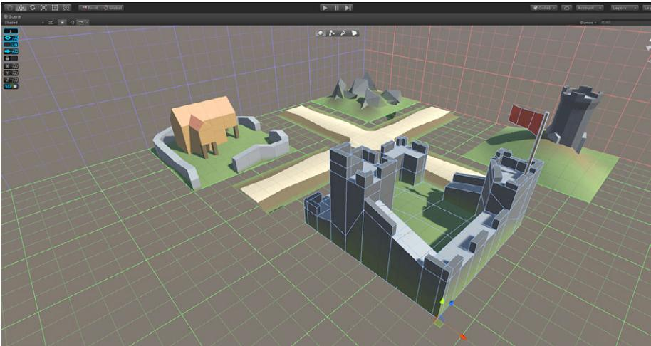

Grey-boxing a level design with ProBuilder, included in Unity

#### **Placeholder assets**

During preproduction, the prototype needs assets that can represent the final game. These assets are convenient for validating project milestones.

Reuse assets from previous games or incorporate external assets as your placeholders. The Asset Store offers a variety of [GUI assets,](https://assetstore.unity.com/2d/gui?utm_source=demand-gen&utm_medium=pdf&utm_campaign=authoring-optimizing-ui&utm_content=ui-design-ebook) [icons](https://assetstore.unity.com/3d/gui?utm_source=demand-gen&utm_medium=pdf&utm_campaign=authoring-optimizing-ui&utm_content=ui-design-ebook), [fonts,](https://assetstore.unity.com/2d/fonts?utm_source=demand-gen&utm_medium=pdf&utm_campaign=authoring-optimizing-ui&utm_content=ui-design-ebook) and [tools](https://assetstore.unity.com/tools/gui?utm_source=demand-gen&utm_medium=pdf&utm_campaign=authoring-optimizing-ui&utm_content=ui-design-ebook) for this purpose. If you need to mock up text, you can try a Lorem Ipsum from this [website](https://loremipsum.io/ultimate-list-of-lorem-ipsum-generators/).

The Asset Store can help you prototype with placeholder assets: These include full game GUI skins, such as the one by [MobStudios](https://assetstore.unity.com/publishers/44448?utm_source=demand-gen&utm_medium=pdf&utm_campaign=authoring-optimizing-ui&utm_content=ui-design-ebook) (left), or gear and skills icons from [Rexard](https://assetstore.unity.com/publishers/13229?utm_source=demand-gen&utm_medium=pdf&utm_campaign=authoring-optimizing-ui&utm_content=ui-design-ebook) (right) which were used for the sample project.

#### **Asset import**

Once you're ready, you can begin importing UI art assets into your project. Be sure to agree on production standards as a team for the asset specifications, naming conventions, and file paths.

Several Unity tools can streamline this process, such as the [Sprite Editor](https://docs.unity3d.com/Manual/SpriteEditor.html?utm_source=demand-gen&utm_medium=pdf&utm_campaign=authoring-optimizing-ui&utm_content=ui-design-ebook), [PSD Importer](https://docs.unity3d.com/Packages/com.unity.2d.psdimporter@6.0/manual/index.html?utm_source=demand-gen&utm_medium=pdf&utm_campaign=authoring-optimizing-ui&utm_content=ui-design-ebook), [AssetPostProcessor,](https://docs.unity3d.com/ScriptReference/AssetPostprocessor.html?utm_source=demand-gen&utm_medium=pdf&utm_campaign=authoring-optimizing-ui&utm_content=ui-design-ebook) [Presets,](https://docs.unity3d.com/Manual/Presets.html?utm_source=demand-gen&utm_medium=pdf&utm_campaign=authoring-optimizing-ui&utm_content=ui-design-ebook) and [Sprite Atlas.](https://docs.unity3d.com/Manual/class-SpriteAtlas.html?utm_source=demand-gen&utm_medium=pdf&utm_campaign=authoring-optimizing-ui&utm_content=ui-design-ebook) The [next chapter](#page-30-0)  explains these tools in greater detail.

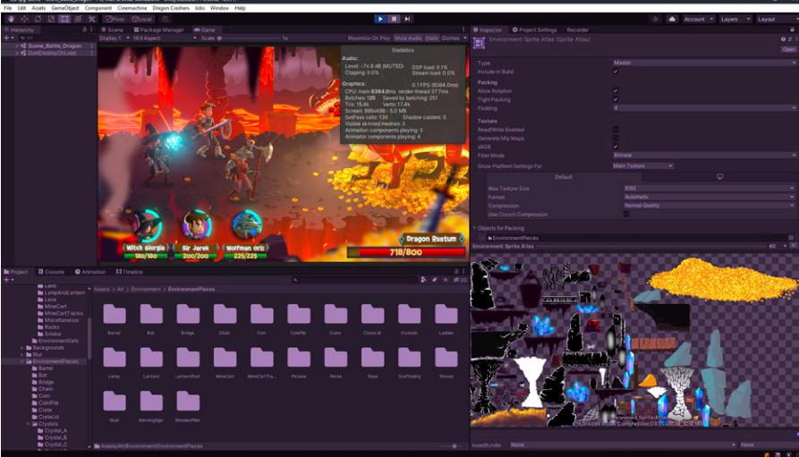

The Sprite Atlas can be used to pack several sprites into one larger texture to optimize performance.

#### **Setting up the UI in-engine**

In Unity, there are two systems for creating runtime UI:

- **Unity UI:** Released with Unity 4.6 (late 2014)
- **UI Toolkit:** A new UI system that can be used alongside Unity UI

Both systems are WYSIWYG solutions made for UI artists, with some key differences.

|                | Unity UI                                                                                                                                                            | UI Toolkit                                                                                                                                                                                                    |  |  |  |
|----------------|---------------------------------------------------------------------------------------------------------------------------------------------------------------------|---------------------------------------------------------------------------------------------------------------------------------------------------------------------------------------------------------------|--|--|--|
| What is it?    | A GameObject-based UI system                                                                                                                                        | A UI system inspired by web technologies                                                                                                                                                                      |  |  |  |
| Workflow       | UI elements are GameObjects inside a Canvas GameObject. They have a Rect Transform component to define position and scale relative to their parent.           | UXML files define the UI's layout, and USS files define the styling. UXML files, also known as Visual Trees, are displayed in the Game view through a UI Document component applied to a GameObject. |  |  |  |
| Authoring tool | In the Scene view, create UI GameObjects in the Hierarchy and nest them to form layout groups.                                                                   | With UI Builder, create UI Toolkit interfaces consisting of UXML and USS files visually.                                                                                                                   |  |  |  |
| Styling        | Use Prefabs and Nested Prefabs to apply the same styling to many UI elements. You can override the Prefab's settings from the Scene view.                     | Use Selectors (USS files) to define styling and apply to many Visual Elements. Override styles with in-line styles in the Visual Tree elements.                                                         |  |  |  |
| Key benefits   | Integration with other Unity systems, such as Animation, GameObjects, or the position in a 3D space                                                              | Performance (retained-mode graphics), scalability with complex UI, customizable materials, different screen sizes and theming; works for Editor UI as well as runtime UI; textureless interfaces     |  |  |  |
| Best for…      | Simpler UI elements blended in-game or with very specific needs, i.e., damage points coming from a character in a 3D space or a UI element that needs Physics | Recommended for screen overlay menus and HUD elements                                                                                                                                                      |  |  |  |

See the simplified comparison chart (an in-depth chart is available in the [documentation\)](https://docs.unity3d.com/Manual/UI-system-compare.html?utm_source=demand-gen&utm_medium=pdf&utm_campaign=authoring-optimizing-ui&utm_content=ui-design-ebook).

UI Toolkit and Unity UI can work simultaneously in the same project. We recommend testing the UI Toolkit progressively to get your UI artists more familiar with it. Then gradually replace your placeholder assets with production artwork, while matching the original UI design. Use the mockups to guide you.

Working with Unity UI in-Editor (left) vs working with UI Builder (right) to create a UI Toolkit interface

#### **UI and input controls**

You can set up some basic interaction with the UI controls. Both UI systems in Unity handle input differently:

— Unity UI's input implementation works via the [Unity Event System.](https://docs.unity3d.com/Packages/com.unity.ugui@1.0/manual/EventSystem.html) For example, a Button has an OnClick callback event where you can invoke both built-in and scripted methods.

Its interactive UI in the Editor is artist-friendly and facilitates prototyping. But because it's accessible to anyone on the project, be aware that merge conflicts can occur when different team members change the same component.

— UI Toolkit provides a comprehensive [Event System](https://docs.unity3d.com/2020.1/Documentation/Manual/UIE-Events.html?utm_source=demand-gen&utm_medium=pdf&utm_campaign=authoring-optimizing-ui&utm_content=ui-design-ebook) that connects user interactions to visual elements. A C# script can register the callbacks to available events. For example, myVisualElement. RegisterCallBack<MouseDownEvent>(myFunction) will trigger the designated myFunction when the user clicks the mouse on myVisualElement.

Essentially, UI Toolkit separates the functional implementation from the UI design. This differentiates the roles of the developer and UI artist, allowing each team to focus on their specialty. Though UI artists usually won't be responsible for setting up callbacks and events, they should understand the process if they want to grey-box functional designs that they can hand off to a UI programmer.

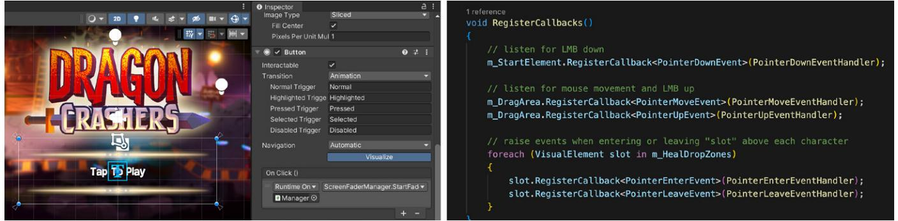

#### **Playtesting the UI**

Are your buttons interactive enough? Do users know where to click? Do they feel compelled to purchase items in the shop? Some of these answers might not be intuitive. You'll need playtesting to answer them.

On the left is an example of connecting scripts with Unity UI GameObjects through the Unity Event System. On the right are visual elements registered to receive input callbacks in the UI Toolkit.

There are various analytics that can help you track user behavior. Some technologies can help with this, such as [eye tracking](https://tryevidence.com/blog/eye-tracking-and-video-games-research/) to identify how a user reacts to areas of interest in a head-up display or interface.

Analyzing user behavior will allow you to define usability trends, so your team can determine what needs improvement. Playtesting resources include [Playtest](https://www.playtestcloud.com/)  [Cloud,](https://www.playtestcloud.com/) [Antidote,](https://antidote.gg/) [Steam Playtest,](https://partner.steamgames.com/doc/features/playtest) and [Playtesting.Games](https://www.playtesting.games/).

#### **Marketing and live content UI**

Depending on your team and studio size, you might be involved in marketing the game during production. Once the game is live, its commercial success informs the amount of marketing investment and resources available after launch. If a game is very successful, a company might keep a full UI team to add new features and continue to make improvements.

Consistent styling throughout the UI, promotional images, and live campaigns for *Royal Match* by Dream Games (images from the game's AppStore page and Facebook account)

# ASSET PREPAR ATION

Much of UI design happens outside of Unity in a DCC application. This chapter covers the general pipeline for preparing UI art assets and importing them into Unity.

# Target screen resolution

Once you start creating mockup screens, make sure to set the target resolution in your drawing software to avoid having to redo work later.

Common good practices include:

- **Drawing the art in the highest resolution of your target devices:** If you plan to support up to 4K graphics, for instance, make that your working resolution.
- **Sticking to one resolution for all assets:** Scale them down later, if necessary, to support lower resolution screens.

If you design with vector graphics, resizing assets later is less of an issue. But try to work with a **Reference Resolution**, so that each asset has the correct relative scale. You will still need to export vector graphics into a raster format in order to work with a UI system.

Although vector format support is still in early development, it's available as an option (under the images format) in UI Toolkit. However, raster images (sprites and textures) remain the recommended image format for the UI systems today.

Avoid scaling raster images up after they're created. This can result in pixelation and blurriness, thereby lowering visual quality. Instead, begin from the highest resolution supported, then scale down when exporting from a graphics application (see [the section](#page-35-0) on exporting from DCC tools).

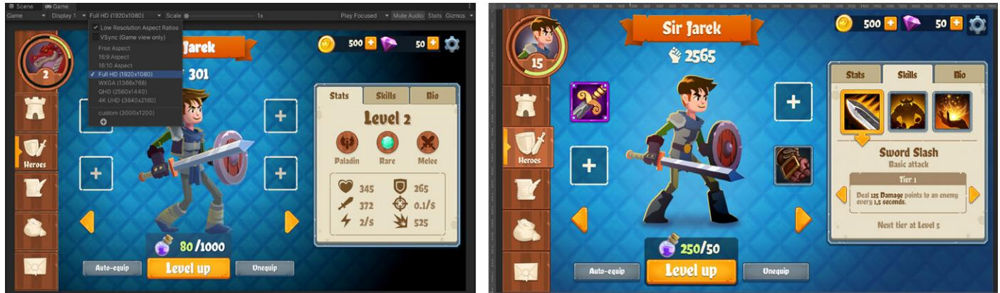

Once you've chosen the Reference Resolution, preview the art in Unity's **Game view**.

Set up your working environment to use a target resolution when creating mockups: Compare the Unity Game view (left) with Photoshop (right).

# Sprite resolution in Unity

For the most part, your UI graphic assets will be rendered on screen space using Unity UI or UI Toolkit. While they won't follow Unity's world scale, which applies to 3D objects, they will use the **2D Sprite Editor** for additional visualization and performance settings.

#### **Unity units**

When designing elements for your game world, use the Unity grid to maintain the consistent placement and appearance of your sprites.

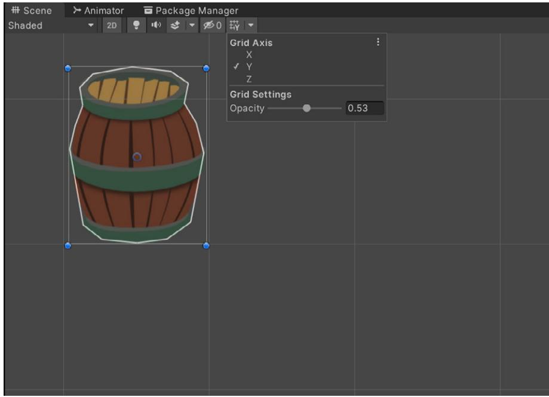

A Unity unit is one square of the grid in the **Scene view**. You can assume that 1 Unity unit is equal to 1 meter. This reference is especially important for Unity's physics system.

Try to maintain a consistent scale across your game. The height of a player character should, for example, be between 0.5 and 2 units. Characters and objects that are too small or too large compared to other visual elements can lead to strange Transform numbers and issues with physics calculations.

If you're using Unity UI with a **World Space UI** (e.g., a floating health bar), decide whether it matches the 2D asset scale or the world scale. See [Creating a World](https://docs.unity3d.com/2020.1/Documentation/Manual/HOWTO-UIWorldSpace.html?utm_source=demand-gen&utm_medium=pdf&utm_campaign=authoring-optimizing-ui&utm_content=ui-design-ebook)  [Space UI](https://docs.unity3d.com/2020.1/Documentation/Manual/HOWTO-UIWorldSpace.html?utm_source=demand-gen&utm_medium=pdf&utm_campaign=authoring-optimizing-ui&utm_content=ui-design-ebook) for more information.

#### **2D camera and sprite sizes**

Removing the 3D perspective can make it easier to work with sprites. 2D games most frequently use the **Orthographic Camera**.

Establish the general scale of the main scene, including the player character, enemies, collectibles, and level hazards. Then check the Camera's zoom level by looking at the Orthographic property called **Size**, which represents the distance from the center to the top of the screen in Unity units. Multiplying this value by 2 gives you the full vertical size.

| ▼ ■ √ Camera            |      |              | e | -1 |   |
|-------------------------|------|--------------|---|----|---|
| Render Type             | Base |              |   |    | D |
| Projection              |      |              |   | 0  |   |
| Projection 5 Size |      | Orthographic |   |    | D |
|                         |      |              |   |    |   |
| Clipping Planes         | Near | 0.3          |   |    |   |
|                         | Far  | 1000         |   |    |   |

The size of the Orthographic Camera is the distance from the center to the top of the screen (the full vertical height is 2x the orthographic size).

If the Orthographic Camera's Size property equals 5, its vertical **Field of View**  (FOV) is equal to 10 units. If you're targeting 4K resolution (3840 x 2160), then the screen (or Camera) height is 2160 pixels. With a simple calculation, you can determine how many pixels per unit (PPU) your art requires to match that resolution:

#### **Max Vertical Resolution / (Orthographic Camera Size \*2) = Sprites PPU**

In this case, 2160 pixels / 10 units = 216 PPU, meaning that every sprite in your game needs 216 PPU to look sharp at a native 4K resolution.

| O Inspector                                                  |                    | a :           |
|--------------------------------------------------------------|--------------------|---------------|
| ARTICA Sprite_Barrel (Texture 2D) Import Settings 7109 |                    | 0 花 :         |
| 1.773                                                        |                    | Open          |
|                                                              |                    |               |
| Texture Type                                                 | Sprite (2D and UI) | D             |
| Texture Shape                                                | 2D                 | D             |
| Sprite Mode                                                  | Single             | D             |
|                                                              |                    |               |
| Packing Tag                                                  |                    |               |
| Pixels Per Unit                                              | 216                |               |
| Mesh Type                                                    | Tight              | œ             |
| Extrude Edges                                                |                    |               |
| Pivot                                                        | Center             | œ             |
| Generate Physics Shape                                       | >                  |               |
|                                                              |                    | Sprite Editor |
|                                                              |                    |               |

Setting the PPU for a sprite

This seems straightforward, but if you want the Camera to zoom in and out, you'll need to account for that. Allowing the Camera to zoom to a maximum Orthographic Size of 3 means that the PPU needs to be 360 (2160 / (3 \*2)).

#### **Tip: PPU value**

When you set the PPU value of your game, apply that value to the grid size in your graphics software for a better reference or size and scale of the game in Unity.

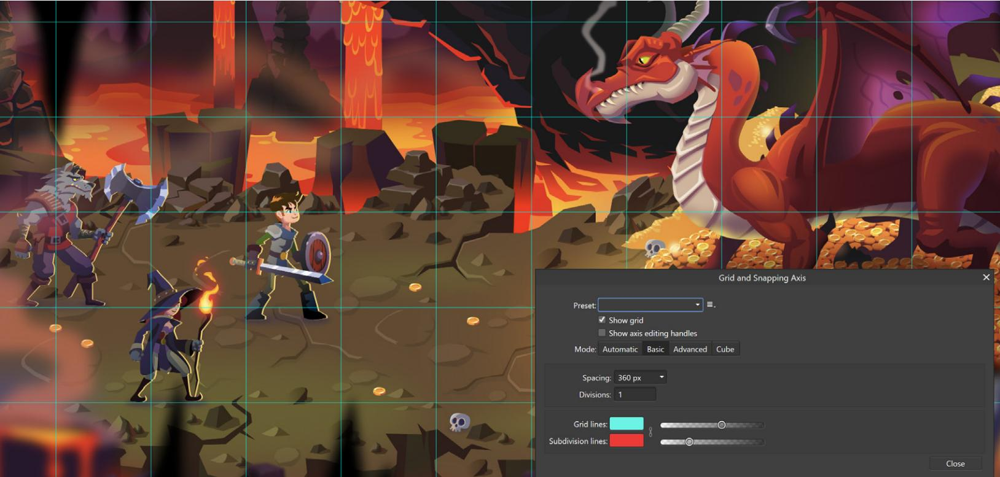

Setting the grid in Affinity Photo to match the game's PPU

You don't have to be strict with these numbers. Often, you can save memory by using a slightly lower sprite resolution than suggested.

Test your game on target devices to see if your sprites have sufficient PPU. Many times, the benefits of using high-resolution assets aren't apparent.

Allocate drawing time and device memory to more essential elements like the main characters, visual effects, or UI. Build size is crucial on mobile devices, so verify which assets can be scaled down to save resources.

Read more about 2D asset resolution in [this blog post](https://blog.unity.com/technology/choosing-the-resolution-of-your-2d-art-assets?utm_source=demand-gen&utm_medium=pdf&utm_campaign=authoring-optimizing-ui&utm_content=ui-design-ebook).

# *2D game art, animation, and lighting for artists*

2D games are making their mark. The evolution of hardware, graphics, and game development software makes it possible to create 2D games with real-time lights, high-resolution textures, and an almost unlimited sprite count.

Get Unity's most comprehensive 2D development guide, created for developers and artists who want to make a commercial 2D game.

[Download the e-book.](https://resources.unity.com/games/2d-game-art-animation-lighting-for-artists-ebook?ungated=true%3Futm_source&utm_medium=pdf&utm_campaign=authoring-optimizing-ui&utm_content=ui-design-ebook)

#### **Tip: Camera distance**

In 2D and 3D games alike, you need to consider whether the UI should remain constant in size when rendered in screen space or following certain gameplay elements by position. In cases where the UI lives in the 3D World Space (e.g., meter bars above characters), decide on how close the Camera should get to a UI element or what distance to cull it from.

# Exporting graphics from DCC tools

You work hard to make your art beautiful and true to your vision. It's only natural that you want to get it all into Unity as quickly as possible.

To avoid the lengthy process of exporting each layer as an individual PNG file, follow these tips for exporting your sprites efficiently from different graphics software.

#### **From Adobe Photoshop**

Export and save layers as individual files using a variety of formats, including PSD, BMP, JPEG, PDF, Targa, and TIFF. Layers are automatically named as they're saved. You can set specific options to control the generation of names.

Follow these steps to conveniently export a limited number of layers as files:

1. From the menu, select **File > Export > Export Layers To Files**.

| Ps      | File Edit Image Select Layer Type                  | Filter 3D View Plugins Window Help       |  |
|---------|-------------------------------------------------------------|---------------------------------------------------|--|
|         | Ctr + N New                                              | > Width Anti-alias Style: Normal 0 px |  |
| >>      | Ctrl+0 Open Alt+Ctrl+O Browse in Bridge            | ×                                                 |  |
| DEFERE  | Alt+Shift+Ctrl+O Open As                                 |                                                   |  |
| 4       | Open as Smart Object                                        |                                                   |  |
|         | Open Recent                                                 | >                                                 |  |
| 中国内田    | Close Ctr +W                                             |                                                   |  |
|         | Close All Alt+Ctrl+W                                     |                                                   |  |
|         | Close Others Alt+Ctr +P                                  |                                                   |  |
|         | Close and Go to Bridge  Shift+Ctrl+W Ctr + S Save     |                                                   |  |
|         | Save As Shift + Ctr   + S                                |                                                   |  |
|         | Alt+Ctrl+S Save a Copy                                   |                                                   |  |
|         | F12 Revert                                               |                                                   |  |
|         | Export                                                      | > Quick Export as PNG                          |  |
|         | Generate                                                    | > Alt+Shift+Ctrl+W Export As                |  |
|         | Share Invite                                             | Export Preferences                                |  |
| 日本第二次公室 | Share on Behance                                            | Save for Web (Legacy) Alt + Shift + Ctrl + S   |  |
|         | Search Adobe Stock                                          | Artboards to Files                                |  |
|         | Place Embedded                                              | Artboards to PDF                                  |  |
|         | Place Linked                                                | Export For Aero Layer Comps to Files           |  |
| ●●●●■   | Package                                                     | Layer Comps to PDF                                |  |
|         | Automate                                                    | Layers to Files                                   |  |
|         | Scripts Import                                           | Color Lookup Tables                               |  |
| 27      |                                                             | Data Sets as Files                                |  |
|         | File Info Alt+Shift+Ctrl+1 Version History            | Paths to Illustrator                              |  |
| JIII    |                                                             | Render Video                                      |  |
|         | Print Ctr +P Alt + Shift + Ctrl + P Print One Copy |                                                   |  |
| O       |                                                             |                                                   |  |
|         | Ctr +0 Exit                                              |                                                   |  |
| 0 4     |                                                             |                                                   |  |
|         |                                                             |                                                   |  |

Getting ready to export from Adobe Photoshop

2. In the Export Layers To Files dialog box, click **Browse** to select a destination for the exported files. By default, the generated files are saved in the Sample folder as the source file.

| Export Layers To Files                                                  |        |
|-------------------------------------------------------------------------|--------|
| Destination:                                                            |        |
| C: Projects Browse                                                   | Run    |
| File Name Prefix:                                                       | Cancel |
| export_                                                                 |        |
| Visible Layers Only                                                     |        |
| File Type:                                                              |        |
| PNG-24 >                                                             |        |
| Include ICC Profile                                                     |        |
| PNG-24 Options:                                                         |        |
|                                                                         |        |
| Transparency Interlaced V Trim Layers                                   |        |
|                                                                         |        |
|                                                                         |        |
| Please specify the format and location for saving each layer as a file. |        |
|                                                                         |        |
|                                                                         |        |

Automating the export process

- 3. If you want your sprites to have a common file name prefix, enter it in the text field (e.g., tile\_wood01.png, tile\_bricks01.png, and so on).
- 4. Select **Visible Layers Only** to export the layers only visible in the **Layers** panel.
- 5. Choose **PNG-24** as a **File Type** (uncheck **ICC Profile** as it's unnecessary here).
- 6. Go to **PNG Options** and check **Transparency** and **Trim Layers** (leave **Interlaced** unchecked).
- 7. Click **Run**, and after a short wait, the sprites should export to the specified folder.

Remember that all layers are exported separately. This method does not take layer groups into account. If you have an object that consists of multiple layers, merge them before exporting.

Now, let's look at how to [export sprites with multiple layers](https://helpx.adobe.com/photoshop/using/generate-assets-layers.html) from Photoshop. It requires more setup, but this approach allows for greater control over the exported images.

To start, you'll need the names of the layers or layer groups; the source from which you want to generate sprites. Select **File > Generate > Image Assets** from the menu.

Photoshop will create a folder as a PSD file and export all the layers or groups saved as PNG files. If you haven't saved a PSD file yet, it will create a folder on your desktop. If you change any layer or folder that is marked for export, the image asset will be exported in the background (automatically).

Specify the folder for every sprite by adding its name and a slash before the layer name. To group all three of the following barrel sprites into one folder, add "barrel/" before the layer names.

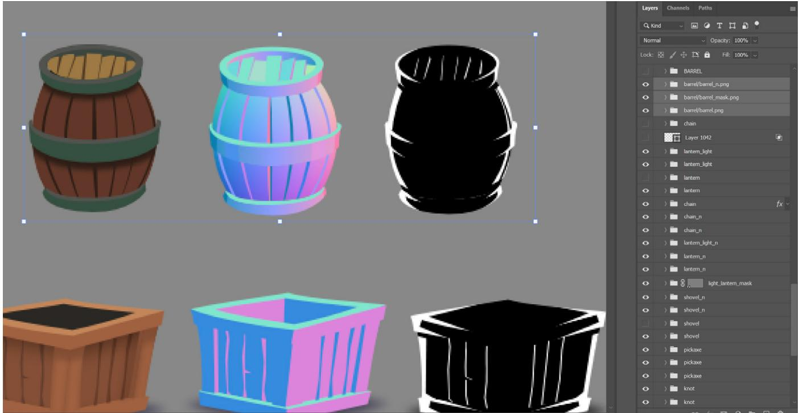

Exporting multiple layers of the same sprite from Photoshop: The three barrel sprite textures are exported to the same folder.

To change the sprite's size, add the specified dimensions or scale in percent before the layer name. For example, call the layers "50% barrel/barrel.png" or "80 x 160 barrel/barrel.png." When specifying dimensions, Photoshop will use pixels as the default unit.

#### **Exporting from Adobe Illustrator**

To export from Adobe Illustrator, follow the standard instructions for a Photoshop file:

- 1. Export the Adobe Illustrator file to **PSD**.
- 2. Open the PSD file in Photoshop and either follow the above instructions for Photoshop or see the [PSD Importer section](#page-47-0) below.

| Export for Screens                  |                              |                                                                                                                                   |                                                                                                                                                     |               |         |   |
|-------------------------------------|------------------------------|-----------------------------------------------------------------------------------------------------------------------------------|-----------------------------------------------------------------------------------------------------------------------------------------------------|---------------|---------|---|
| Artboards Assets 1 Artboard 1 |                              | Select: O All Include Bleed O Full Document Export to: Create Sub-folders @ Scale O Format Formats: Scale | Q Range: 1 C:\Users\mdeshamais\Creative Cloud Files Open Location after Export Export PDFs as: O Single File O Multiple Files Suffix | iOS Format | Android | * |
|                                     |                              | 1×                                                                                                                                | ▼ None                                                                                                                                              | PNG           | >       |   |
|                                     |                              |                                                                                                                                   | + Add Scale                                                                                                                                         |               |         |   |
| 일본   1995                           | Clear Selection              | Prefix:                                                                                                                           |                                                                                                                                                     |               |         |   |
|                                     | Sclected: 1, Total Export: 0 |                                                                                                                                   | Export Artboard )                                                                                                                                   |               | Cancel  |   |

You can also export directly to formats like PNG, but ensure that the raster image looks correct in a program like Photoshop before adding it to the game.

#### **Exporting from Affinity Photo or Affinity Designer**

Both Affinity Photo (raster) and Affinity Designer (vector) graphics by Serif provide a dedicated mode for exporting called **Export Persona**. Here's how to use it:

1. Switch to [Export Persona](https://www.creativebloq.com/how-to/affinity-designer-how-to-use-the-export-persona) by clicking its icon at the top-left of the application toolbar.

Export Persona in Affinity Photo

- 2. Create a slice from a layer or layer group to export a sprite. Switch to the **Layers** tab on the right, select a layer to export, and click the **Create Slice** button.
- 3. Switch to the **Slices** tab, and select the slices to export. Verify that the **Export preset** is set to **Single PNG** for all the slices.

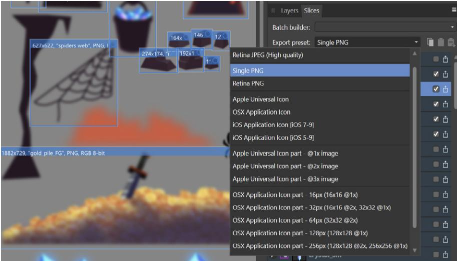

Set the Export preset to Single PNG in Affinity Photo

- 4. Click **Export Slice**, and choose a destination folder when prompted. You can save time by exporting the sprites directly to the Assets folder in your Unity project.
- 5. After choosing a destination folder, the **Continuous** option becomes available. This allows you to export slices whenever you change a layer.
- 6. To have better control over the exported sprites, click the arrow icon to the left of the slice name to set the export options manually.

Setting export options for sprites

- 7. Choose a subfolder for your sprite in the **Path** section. In this example, all of the barrel sprites are in the "barrel" subfolder. PNG is the file format, and resolution scaling is set at 1x. This means no scaling – sprites are exported at 100% of their size. You can also output multiple sizes at once by clicking the "**+**" button.
- 8. For multiplatform games, choose additional sizes for your sprites that can be used when building your project for other devices. For instance, choose 2x for scaling to get "Retina" sprites. Another "**+**" button on the bottom of the expanded window enables you to add additional file formats if you want to export JPG files alongside the PNG sprites.

| II   Export Options               |  |
|-----------------------------------|--|
| Mode: Selection Defaults          |  |
| Preset:                           |  |
| File format: PNG               |  |
| Pixel format: Use document format |  |
| Bilinear Resampler:            |  |
| Matte:                            |  |
| ICC Profile:                      |  |
| Embed ICC profile                 |  |
| Include bleed                     |  |
| Palettised                        |  |
| Palette:                          |  |
| Colours:                          |  |
| Embed metadata                    |  |

Export Options window in Affinity

#### **Exporting from Krita**

Krita is a free and open-source raster graphics editor. It is designed primarily for digital painting and 2D animation.

| Export Layers - Krita |                                       |  |
|-----------------------|---------------------------------------|--|
| Documents:            | C:/Projects/normalmap_v6.psd          |  |
|                       | Refresh                               |  |
| Initial directory:    | C:/Projects/Export                    |  |
| Export options:       | Export filter layers                  |  |
|                       | Export in batchmode                   |  |
|                       | Group as layer                        |  |
|                       | Ignore invisible layers >          |  |
|                       | V Adjust export size to layer content |  |
| Export size:          | = 1080 = dpi: 72 11 1920     |  |
| Images extensions:    | IPNG                                  |  |
|                       | Cancel OK                          |  |

Exporting sprites from Krita

To export from Krita, save your document first, then complete the following:

- 1. Go to **Tools > Scripts > Export Layers**. In the pop-up window, select the **Initial** directory. This is where the exported sprite files will end up.
- 2. In the Export Layers options, check the option called **Adjust export size option to layer content**. This will crop layers to their ideal size, leaving no empty pixels as padding. There are a couple of optional settings here:

— **Group as layer:** This will export groups rather than individual layers, which is useful for sprites consisting of multiple layers. However, the exporter will only check for the highest groups in the Hierarchy, so your sprites cannot be grouped in another group.

— **Ignore invisible layers:** This setting is handy when you want to exclude some sprites from exporting. It simply turns off their visibility.

3. Choose PNG as **Image extensions**. Click **OK**, and the sprites will be exported to your selected folder.

#### **Tip: Color palettes**

If you've defined a color palette that you'd like to use throughout the game UI, consider creating a **[Swatch Library](https://docs.unity3d.com/2019.3/Documentation/Manual/PresetLibraries.html?utm_source=demand-gen&utm_medium=pdf&utm_campaign=authoring-optimizing-ui&utm_content=ui-design-ebook)** in Unity with the same colors.

From any color palette window, select **Create New Library** from the options in the vertical ellipsis **( )** menu. Then, choose **Project Folder** as your **Location**. This creates a **Swatch Library ScriptableObject** in the Editor folder. Anyone using the same project now has access to this shared set of colors.

Team members can conveniently pull from this Swatch Library and share colors when setting up their UIs.

#### Sprite Editor and settings

When you import UI images, it's common to import them as 2D sprites by selecting **Sprite (2D and UI)** from the **Texture Type** settings.

To make this Texture Type the default, go to **Project Settings**, followed by **Editor > Default Behavior Mode** and select **2D**. If set to a 3D project, images will be imported as textures. These can still be used in UI systems but with certain limitations.

When you change the assets to Texture Type: Sprite (2D and UI), Unity treats them differently. In Unity UI, sprites are compatible with the Image component, and default textures are compatible with the Raw Image component.

#### **Tip: Asset types**

You can select multiple assets of the same type in the **Project view** to change their type all at once. If you select the assets of more than one type by mistake, the **Narrow the Selection** menu appears in the **Inspector**. Only choose texture assets of the same type that you want to change.

#### **Sprite settings**

Once images are imported as sprites, you'll have additional options available, including the [Sprite Editor](https://docs.unity3d.com/Manual/SpriteEditor.html?utm_source=demand-gen&utm_medium=pdf&utm_campaign=authoring-optimizing-ui&utm_content=ui-design-ebook). Install the **2D Sprite package** from the **Package Manager** if it's not already installed.

These are a few of the main options in the Inspector:

#### — **Sprite Mode**

— **Single:** The image contains one element for use in the game. Opening the Sprite Editor provides options for you to make it tileable or 9-slice. You can also use the Sprite Editor to change its pivot point.

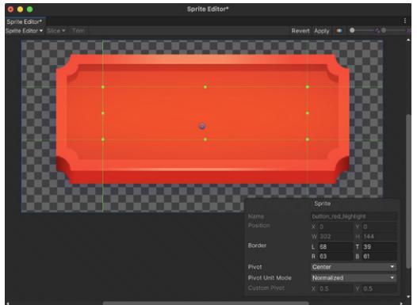

9-slicing a button graphic in the Sprite Editor: The image is split into nine areas, so that the corners are not stretched or distorted when the sprite is resized.

— **Multiple:** The image can be sliced into several sprites in the Sprite Editor, giving each slice borders and custom pivot points like in the Single Sprite Mode. This is commonly used for animation sequences or different states of the same button.

The Multiple setting in Sprite Mode lets you slice an image from the Sprite Editor into several sprites. The individual sprites will show up in the Project view.

— **Polygon:** This option clips the sprite in the shape of a polygon. You can adjust the control points in the Outline section of the Sprite Editor.

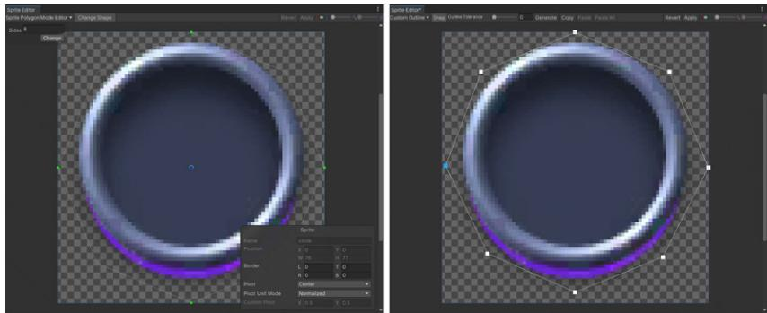

Use the Polygon mode and adjust the Outline layer to clip transparent pixels.

- **Packing Tag:** This is a legacy feature from the discontinued Sprite Packer, now replaced by Sprite Atlas.
- **Pixels Per Unit:** This is where you indicate the pixel density of the sprite (see the [above section on sprite resolution](#page-32-0) in Unity).
- **Mesh Type**:

— **Tight:** This option improves 2D/UI performance by reducing overdraw. The Tight packing option automatically adjusts each sprite mesh's outline to clip the transparent pixels.

If you want more control over the outline of the mesh, you can also change the polygon control points manually from the Sprite Editor with the Outline option.

See this [blog post](https://blog.unity.com/technology/a-lightning-round-of-great-tips-for-2d-games?utm_source=demand-gen&utm_medium=pdf&utm_campaign=authoring-optimizing-ui&utm_content=ui-design-ebook) for more details on reducing overlapping pixels.

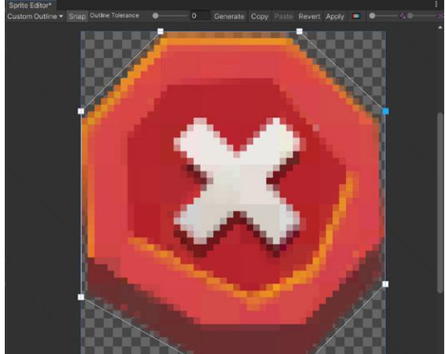

Adjusting the autogenerated outline of a sprite

— **Full Rect:** The sprite will use a rectangle mesh equal to the specified sprite size. The resulting sprite mesh will be simpler with less vertices, but at the expense of transparency overdraw. The default Tight option is generally recommended.

— **Extrude Edges:** When importing a sprite, the default Tight Mesh Type clips transparent pixels. Extrude Edges allow you to grow the generated outline to avoid pixel bleeding or other potential artifacts.

— **Pivot:** This is the sprite's center point. When you change the position, scale, or rotation of the GameObject, it will take place from the pivot point in the Inspector. You can find some predefined positions in relation to the sprite's Full Rect. Leverage the Sprite Editor to change the pivot point with further precision.

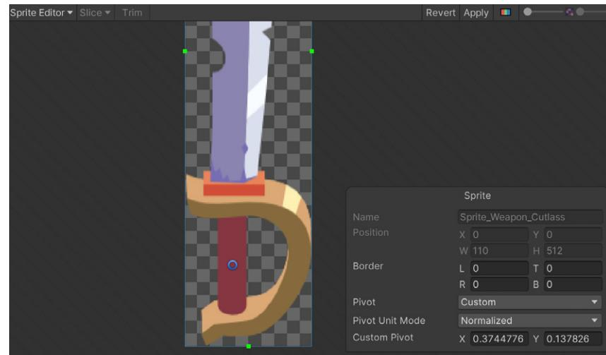

Changing the pivot point of a sword sprite from the Sprite Editor

— **Generate Physics Shape:** The GameObject can use the outline shape of the sprite for 2D physics purposes via the Polygon Collider 2D component.

#### **Tip: Asset setup**

Automate the process of setting up each added asset as Sprite (2D and UI) with the [AssetPostprocessor.](https://docs.unity3d.com/2022.1/Documentation/ScriptReference/AssetPostprocessor.html?utm_source=demand-gen&utm_medium=pdf&utm_campaign=authoring-optimizing-ui&utm_content=ui-design-ebook)

You can create a script to ensure that all assets added to a particular directory have the right settings applied automatically. Find some examples on how to set these AssetPostprocessors up for sprites in the [documentation.](https://docs.unity3d.com/Packages/com.unity.2d.sprite@1.0/manual/DataProvider.html?utm_source=demand-gen&utm_medium=pdf&utm_campaign=authoring-optimizing-ui&utm_content=ui-design-ebook)

#### **Sprite Renderer vs Canvas Renderer**

To render 2D Sprites in the 3D scene as part of the game world, a GameObject can use a [Sprite Renderer](https://docs.unity3d.com/ScriptReference/SpriteRenderer.html?utm_source=demand-gen&utm_medium=pdf&utm_campaign=authoring-optimizing-ui&utm_content=ui-design-ebook) component. This component harnesses information from the Sprite settings to display the sprite properly.

For example, if Draw Mode is set to 9-slice, it will use the border settings introduced in the Sprite Editor to render the image accordingly. It will also use the Pixel Per Unit information in the sprite's Import settings. Read more about the Sprite Renderer in the [documentation.](https://docs.unity3d.com/2021.2/Documentation/Manual/Sprites.html?utm_source=demand-gen&utm_medium=pdf&utm_campaign=authoring-optimizing-ui&utm_content=ui-design-ebook)

If the sprites appear in World Space using the Unity UI system, the GameObject with the sprite will be inside of a [Canvas.](https://docs.unity3d.com/Packages/com.unity.ugui@1.0/manual/UICanvas.html?utm_source=demand-gen&utm_medium=pdf&utm_campaign=authoring-optimizing-ui&utm_content=ui-design-ebook) The sprite will use an [Image](https://docs.unity3d.com/Packages/com.unity.ugui@1.0/manual/UIVisualComponents.html#image?utm_source=demand-gen&utm_medium=pdf&utm_campaign=authoring-optimizing-ui&utm_content=ui-design-ebook) component which, in turn, uses the configuration from the sprite to display the graphics. See the [Unity UI chapter](#page-52-0) for more details.

#### **Tip: Visual elements**

UI Toolkit does not currently support World Space (3D) rendering. While you cannot attach visual elements (the main building blocks of UI Toolkit) to GameObjects, you can, however, use the [RuntimePanelUtils](https://docs.unity3d.com/Packages/com.unity.ui@1.0/api/UnityEngine.UIElements.RuntimePanelUtils.html?utm_source=demand-gen&utm_medium=pdf&utm_campaign=authoring-optimizing-ui&utm_content=ui-design-ebook) to match UI elements to World, Screen, and Panel coordinates. Doing this helps you display things like floating health meters on top of a character's head.

# Faster workflows with PSD Importer

Exporting to the PNG file format is the most common workflow for sprites, but you can also import PSD files directly into Unity. By default, this will flatten the PSD layers into one image, which is not usually the desired behavior.

We keep the layers separate as individual sprites with the [PSD Importer.](https://docs.unity3d.com/Packages/com.unity.2d.psdimporter@8.0/manual/index.html?utm_source=demand-gen&utm_medium=pdf&utm_campaign=authoring-optimizing-ui&utm_content=ui-design-ebook) As you edit and paint layers in Photoshop, the changes immediately become visible in the Editor. Having the PSD source file in the Unity project makes it easier to include in version control.

| Inspector    |                                            | D    |
|--------------|--------------------------------------------|------|
| 1            | Fei_Cel_group (Texture 2D) Import Settings | 3 主  |
|              | Importer                                   | Open |
|              | UnityEditor.U2D.PSD.PSDImporterOverride    |      |
| Texture Type | Sprite (2D and UI)                         |      |

In Unity 2019 LTS and above, the PSD Importer can support PSD files as well as PSB files by adding two scripts.

You will need to save your Photoshop file as a **Large Photoshop Format** or **.PSB** file. If you are using Unity 2019 LTS or newer, you can use these [two scripts](https://docs.unity3d.com/Packages/com.unity.2d.psdimporter@8.0/manual/PSD-override.html?utm_source=demand-gen&utm_medium=pdf&utm_campaign=authoring-optimizing-ui&utm_content=ui-design-ebook)  anywhere in your project to enable **.PSD** file extension compatibility.

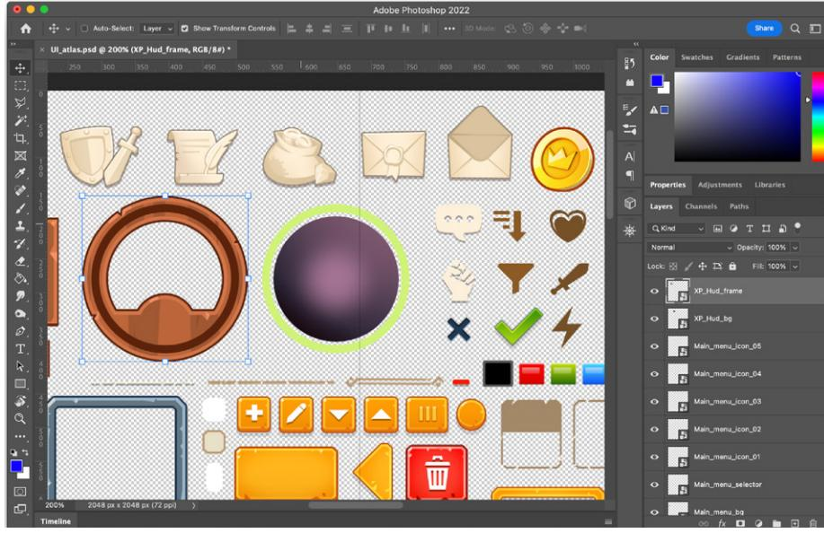

Creating the UI assets in Photoshop: Normally each element has its own group or is a smart object. Smart objects allow you to work on each element in isolation and preserve the original resolution of the element, even if resized later in the main document.

#### In the below example:

- Your newly imported PSD file appears as a flattened texture with the default settings in the Project view.
- Switching to the PSD Importer shows each layer as an individual sprite.
- More settings become available in the Inspector.

As such, each layer functions as a separate sprite, ready to be incorporated into your UI.

Switching to the PSD Importer shows you more options.

When working with UI assets, uncheck the **Use as Rig** option in the Inspector under **Character Rig**. That setting is only effective for 2D character skeletal animation. You should also find options for importing layers (e.g., discarding hidden layers, grouping objects by layer, etc.)

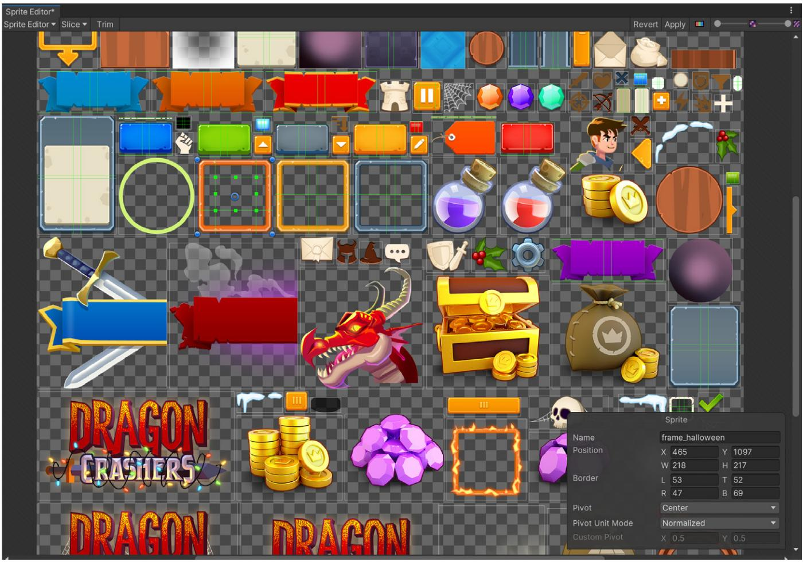

If you open the PSD in the Sprite Editor, you can set up pivot points, borders, and image rects.

The sprites in the Project view from the PSD are usable as normal sprites. For details on how to use this package, read the [2D Animation guide](https://resources.unity.com/games/2d-game-art-animation-lighting-for-artists-ebook?ungated=true) or [this blog post.](https://blog.unity.com/technology/how-to-speed-up-2d-art-workflows-with-2d-psd-importer?utm_source=demand-gen&utm_medium=pdf&utm_campaign=authoring-optimizing-ui&utm_content=ui-design-ebook)

# Sprite Atlas

The Unity [Sprite Atlas](https://docs.unity3d.com/Manual/class-SpriteAtlas.html?utm_source=demand-gen&utm_medium=pdf&utm_campaign=authoring-optimizing-ui&utm_content=ui-design-ebook) feature packs all of your UI assets into a single texture. It offers extra control over the creation of these textures and eliminates the need to pack the Atlas manually in the DCC application, saving you time – especially if you need to make changes and rearrange elements in the Atlas.

To build a new Sprite Atlas, right-click in the **Project** window (or select the **Assets** menu in the toolbar), and choose **Create > 2D > Sprite Atlas**.

Give the Atlas a descriptive name. Then, in the **Objects for Packing** option, select the sprites you want to include, or include the entire folder. The **Include in Build** option should be checked by default.

Leverage these main benefits of Sprite Atlas:

— **Pack multiple sprites into one texture to reduce draw calls:** Each mesh with different materials or textures is drawn on the screen separately. This adds to the rendering time and can reduce a game's frame rate.

Use a Sprite Atlas to consolidate several textures into a single, combined texture. Unity can then call this single texture to issue a single draw call. The packed textures are accessible all at once, resulting in less performance overhead.

— **Scale down sprites depending on device type:** In Unity, it's efficient to scale an entire Sprite Atlas instead of individual sprites and assign the scaled Atlas to different devices. See Variant Atlas (below).

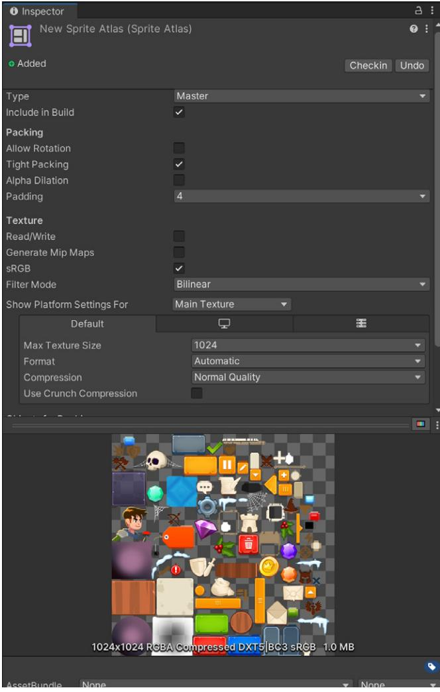

A Sprite Atlas in Unity

#### **Variant Sprite Atlas**

Use a [Variant Sprite Atlas](https://docs.unity3d.com/Manual/MasterVariantAtlases.html?utm_source=demand-gen&utm_medium=pdf&utm_campaign=authoring-optimizing-ui&utm_content=ui-design-ebook) to scale down sprites for specific devices. This creates lower-resolution copies of the **Atlas Texture** and supports a range of platforms with different hardware limitations.

A Variant Sprite Atlas itself doesn't contain sprites, but rather relies on a **Master Sprite Atlas**, set in the **Master Atlas field** of the Inspector. Once you create a Master Sprite Atlas, change its **Type** to **Variant** and choose a **Scale** in the range of 0.1 to 1.

| O Inspector                     |                   | a       |  |  |
|---------------------------------|-------------------|---------|--|--|
| New Sprite Atlas (Sprite Atlas) |                   | � 花  |  |  |
|                                 |                   | Open    |  |  |
| Type                            | Variant           | >       |  |  |
| Master Atlas                    | 到Environment      | 0       |  |  |
| Include in Build                | >                 |         |  |  |
| Variant                         |                   |         |  |  |
| Scale                           | 0.5               |         |  |  |
| Texture                         |                   |         |  |  |
| Read/Write Enabled              |                   |         |  |  |
| Generate Mip Maps               |                   |         |  |  |
| SRGB                            | >                 |         |  |  |
| Filter Mode                     | Bilinear          |         |  |  |
| Show Platform Settings For      | Main Texture D |         |  |  |
| P Default                    | g iOS          | டு      |  |  |
| Format                          | Automatic         |         |  |  |
| Compression                     | Normal Quality    | D       |  |  |
| Use Crunch Compression          |                   |         |  |  |
| Pack Preview                    |                   |         |  |  |
|                                 |                   |         |  |  |
|                                 |                   |         |  |  |

Setting up a Variant Sprite Atlas

Be aware of potential conflicts that can arise when a sprite appears in two Sprite Atlases that both have Include in Build enabled. Unity must randomly select a Texture from the two Atlases (see [Resolving different Sprite Atlas](https://docs.unity3d.com/Manual/SpriteAtlasScenarios.html?utm_source=demand-gen&utm_medium=pdf&utm_campaign=authoring-optimizing-ui&utm_content=ui-design-ebook)  [scenarios](https://docs.unity3d.com/Manual/SpriteAtlasScenarios.html?utm_source=demand-gen&utm_medium=pdf&utm_campaign=authoring-optimizing-ui&utm_content=ui-design-ebook) for more information).

To avoid these conflicts, enable **Include in Build** for the **Variant Atlas** only and disable it for the **Master Atlas**. As a result, Unity will only load the lower- resolution sprite at runtime.

# UNITY UI

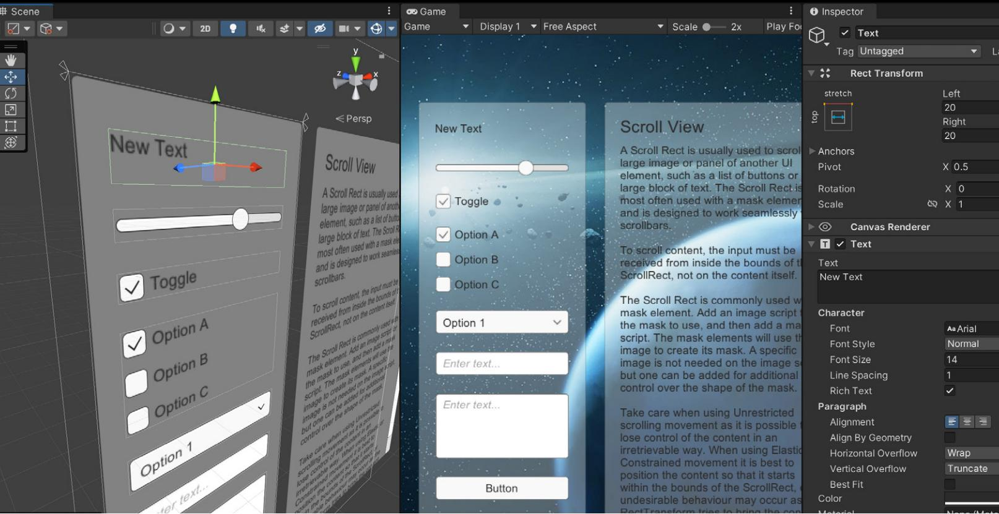

The Unity [UI Samples](https://assetstore.unity.com/packages/essentials/ui-samples-25468#description?utm_source=demand-gen&utm_medium=pdf&utm_campaign=authoring-optimizing-ui&utm_content=ui-design-ebook) asset uses GameObject-based elements.

In Unity UI, every part of the interface uses components along with the Game view to position, plan, and style user interfaces. All parts of the UI appear as GameObjects in the Scene view Hierarchy.

#### Designing with Unity UI

Because the elements that make up each UI are GameObjects, they are compatible with other tools and systems within Unity. That said, all GameObjects must live within a [Canvas](https://docs.unity3d.com/Packages/com.unity.ugui@1.0/manual/UICanvas.html?utm_source=demand-gen&utm_medium=pdf&utm_campaign=authoring-optimizing-ui&utm_content=ui-design-ebook) GameObject for Unity UI.

|                                                                                                                                                                                | E Hierarchy                      | Create Empty Parent | �状G |                             |
|--------------------------------------------------------------------------------------------------------------------------------------------------------------------------------|----------------------------------|---------------------|-----|-----------------------------|
| ++++++++++++++++++++++++++++++++++++++++++++++++++++++++++++++++++++++++++++++++++++++++++++++++++++++++++++++++++++++++++++++++++++++++++++++++++++++++++++++++++++++++++++++ | Q- All                           | 3D Object           |     | O + 6 2D ﮨﮯ 2 7 |
|                                                                                                                                                                                | Controls (not loaded)            | Effects             |     |                             |
|                                                                                                                                                                                | A Untitled*                      | Light               | >   |                             |
|                                                                                                                                                                                | Main Camera Directional Light | Audio               | >   |                             |
|                                                                                                                                                                                | T Canvas                         | Video               |     |                             |
|                                                                                                                                                                                | Image EventSystem             | UI                  |     | Image                       |
|                                                                                                                                                                                |                                  | UI Toolkit          |     | Text - TextMeshPro          |

A new GameObject of the Type UI being created inside a Canvas

#### **The building block: Canvas**

The Canvas area is depicted as a rectangle in the Scene view. UI elements in the Canvas are drawn in the order they appear in the Hierarchy. The child element at the top renders first, the second child next, and so on. Drag the elements in the Hierarchy to reorder them.

Canvases can render using three different modes:

- **Screen Space Overlay:** This rendering mode overlays the UI on top of everything in the 3D scene. No 3D object will be rendered in front of the UI, regardless of its placement. The Canvas has the same size as the Game view resolution and automatically changes to match the screen. Post-processing does not affect the UI.
- **Screen Space Camera:** This is similar to Screen Space Overlay, but in this mode, the Canvas appears at a given distance in front of a specified Camera component. The Camera's settings (Perspective, Field of View, etc.) affect the appearance of the UI. The UI appears on a 3D plane in front of the Camera defined by the plane distance. The GameObjects can be behind or in front of the Canvas, depending on their 3D positions. This Canvas also has the same size as the Game view resolution.
- **World Space:** In this render mode, the Canvas behaves like a GameObject in the scene. The size of the Canvas can be set manually using its Rect Transform. UI elements will render behind or in front of other objects based on the 3D placement of the Canvas. This is useful for UIs that are meant to be a part of the game world.

Examples of UI rendering modes, from left to right: Screen Space – Overlay for screens that overlay everything else, Screen Space – Camera for context-specific UI, and World Space UI Canvases which create elements that appear in the game world space

When first creating a Canvas, the Render Mode setting defaults to Screen Space – Overlay, which appears very large in the Scene view compared to other GameObjects. One Unity unit (typically one meter) represents one pixel, so creating a UI at HD resolution, for example, makes the Canvas 1920 x 1080 Unity units in the Scene view.

#### **Tip: Resolution**

When creating the UI elements in Unity, following the mockup screens, match the Game view to the Reference Resolution used in your drawing application. Make sure the [Image control](https://docs.unity3d.com/Packages/com.unity.ugui@1.0/manual/script-Image.html?utm_source=demand-gen&utm_medium=pdf&utm_campaign=authoring-optimizing-ui&utm_content=ui-design-ebook) shows pixels at one-to-one scale via **Set Native Size**.

If you're having trouble working on objects of vastly different scale, use the **Frame Selected** tool. Double-click a different GameObject in the **Hierarchy** view or press the **F** shortcut in any view to fit and focus the view to the selected object.

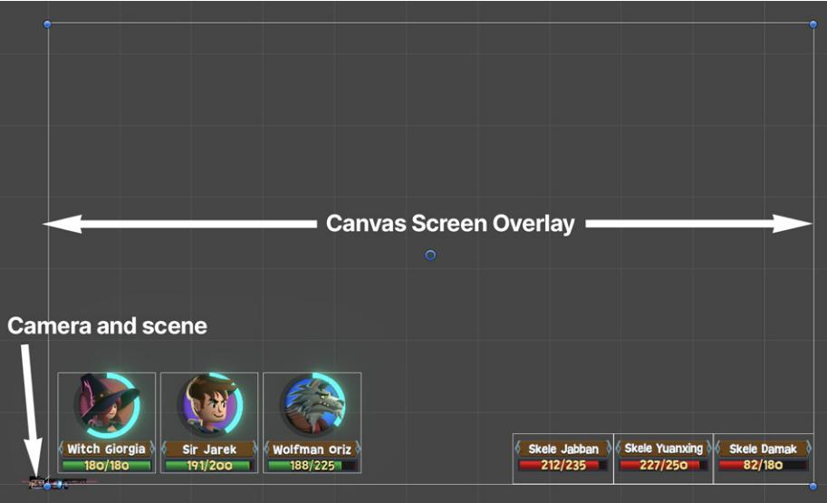

By default, the UI Canvas looks large using a render mode set to Screen Space – Overlay. For scale reference, see the scene elements in the bottom-left corner.

#### **Tip: Previsualization**

Use the **Game** and **Simulator views** to quickly previsualize how the UI will look in different target screens.

Previewing a UI with the Device Simulator

The **[Device Simulator](https://docs.unity3d.com/Manual/device-simulator-view.html?utm_source=demand-gen&utm_medium=pdf&utm_campaign=authoring-optimizing-ui&utm_content=ui-design-ebook)** includes predefined mobile devices, but you can also add your own target screens in the Game view.

# Layout and prebuilt UI elements

The different elements in the Canvas use the **[Rect Transform](https://docs.unity3d.com/Packages/com.unity.ugui@1.0/manual/class-RectTransform.html?utm_source=demand-gen&utm_medium=pdf&utm_campaign=authoring-optimizing-ui&utm_content=ui-design-ebook)** component instead of the regular Transform component. The Rect Transform component is a rectangle that can contain a UI element.

Rect Transforms include a layout concept called **[Anchors](https://docs.unity3d.com/Packages/com.unity.ugui@1.0/manual/UIBasicLayout.html?utm_source=demand-gen&utm_medium=pdf&utm_campaign=authoring-optimizing-ui&utm_content=ui-design-ebook)**. Anchors appear as four small triangular handles in the Scene view, with additional information available in the Inspector.

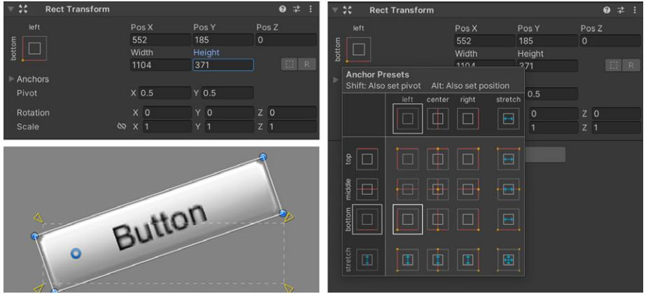

A Rect Transform in the Inspector shows the different Presets for Anchors: The Button element rotates based on its modified anchor position. By default, the pivot is in the center of the object, or X: 0.5, Y: 0.5.

If the parent of a Rect Transform is also a Rect Transform, you can anchor the child Rect Transform to it in various ways. Either attach the child to the sides or middle of the parent, or stretch it to the dimensions of the parent. See more examples in the [documentation](https://docs.unity3d.com/Packages/com.unity.ugui@1.0/manual/UIBasicLayout.html?utm_source=demand-gen&utm_medium=pdf&utm_campaign=authoring-optimizing-ui&utm_content=ui-design-ebook).

The selected Rect Transform is anchored to the bottom/center of its parent Rect Transform, with a gap of 161 pixels from the bottom and 0 pixels from the horizontal center.

Here are some basic layout elements (each one is indicated by a letter in the image below):

- A) **Predefined UI GameObjects** include text labels, buttons, sliders, toggles, drop-down lists, text fields, scroll bars, panels, and scroll views. Elements can consist of several child objects, each with a descriptive name and Image component attached to modify their appearance.
- B) **Rect Transform gizmos** can help you align elements, fix UI elements to reference points in the Canvas ([Anchor Presets](https://docs.unity3d.com/Packages/com.unity.ugui@1.0/manual/UIBasicLayout.html?utm_source=demand-gen&utm_medium=pdf&utm_campaign=authoring-optimizing-ui&utm_content=ui-design-ebook)), or stretch and scale them.
- C) **The predefined elements** automatically include their required components. For instance, a Button adds an Image component, a child GameObject with the text label, and a Button component.
- D) **Unity Events** are included with interactive components to trigger a function. The triggered action can be a method from a script, Transform, or GameObject. For example, a Button includes an OnClick Event and a Slider includes an OnValueChanged Event, both of which can execute logic and create user interaction.

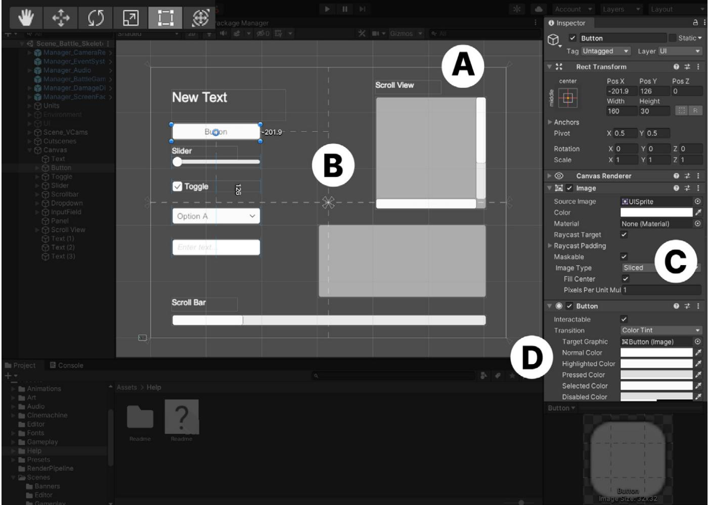

GameObjects made for UI are manipulated with the Rect tool instead of the regular Transform gizmos.

#### **Tip: Optimization**

If you have one large Canvas with thousands of elements, updating a single UI element forces the whole Canvas to update. This can potentially consume CPU resources.

Take advantage of Unity UI's ability to support multiple Canvases and divide UI elements based on how frequently they need to be refreshed. Keep static UI elements on a separate Canvas, and dynamic elements that update at the same time on smaller sub-canvases.

Check out [this list](https://unity.com/how-to/unity-ui-optimization-tips?utm_source=demand-gen&utm_medium=pdf&utm_campaign=authoring-optimizing-ui&utm_content=ui-design-ebook) of optimizations you can apply to Unity UI Canvases.

#### Auto Layout system

If you need UI elements automatically arranged or resized to fit into the Canvas, the Auto Layout system provides additional components via the **Add Component > Layout** menu. Layout components can make the child elements adjust to Canvas changes. For example, you can use a **Horizontal Layout Group** component to distribute a row of elements inside the Canvas with the same space between the elements.

For more instructions on how to implement these components, see the [documentation.](https://docs.unity3d.com/Packages/com.unity.ugui@1.0/manual/UIAutoLayout.html?utm_source=demand-gen&utm_medium=pdf&utm_campaign=authoring-optimizing-ui&utm_content=ui-design-ebook)

**Note:** Use these components sparingly for performance reasons.

#### Canvas Scaler

The parent Canvas includes a [Canvas Scaler](https://docs.unity3d.com/Packages/com.unity.ugui@1.0/manual/script-CanvasScaler.html?utm_source=demand-gen&utm_medium=pdf&utm_campaign=authoring-optimizing-ui&utm_content=ui-design-ebook) component. This controls the overall pixel density (pixels per unit) as well as scaling methods for different screens.

In **World Space** render mode, the UI Scale Mode is set to **World**. In **Screen Space** render mode, the UI Scale Mode has three options: **Constant Pixel Size**, **Constant Physical Size**, and **Scale with Screen Size**. The Canvas Scaler options change for each mode.

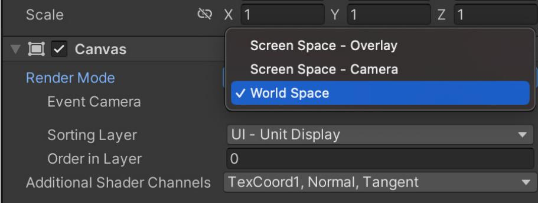

Adjust the Canvas Scaler in different ways depending on the selected mode.

#### **Constant Pixel Size**

In this property, the UI elements will retain the same size in pixels regardless of the screen size. Its settings include:

- **Scale Factor:** All UI elements scale in the Canvas by this factor.
- **Reference Pixels Per Unit:** This indicates the expected pixel density per unit of your sprites. It defaults to 100 PPU, but should match the PPU of your sprites.

Suppose your mockups use a resolution of 1920x1080 pixels. If the game camera has an orthographic size of 5 (distance from the center), the Game view will be 10 units in height. Using a target screen of 1080 pixels of height means that a pixel perfect sprite has a PPU setting of 108.

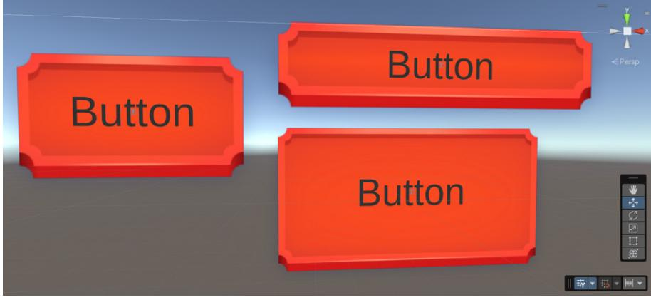

Changing the Reference Pixel Per Unit setting adds or decreases the pixel density of the graphics in the Image component (shown in the lower-right button). For the button graphic, a 9-slice image fills up graphics of variable size, keeping the corners intact.

#### **Constant Physical Size**

This property ensures that the UI elements retain the same physical size, regardless of screen size and resolution. Its settings include:

- **Physical Unit:** This unit specifies both position and sizes.
- **Fallback Screen DPI:** If the screen DPI is unknown, Unity will use this value. It refers to the number of physical pixels per square inch of the screen. A value of 300 or more is generally considered to be highresolution.
- **Default Sprite DPI:** This defines the pixels per inch for sprites that have a PPU value that matches the Reference Pixels Per Unit.
- **Reference Pixels Per Unit:** If a sprite has this Pixels Per Unit setting, then its DPI will match the Default Sprite DPI setting.

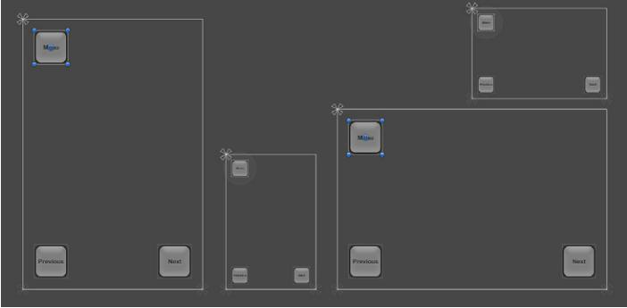

Peruse this [documentation page](https://docs.unity3d.com/Packages/com.unity.ugui@1.0/manual/HOWTO-UIMultiResolution.html?utm_source=demand-gen&utm_medium=pdf&utm_campaign=authoring-optimizing-ui&utm_content=ui-design-ebook) for tips on designing for multiple resolutions.

#### **Scale with Screen Size**

This property makes UI elements bigger for larger screens, with calculations based on a given Reference Resolution. Its settings include:

- **Reference Resolution:** This is the resolution the UI layout is designed for. If the screen resolution is larger, the UI will be scaled up. If it's smaller, the UI will be scaled down.
- **Screen Match Mode:** This determines whether the scaling uses the width or height as reference, or a mix between them.
- **Match:** This slider dictates which axis to favor when using Screen Match Mode. It's helpful in a situation where the output resolution has a different aspect ratio than the Reference Resolution.
- **Reference Pixels Per Unit:** This indicates the expected pixel density per unit of your sprites. It defaults to 100 PPU, but should match the PPU of your sprites.

The below example demonstrates matching a Reference Resolution (full HD, or 1920x1080 pixels) to a Game view resolution of 3440x1440 pixels. The top uses the width to match the different resolutions, while the bottom matches the height. The sweet spot is likely a value in between.

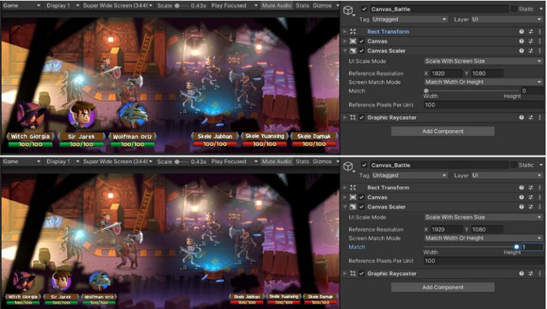

You can test how the UI will look in other screen sizes in the Game view. In this example, the Match setting adjusts the HD screen for an output resolution of 3440x1440 pixels.

# Customizing visuals with the Image component

In addition to their Rect Transform, many UI GameObjects have an Image or Text component. Think of when you're creating a new **UI Button (Text Mesh Pro)**.

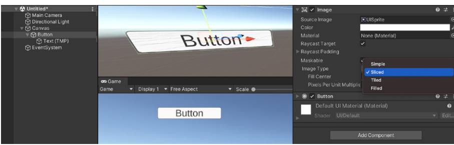

Customizing a new UI Button

The GameObject called **Button** includes an Image component that stands in for the rectangular image of the button. Another object below holds the TextMesh Pro component.

If you add a [Slider](https://docs.unity3d.com/Packages/com.unity.ugui@1.0/manual/script-Slider.html?utm_source=demand-gen&utm_medium=pdf&utm_campaign=authoring-optimizing-ui&utm_content=ui-design-ebook), Unity creates several objects in the Hierarchy that represent the background, fill area, and handle of the Slider. You can then use these GameObjects to style your UI objects.

Styling your UI objects is a matter of adjusting settings for their components. Let's examine the Image component settings first.

| VIZ V Image             |                 | ?) | 14 |    |
|----------------------------|-----------------|----|----|----|
| Source Image               | o Ul Sprite     |    |    | O  |
| Color                      |                 |    |    | 25 |
| Material                   | None (Material) |    |    |    |
| Raycast Target             | >               |    |    |    |
| Raycast Padding >       |                 |    |    |    |
| Maskable                   | >               |    |    |    |
| Image Type                 | Sliced          |    |    |    |
| Fill Center                | >               |    |    |    |
| Pixels Per Unit Multiplier |                 |    |    |    |

The Image component

- **Source Image:** Apply a sprite to this field to add a custom image texture.
- **Color:** Tinting the sprite using this field can be helpful if you want to create slight variations on the same graphic but with different colors (like green and red buttons).
- **Material:** Use this field to swap the UI to an alternate material. If you use a material with the UI/Lit or URP/2D/Sprite-Lit-Default shader, your Image component can react to lighting. Note that the Canvas must use the Screen Space – Camera or World Space render modes for this setting.
- **Raycast Target:** This indicates whether the UI element should be able to receive interaction, such as clicks. Raycast Padding enlarges or shrinks the interactive area using the Padding options. You can disable this option if your element is only decorative.
- **Image Type:** This field defines how the applied sprite will appear.

The options for this field include:

— **Simple:** Use this to scale the whole sprite equally. The option called Use Sprite Mesh applies the image area defined in the Sprite Editor. You might use this to hide part of the graphic with a custom outline. The Preserve Aspect option keeps the horizontal-to-vertical ratio intact.

— **Sliced:** This utilizes the sprite's 9-slicing so that resizing does not distort the corners, but only stretches the center. Disabling Fill Center hides the center altogether. The Pixels Per Unit Multiplier field lets you increase the pixel density for this image.

— **Tiled:** This is similar to Sliced, but instead repeats/tiles the center rather than stretching it. For sprites with no borders at all, the entire sprite is tiled.

— **Filled:** This is similar to the Simple option, except it fills the sprite from an origin in a defined direction, method, and amount.

Some of the options for Image Type enable a button called **Set Native Size**. This is useful in cases where filling in the Image area stretches or shrinks the sprite. Clicking this button will reset the original sprite size.

The scaled up settings icon sprite takes up too much space (left), so the Set Native Size option adjusts the image to the size of the original sprite (right).

Unity UI also supports an alternate component called **Raw Image**, which can use any texture as its image. It is not compatible with sprite features like 9-slicing, but provides additional UV controls. The Raw Image component is particularly effective if your UI needs a custom shader or a **Render Texture**, for example, though it tends to be used infrequently.

# Text with TextMesh Pro

TextMesh Pro is now the standard Unity UI text component in Unity 2021 LTS. It offers more refined control over text formatting and layout compared to Unity UI's older UI Text and Text Mesh systems. TextMesh Pro includes the following features:

- Character, word, line, and paragraph spacing
- Kerning and justified text
- Links and Rich Text tags
- Support for multiple fonts and sprites
- Custom styles and advanced text rendering with custom [shaders](https://docs.unity3d.com/Packages/com.unity.textmeshpro@4.0/manual/Shaders.html?utm_source=demand-gen&utm_medium=pdf&utm_campaign=authoring-optimizing-ui&utm_content=ui-design-ebook)

In the above Button example, a child object called Text(TMP) has a TextMesh Pro – Text(UI) component that distinctly determines the look of the text.

By default, a **TextMesh Pro UI Text GameObject** has these components:

- **Rect Transform:** Controls the GameObject's position and size on the Canvas
- **Canvas Renderer:** Renders the GameObject on the Canvas
- **TextMesh Pro script:** Contains the text to display and the properties that control its appearance and behavior
- **Material:** Uses one of the TextMesh Pro shaders to further control the text's appearance

See [UI Text GameObjects](https://docs.unity3d.com/Packages/com.unity.textmeshpro@4.0/manual/TMPObjectUIText.html?utm_source=demand-gen&utm_medium=pdf&utm_campaign=authoring-optimizing-ui&utm_content=ui-design-ebook) in the documentation for a detailed overview of the TextMesh Pro UI components.

# Reusable UI elements: Prefabs

When you create a new UI GameObject in the Scene view, it only belongs to that scene. You can duplicate the object, but making changes later is a manual process for every instance. Repeating elements when making UIs can therefore be quite inefficient.

Instead, use Unity's Prefab system. It equips you to modify many duplicate instances at once.

#### **Creating and editing Prefabs**

Unity's Prefab system enables you to create, configure, and store a GameObject – with all of its components, properties, and child GameObjects – as a reusable Asset.

The **Prefab Asset** acts as a template from which you can create new Prefab instances. These assets can be shared between scenes or other projects without having to be reconfigured.

To work with them, drag a regular GameObject from your Scene view into the Project view. Then create a Prefab with the prompt and select **Original Prefab** for any new Prefab or **Prefab Variant** (if you're only overriding the values of an existing Prefab). Its icon will change to a blue box in the Hierarchy view.

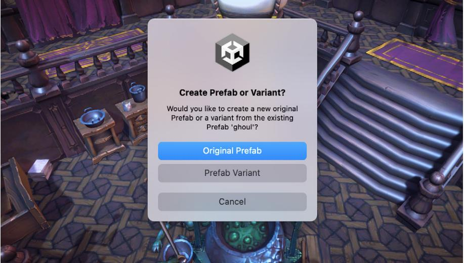

Creating a Prefab: Choose the Original Prefab option for a new Prefab or Prefab Variant.

Like all assets in Unity, Prefabs can be edited. You can either change a single instance on a per-object basis or apply broad changes to all instances of the Prefab at once. This makes it easier to fix object errors, swap artwork, and make other stylistic changes.

Modified instances of a Prefab have a blue line next to the overridden properties. Such blue lines show every place the instance differs from the original Prefab. You can see all of these at a glance using the **Overrides** drop-down menu.

Overrides can be transferred to the original Prefab Asset via the **Apply** command. This makes changes to all other Prefab instances as well.

You can also choose the **Revert** option to restore the original Prefab values. Otherwise, just leave the modified instance in the scene.

| Inspector                         |                                                                 | വ                                                      |
|-----------------------------------|-----------------------------------------------------------------|--------------------------------------------------------|
| AN_Stones_1                       |                                                                 | V Static ▼                                             |
| Tag Untagged                      | Layer Default >                                              | œ                                                      |
| Prefab Open                    | Select                                                          | Overrides >                                         |
| 2 Transform V               | Overrides to AN_Stones_1                                        | in & Scene                                             |
| Position Rotation Scale     | X 20.1 AN_Stones_1 × -1.20 Transform × 1 CODO |                                                        |
| LOD Group                         | COD1                                                            |                                                        |
| Fade Mode Animate Cross-fading | Cross >                                                      | Click on individual items to review, revert and apply. |
| LOD O                             |                                                                 | Revert All Apply All                                |
| 100% 1%                        | 25%                                                             | 5%                                                     |
|                                   |                                                                 | Recalculate Bounds Recalculate Lightmap Scale          |

The Overrides drop-down window of a 3D Asset Prefab

Edit a Prefab from its location in the Project or by clicking on the arrow to the right of the Prefab in the Hierarchy. When you enter **[Prefab Mode](https://docs.unity3d.com/Manual/EditingInPrefabMode.html?utm_source=demand-gen&utm_medium=pdf&utm_campaign=authoring-optimizing-ui&utm_content=ui-design-ebook)**, you will be editing the original Prefab. The context of the scene will be removed or grayed out.

In Unity UI, this workflow is efficient for quickly modifying reusable elements. You can edit a single element, then watch those changes propagate into the instances. The following example demonstrates basic usage:

- The Prefab in the Hierarchy view has a template asset set up in the Project. You can reuse this as many times as you need, and modify [the original Prefab](https://docs.unity3d.com/Manual/EditingInPrefabMode.html?utm_source=demand-gen&utm_medium=pdf&utm_campaign=authoring-optimizing-ui&utm_content=ui-design-ebook) in context.
- The health bar Prefab color changes to orange, and the change is saved when Prefab Mode is exited.

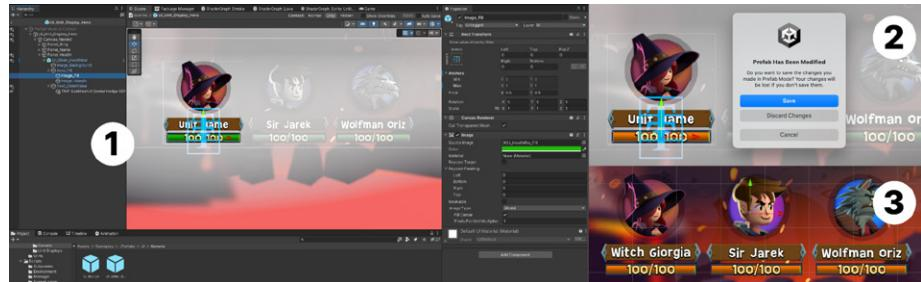

— Changes apply to all elements using that Prefab in any scene.

Using the Prefab system with Unity UI

#### **Nested Prefabs**

[Nested Prefabs](https://docs.unity3d.com/Manual/NestedPrefabs.html?utm_source=demand-gen&utm_medium=pdf&utm_campaign=authoring-optimizing-ui&utm_content=ui-design-ebook) allow you to insert Prefabs into one another to create a larger Prefab. Think of a building that's composed of smaller Prefabs (e.g., rooms and furniture). Nested Prefabs facilitate splitting the development of assets across a team of multiple artists and developers, so they can work on content simultaneously.

#### **Prefab Variants**

[Prefab Variants](https://docs.unity3d.com/Manual/PrefabVariants.html?utm_source=demand-gen&utm_medium=pdf&utm_campaign=authoring-optimizing-ui&utm_content=ui-design-ebook) allow you to derive Prefabs from other Prefabs. They're useful when you want a set of predefined variations of a Prefab (e.g., variations of an enemy character with different stats or materials).

To create the Variant, drag an existing Prefab into the Project view. A Prefab Variant inherits the properties of another Prefab, called the **Base**. Overrides made to the Prefab Variant take precedence over the Base Prefab's values.

A Prefab Variant can have any other Prefab as its base, including **Model Prefabs** or other Prefab Variants. You can also remove all modifications and revert to the Base Prefab at any time.

Nested Prefabs and Variants work well with version control systems. Team members can work in different Prefabs at the same time, make updates without conflict, and maintain backups of the different parts.

#### Animation integration

Unity UI elements, such as buttons or sliders, include different control states: **Normal**, **Highlighted**, **Pressed**, **Selected**, and **Disabled**. Each control state can represent one or more graphical or Transform properties, including:

- The element's sprite
- Its tint color
- Transforms (scale, rotation, and translation)

| > Button O                |           | 2 2 |   |                 |
|---------------------------------|-----------|--------|---|-----------------|
| Interactable                    | >         |        |   | Normal Entry |
| Transition                      | Animation |        | > |                 |
| Normal Trigger                  | Normal    |        |   | Any State       |
| Highlighted Trigger Highlighted |           |        |   | Highlighted     |
| Pressed Trigger                 | Pressed   |        |   |                 |
| Selected Trigger                | Selected  |        |   | Pressed         |
| Disabled Trigger                | Disabled  |        |   | Selected        |
| Navigation                      | Automatic |        | > |                 |
|                                 | Visualize |        |   | Disabled        |
|                                 |           |        |   |                 |

The Animation Transition option can create an Animation Controller.

Transitions between control states can be fully animated using [Unity's animation](https://docs.unity3d.com/Manual/AnimationOverview.html?utm_source=demand-gen&utm_medium=pdf&utm_campaign=authoring-optimizing-ui&utm_content=ui-design-ebook)  [system.](https://docs.unity3d.com/Manual/AnimationOverview.html?utm_source=demand-gen&utm_medium=pdf&utm_campaign=authoring-optimizing-ui&utm_content=ui-design-ebook) This is powerful behavior that allows many properties to animate simultaneously. For example, during a transition, you could swap sprites, tint or blend colors, and change scale or position.

It's important to note that the heavy use of animations with Unity UI can take a toll on performance, so try to implement your animations in a controlled way. You can read more on performance [here](https://unity.com/how-to/unity-ui-optimization-tips).

To use the **Animation Transition mode**, an Animator component needs to be attached to the **Controller** element. Click **Auto Generate Animation** to create an **Animator Controller** with states already set up. Then save the asset. The new Animator Controller will be ready for immediate use.

Unlike most Animator Controllers, this one stores the animations for the transitions. So if you select a **Button** element with an attached Animator Controller, you can edit the Button's control state animations in the Animation window (**Window > Animation**).

There is an **Animation Clip** pop-up menu you can use to select the desired clip. Choose from **Normal**, **Highlighted**, **Pressed**, and **Disabled**. If you want to use the same system for other UI-related effects like fullscreen transitions, you can animate entire Rect Transforms the same way. More tips are available in the [documentation.](https://docs.unity3d.com/Packages/com.unity.ugui@1.0/manual/HOWTO-UIScreenTransition.html?utm_source=demand-gen&utm_medium=pdf&utm_campaign=authoring-optimizing-ui&utm_content=ui-design-ebook)

### Grey-boxing with Unity UI

As a UI artist, you will spend most of your time creating visual assets. Making the UI functional, meanwhile, is often a task for the developer. However, UI artists can similarly benefit from adding basic interactivity to their creations.

Functional grey-boxing (while the UIs are still prototypes) supports both the testing and design of navigational flows. These flows work through some simple Unity components.

#### **Unity Events**

One convenient way to prototype game flow with Unity UI is through the [Unity](https://docs.unity3d.com/Packages/com.unity.ugui@1.0/manual/EventSystem.html?utm_source=demand-gen&utm_medium=pdf&utm_campaign=authoring-optimizing-ui&utm_content=ui-design-ebook)  [Events](https://docs.unity3d.com/Packages/com.unity.ugui@1.0/manual/EventSystem.html?utm_source=demand-gen&utm_medium=pdf&utm_campaign=authoring-optimizing-ui&utm_content=ui-design-ebook). These are exposed in the Inspector with certain interactive UI elements, like Buttons or Toggles.

Unity Events can trigger basic GameObject functionality (e.g., enabling or disabling GameObjects) or invoke your own functions. They are compatible with GameObject and **MonoBehaviour** methods, and can incorporate **[Visual Scripting](https://unity.com/features/unity-visual-scripting?utm_source=demand-gen&utm_medium=pdf&utm_campaign=authoring-optimizing-ui&utm_content=ui-design-ebook)** nodes as well.

| add simple user interactions via Unity Events. | In the Button and Toggle components, you can |  |  |
|------------------------------------------------|----------------------------------------------|--|--|

For instance, you can customize the appearance of a UI element without writing any code. Unity Events provide a simple UI that artists can set in the Inspector.

| C @ Inspector Selected Color Disabled Color Color Multiplier Fade Duration                                                       | Inspector 0.1                                                                                   | a : 100 A 1                                                                                                                                                              |
|-------------------------------------------------------------------------------------------------------------------------------------------------|----------------------------------------------------------------------------------------------------|-----------------------------------------------------------------------------------------------------------------------------------------------------------------------------------|
| Navigation On Click ()                                                                                                                       | Automatic Visualize                                                                             |                                                                                                                                                                                   |
| Runtime Only D [8 CircleSprite (Spr 9   ESprite_Crate Runtime Only > 0 Enemy Sprite Default Ul Mater UI/Defau Shader | SpriteRenderer.sprite No Function V No Function GameObject Transform SpriteRenderer | bool enabled 6 string name bool runInEditMode string tag bool useGUILayout BroadcastMessage (string) > Cancellnvoke (string) > Cancelinvoke () > |
| Button ▼                                                                                                                                        | EnemySpriteScript Add Component                                                                 | killThisEnemy () > SendMessage (string) SendMessageUpwards (string) StopAllCoroutines () StopCoroutine (string)                                                    |

In the OnClick Unity Event, you can trigger functionality without writing code.

This simple example simulates a navigation flow that enables a GameObject. The **OnClick Event** turns on the GameObject called **NewPopUp** by calling **SetActive(true)**, and then disables the PopUp GameObject.

You can trigger many functions within the OnClick Unity Event interface.

By using Unity Events, you can implement a game flow for almost any simple functionality; things like activating GameObjects or changing properties of the attached component.

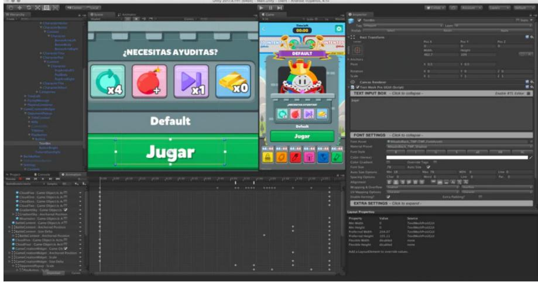

Certain game genres rely heavily on UI flows, such as in *[Trivia Crack 2](https://unity.com/case-study/trivia-crack-2?utm_source=demand-gen&utm_medium=pdf&utm_campaign=authoring-optimizing-ui&utm_content=ui-design-ebook)*.

If you want to add extra flavor or functionality to your UI without additional coding, you can make use of an **[Event Trigger](https://docs.unity3d.com/Packages/com.unity.ugui@1.0/manual/script-EventTrigger.html?utm_source=demand-gen&utm_medium=pdf&utm_campaign=authoring-optimizing-ui&utm_content=ui-design-ebook)**. This component offers more events from the **Event System** and calls registered functions for each one. You can assign multiple functions to a single event, and once the Event Trigger receives that event, it will call all of the functions.

| 学 | Event Trigger                           |                                               |  |  |
|---|-----------------------------------------|-----------------------------------------------|--|--|
|   | Pointer Enter (BaseEventData)           |                                               |  |  |
|   | Runtime Only Ui-Btn-Inventory- O     | - -   UiButtonAnimator.UiHighlight            |  |  |
|   | Runtime Only D Ui-Btn-Inventory- O V | - UiltemHandler.SelectItem                    |  |  |
|   |                                         |                                               |  |  |
|   | Pointer Exit (BaseEventData)            |                                               |  |  |
|   | Ui-Btn-Inventory- O                     | Runtime Only > UiButtonAnimator.UiUnHighlight |  |  |
|   | Runtime Only Ui-Btn-Inventory- O     | - UiltemHandler.UnHighLightItem               |  |  |
|   |                                         |                                               |  |  |
|   | Select (BaseEventData)                  |                                               |  |  |
|   | Runtime Only Ui-Btn-Inventory- O     | -   UiButtonAnimator.UiHighlight              |  |  |
|   | Runtime Only D Ui-Btn-Inventory- O V | - UiltemHandler.SelectItem                    |  |  |
|   |                                         |                                               |  |  |
|   | Deselect (BaseEventData)                |                                               |  |  |
|   | Runtime Only Ui-Btn-Inventory- O     | - UiButtonAnimator.UiUnHighlight              |  |  |
|   | Runtime Only Ui-Btn-Inventory- O     | - UiltemHandler.UnHighLightItem               |  |  |

This button activates additional effects, connected via the Event Trigger component.

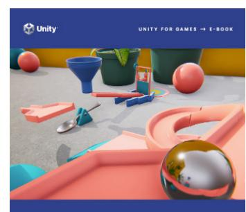

### *The Unity game designer playbook*

Discover more opportunities to implement UI functionality in Unity with this free e-book, which also includes an introduction to scripting and visual scripting for designers.

[Download the e-book.](https://resources.unity.com/games/game-designer-playbook?ungated=true%3Futm_source&utm_medium=pdf&utm_campaign=authoring-optimizing-ui&utm_content=ui-design-ebook)

# **Optimize the UI for mobile, console, and PC games**

Find new optimization tips for Unity UI, and so much more, in these two free e-books for advanced Unity creators:

*[Optimize for mobile games](https://resources.unity.com/games/unity-e-book-optimize-your-mobile-game-performance?utm_source=demand-gen&utm_medium=pdf&utm_campaign=authoring-optimizing-ui&utm_content=ui-design-ebook) [Optimize for PC and console games](https://resources.unity.com/games/performance-optimization-e-book-console-pc?utm_source=demand-gen&utm_medium=pdf&utm_campaign=authoring-optimizing-ui&utm_content=ui-design-ebook)*

# U I T O O L K I T : I N T R O D U C T I O N A N D F L E X B OX L AYO U T

Defining the layout of an interface with responsive elements in Relative position

UI Toolkit is a collection of features, resources, and tools for developing runtime UI and Editor extensions in Unity 2021 LTS and later versions. It empowers designers and artists to create, debug, and optimize user interfaces, and to control how they are presented and interacted with.

UI Toolkit is tailored for maximum performance and reusability, with workflows and authoring tools inspired by standard web technologies. UI designers and artists will find it familiar if they already have experience designing web pages.

UI Toolkit is currently used in the UI of the Unity Editor itself, and a number of Unity packages and features have interfaces made with it as well. Runtime support is more recent, but it's already being used for in-game UI, such as for *Timberborn* by Mechanistry, which you can read more about at the [end of the e-book.](#page-132-0)

While UI Toolkit is intended to become the recommended UI system for UI development, it does not include some of the features supported by Unity UI in Unity 2021 LTS. This makes the latter system a more appropriate choice for certain use cases and legacy projects.

See the [Comparison of UI systems in Unity](https://docs.unity3d.com/Manual/UI-system-compare.html?utm_source=demand-gen&utm_medium=pdf&utm_campaign=authoring-optimizing-ui&utm_content=ui-design-ebook) for more information.

# UI Toolkit workflow

Each interface built with UI Toolkit involves several parts working together:

— **UI Document (UXML):** This [asset](https://docs.unity3d.com/Manual/UIE-UXML.html?utm_source=demand-gen&utm_medium=pdf&utm_campaign=authoring-optimizing-ui&utm_content=ui-design-ebook) references Unity Extensible Markup Language (UXML). Inspired by HTML, XAML, and XML, it defines the structure of the user interface and holds information about the layout's hierarchy. It can be styled using inline style rules and Style Sheets.

— Create the asset via **Assets > Create > UI Toolkit > UI Document**. This asset is added to your project folder which can then be opened in the UI Builder.

— **Style Sheet (USS):** This [asset](https://docs.unity3d.com/Manual/UIE-USS.html?utm_source=demand-gen&utm_medium=pdf&utm_campaign=authoring-optimizing-ui&utm_content=ui-design-ebook) references a Unity Style Sheet (USS). Inspired by Cascading Style Sheets (CSS) from HTML, it contains cascading rules about style properties which can affect the visual layout of a UXML.

— Create this asset via **Assets > Create > UI Toolkit > Style Sheet**. This asset is added to your project folder, which can then be added to an open UXML file in the UI Builder.

— **Theme Style Sheet (TSS):** This asset is a collection of TSS and USS files that determine what **Panel Settings** to use (see below).

To properly visualize these assets in the Scene view, they need to work together with the following component and assets:

| Ul ✓ Ul Document |                                          | ? | ਜਾ |   |
|------------------|------------------------------------------|---|----|---|
| Panel Settings   | 1 MainMenuPanelSettings (Panel Settings) |   |    | 0 |
| Source Asset     | 2 MainMenu (Visual Tree Asset)           |   |    | 0 |
| Sort Order       | 0                                        |   |    |   |

To display UI Toolkit interfaces, a GameObject must have a UI Document component with a Panel Settings Asset and a Visual Tree Asset (UXML).

— **UI Document Component:** This [component](https://docs.unity3d.com/Manual/UIE-render-runtime-ui.html?utm_source=demand-gen&utm_medium=pdf&utm_campaign=authoring-optimizing-ui&utm_content=ui-design-ebook) defines what UXML will be shown, and connects that UI Toolkit asset to a GameObject. It can be added to a GameObject in the Editor Hierarchy, and can specify what Panel Settings to use. The **Sort Order** field determines how this document shows up in relation to other **UI Documents** using the same Panel Settings.

— Add this component to a GameObject using the **Add Component**  menu in the Inspector, or right-click in the Hierarchy and select **UI Toolkit > UI Document**, which will automatically assign Panel Settings.

— **Panel Settings:** This [asset](https://docs.unity3d.com/Manual/UIE-Runtime-Panel-Settings.html?utm_source=demand-gen&utm_medium=pdf&utm_campaign=authoring-optimizing-ui&utm_content=ui-design-ebook) defines how the UI Document component will be instantiated and visualized at runtime. It's possible to have multiple Panel Settings to enable different styles for the UIs. If your game includes HUD or a minimap, for instance, these special UIs could each have their own Panel Settings.

— Create the asset on its own via **Assets > Create > UI Toolkit > Panel Settings Asset**. This asset is added to your project folder, which can then be added to a UI Document component on a GameObject.

Once saved to the Assets folder, artists and designers can work with UXML and USS files in the [UI Builder](https://docs.unity3d.com/Manual/UIBuilder.html?utm_source=demand-gen&utm_medium=pdf&utm_campaign=authoring-optimizing-ui&utm_content=ui-design-ebook) (**Window > UI Toolkit > UI Builder**). UI Builder is a visual tool that helps creators build and edit interfaces without writing code.

Unlike Unity UI, UI Toolkit elements won't appear in the Scene view. UI artists will spend most of their time in the UI Builder, which includes an option to preview the Game view at runtime.

# Flexbox basics

UI Toolkit positions visual elements based on [Yoga](https://yogalayout.com/), an HTML/CSS **Layout engine** that implements a subset of [Flexbox.](https://css-tricks.com/snippets/css/a-guide-to-flexbox/) If you're unfamiliar with Yoga and Flexbox, this chapter will get you up to speed on the principles behind UI Toolkit's Layout engine.

Flexbox architecture is great for developing complex, well-organized layouts. Consider a few of its advantages:

- **Responsive UI:** Flexbox organizes everything into a network of boxes or containers. You can nest these elements as parents and children and arrange them spatially onscreen using simple rules. Children respond automatically to changes in their parent containers. A responsive layout adapts to different screen resolutions and sizes, allowing you to target multiple platforms more easily.
- **Organized complexity:** Styles define simple rules that control the aesthetic values of a visual element. One style can be applied to hundreds of elements at once, with changes immediately reflected on the entire UI. This centers UI design around consistent reusable styles rather than working on the appearance of individual elements.
- **Decoupled logic and design:** UI layouts and styles are decoupled from the code. This helps designers and developers work in parallel without breaking dependencies. Each team can then focus on what they do best.

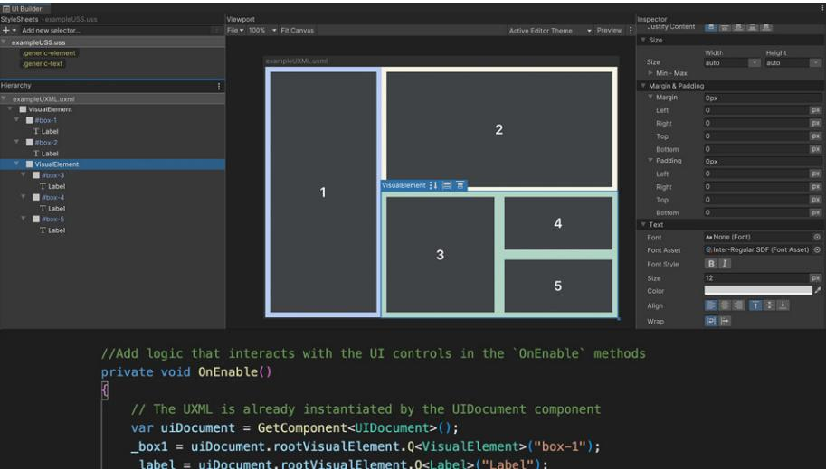

Decoupling logic and design: Programmers will connect the visual elements to the actual game logic (shown at the bottom), while designers will focus on defining the styles for them (UI Builder at the top).

# Visual elements

In UI Toolkit, the fundamental building blocks of each interface are their visual elements. A visual element is the base class of every UI Toolkit element (buttons, images, text, etc.) Think of them as UI Toolkit equivalents of GameObjects.

A **UI Hierarchy** of one or more visual elements is called a **[Visual Tree](https://docs.unity3d.com/2021.2/Documentation/Manual/UIE-VisualTree.html?utm_source=demand-gen&utm_medium=pdf&utm_campaign=authoring-optimizing-ui&utm_content=ui-design-ebook)**.

In UI Toolkit, combinations of multiple visual elements are stored in UI Document files, with the extension **.uxml**. A [UXML](https://docs.unity3d.com/Manual/UIE-UXML.html?utm_source=demand-gen&utm_medium=pdf&utm_campaign=authoring-optimizing-ui&utm_content=ui-design-ebook) file contains information related to the Hierarchy, as well as its styling and the layout of visual elements.

To build your first UI Toolkit interface, create a new [UI Document](https://docs.unity3d.com/ScriptReference/UIElements.UIDocument.html?utm_source=demand-gen&utm_medium=pdf&utm_campaign=authoring-optimizing-ui&utm_content=ui-design-ebook) from the **Assets** menu (**Create > UI Toolkit > UI Document**). Open the file from the **Project** window or directly from **UI Builder (Window > UI Toolkit > UI Builder**).

Create a new UI Document (UXML) file from the Assets menu (left) or UI Builder (right).

A simplified UI Hierarchy of a visual tree

#### **Tip: UI Builder documentation**

The [UI Builder](https://docs.unity3d.com/Packages/com.unity.ui.builder@1.0/manual/index.html?utm_source=demand-gen&utm_medium=pdf&utm_campaign=authoring-optimizing-ui&utm_content=ui-design-ebook) microsite contains an [Interface overview](https://docs.unity3d.com/Packages/com.unity.ui.builder@1.0/manual/uib-interface-overview.html?utm_source=demand-gen&utm_medium=pdf&utm_campaign=authoring-optimizing-ui&utm_content=ui-design-ebook) so you can get better acquainted with the window's interface. See the [Getting started](https://docs.unity3d.com/Packages/com.unity.ui.builder@1.0/manual/uib-getting-started.html?utm_source=demand-gen&utm_medium=pdf&utm_campaign=authoring-optimizing-ui&utm_content=ui-design-ebook) section if you are new to UI Builder.

Overview of the UI Builder window: Get more details in the [documentation.](https://docs.unity3d.com/Packages/com.unity.ui.builder@1.0/manual/uib-interface-overview.html?utm_source=demand-gen&utm_medium=pdf&utm_campaign=authoring-optimizing-ui&utm_content=ui-design-ebook)

- **Style Sheets:** Manage USS Style Sheets that contain a set of rules for styling your elements (see [UI Toolkit: Styling](#page-86-0)).
- **Hierarchy:** Select, reorder, reparent, manage, or add new elements in the UI Hierarchy of your UXML document.
- **Library:** Add new, predefined elements to the Hierarchy or instance other UI Documents (UXML) from here.
- **Viewport:** Preview your UI Document and select or position elements visually, directly on the Canvas.
- **Inspector:** Use it to change the attributes and style properties of the selected Hierarchy element or selector.

To approximate a runtime UI, select the currently loaded UI Document (UXML) in the Hierarchy and check **Match Game View**. This sizes the Viewport to your project Reference Resolution. Remember that modifying this parameter does not affect the UI files themselves, only the visualization.

Before we dive deeper into UI Toolkit, you'll need to understand the fundamentals of **Flexbox Layout**, which can be demonstrated with basic visual elements in the UI Builder.

You can drag visual elements from the **Library** into the **Hierarchy view** and arrange them into parent-child relationships. In Flexbox Layout, modifying a parent (the Flex container) impacts its children (the Flex items).

Using Flexbox requires an understanding of how to lay out elements in the interface according to the engine rules. Let's examine some common settings in the Inspector that affect the visual tree.

#### Positioning visual elements

When mocking up a UI, approach each screen as a separate group of visual elements. Think about how to break them down into visual tree hierarchies.

In the below example, one large visual element could stand in for the menu bar on the left. Separate child visual elements to represent each of the buttons.

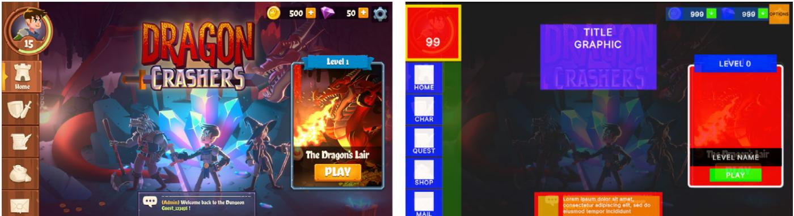

Compare the mockup (left) with its wireframe in UI Builder (right): Visual elements are distributed, positioned, and sized according to reference.

When defining child visual elements, the UI Builder offers two position options:

— **Relative positioning:** This is the default setting for new visual elements. Child elements follow the Flexbox rules of the parent container. For example, if the parent element's **Direction** is set to **Row**, child visual elements arrange themselves from left to right.

Relative positioning resizes and moves elements dynamically based on:

— **The parent element's size or style rules:** If you modify a parent element's **Padding** or **Align > Justify Content** settings, its children adjust themselves according to those changes.

— **The child element's own size and style rules:** If the child visual element has its own minimum or maximum size settings, the Layout engine tries to respect those as well.

UI Toolkit handles any conflicts between the parent and child element (so a child element with a minimum width that is wider than its container, for instance, results in an overflow).

**Absolute positioning:** Here, the position of the visual element anchors to the parent container, similar to how Unity UI works with Canvases. Rules like Margins or Maximum Size still apply, but it does not follow the Flexbox rules from the parent. The element overlays on top of the parent container.

Absolutely positioned elements can use the **Left**, **Top**, **Right**, and **Bottom** settings as anchors. For example, zero values for the Right and Bottom pin a Button to the bottom-right of the parent container.

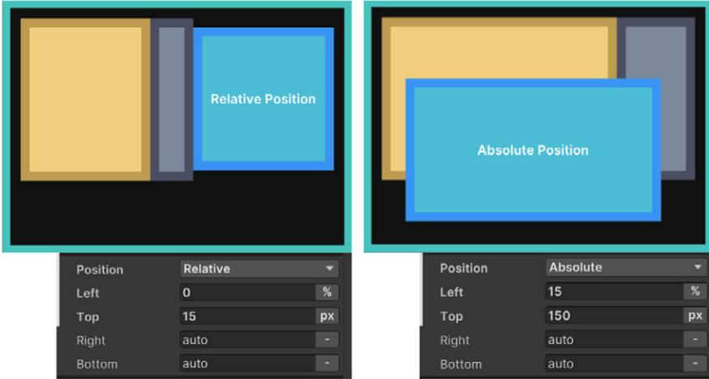

On the left, the blue visual element has a Relative position, with the parent element using Row setting as the Flex: Direction. On the right, the blue visual element uses Absolute position and ignores the parent element's Flexbox rules.

#### **Tip: Positioning**

You'll probably use Relative positioning for elements that are permanently visible, have complex grouping, or contain a number of elements.

Absolute positioning can be useful for temporary UIs (like pop-up windows), applying a complex background that covers the full height and width of an element, or elements that follow the position of other in-game elements (like a character's health bar).

Whether in Absolute or Relative positioning, you can use the Canvas to move elements around and adjust their placement.

Absolute and Relative positioning affect how the Layout engine handles parentchild visual elements.

# Size settings

Remember that visual elements are simply containers. By default, they don't take up any space unless they are filled with other child elements that already have a specific size, or you set them to a particular **Width** and **Height**.

| Size >      |       |    |        |   |
|----------------|-------|----|--------|---|
|                | Width |    | Height |   |
| Size           | 184   | px | 100    | % |
| Min - Max 2 |       |    |        |   |
|                | Width |    | Height |   |
| Max            | none  | -  | none   | - |
|                | Width |    | Height |   |
| Min            | auto  |    | auto   | 1 |

Size settings

The Width and Height fields define the size of the element. The **Max Width** and **Max Height** limit how much it can expand. Likewise, the **Min Width** and **Min Height** limit how much it can contract. These impact how the Flex settings (below) can resize the elements based on available space.

Visual elements don't take up space upon creation (see selected element in blue): The Flex properties (highlighted) and size settings define its initial size.

# Flex settings

The Flex settings can affect your element's size when using Relative positioning. It's recommended that you experiment with elements to understand their behavior firsthand.

**Basis** refers to the default Width and Height of the item before any **Grow** or **Shrink** ratio operation occurs:

- If Grow is set to 1, this element will take all the available vertical or horizontal space in the parent element.
- If Grow is set to 0, the element does not grow beyond its current Basis (or size).
- If Shrink is set to 1, the element will shrink as much as required to fit in the parent element's available space.
- If Shrink is set to 0, the element will not shrink and will overflow if necessary.

Basis, Grow, and Shrink settings

The above example shows how Basis works with the Grow and Shrink options:

- 1. The green element with a Basis of 80% occupies 80 percent of the available space.
- 2. Setting the Grow to 1 allows the green element to expand to the entire space.
- 3. With a yellow element added, the elements overflow the space. The green element returns to occupying 80 percent of the space.
- 4. A Shrink setting of 1 makes the green element shrink to fit the yellow element.
- 5. Here, both elements have a Shrink value of 1. They shrink equally to fit in the available space.

As you can see, elements that have a fixed size expressed in pixels (the blue box in 3–5) don't react to the Basis, Grow, or Shrink settings.

#### **Tip: Calculating visual element size**

The Layout engine combines the Size and Flexbox settings to determine how large each element appears when using Relative positioning. Calculating a visual element's size entails the following:

- The Layout system computes the element size based on the Width and Height properties.
- The Layout engine checks if there is additional space available in the parent container, or if its children are already overflowing the available space.
- If there is additional space available, the Layout system looks for elements that have non-zero values in the Flex/Grow setting. It distributes the additional space according to that factor, expanding the child elements.
- If the child elements overflow the available space, elements that have non-zero Flex/Shrink values will reduce in size accordingly.
- Any other properties that affect the resulting size of an element (Min-Width, Flex-Basis, etc.) are then taken into consideration.
- The Layout engine applies this final, resolved size.

The **Direction** setting defines how child elements are arranged inside the parent. Child elements higher in the Hierarchy menu appear first. Elements at the end of the Hierarchy appear last.

The **Wrap** setting tells the Layout system whether elements should try to fit into one column or row (No Wrap). Otherwise, they appear in the next row or column (Wrap or Wrap reverse).

Parent-child visual elements in UI Builder, using Relative positioning and different Direction and Wrap combinations

# Align settings

The Align settings determine how child elements line up to their parent element. Set the **Align > Align Items** in the parent to line up child elements to the start, center, or end. These options affect the cross-axis (perpendicular to the row or column in the **Flex > Direction**).

The **Stretch** option also works along the cross-axis, but the Min or Max values from the size can limit the effect (this is the default). Meanwhile, the **Auto** option indicates that the Layout engine can automatically choose one of the other options based on other parameters. It's recommended that you select one of the options for more control over the layout, and mainly use the Auto option for special use cases.

Go to **Align > Justify Content** to define how the Layout engine spaces child elements within the parent. These elements can line up, abutting one another, or spread out using the available space. The **Flex > Grow** and **Flex > Shrink** settings influence the resulting layout.

Align and Justify settings applied to a parent element with a Direction set to Row. Note that other position and sizing options can affect the final output.

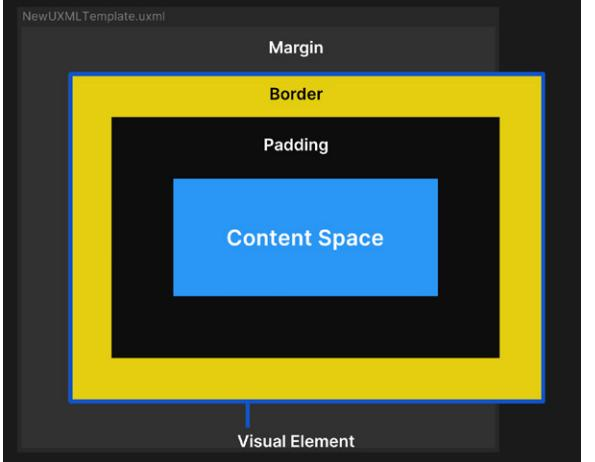

# Margin and Padding settings

Use the Margin and Padding settings to define empty spaces around your visual elements and their content. Unity uses a variation of the standard CSS box model, similar to the diagram.

A visual element in UI Builder with defined Size, Margin, Border, and Padding settings: Elements with a fixed Width or Height can overflow the space.

- — The **Content Space** holds key visual elements (text, images, controls, etc.)
- Padding defines an empty area around the Content Space, but inside the **Border**.
- The Border defines a boundary between the Padding and the Margin. This can be colored and rounded. If given a thickness, the Border expands inward.
- Margin is similar to Padding but defines an area outside the Border.

#### **Tip: Margins**

In UI Builder, you can create empty Margins with either the Position or Margin settings:

- For elements that have Relative position, use the Margin settings.
- For elements with Absolute position, use the Position settings.

In Absolute positioning, the Margins in the Position settings are defined from the edges of the parent container. This can also be handy to anchor an element to a corner. For example, setting zero values in the Right and Bottom parameters pins the element to the bottom-right part of its Flex container.

### Background and images

In UI Toolkit, any visual element can serve as an onscreen image. Simply swap the background to show a texture or sprite.

You can fill in a color or image to change the element's appearance. This is helpful for wireframing. Bright colors with contrast can show how different elements look next to one another and respond to changes in their containers.

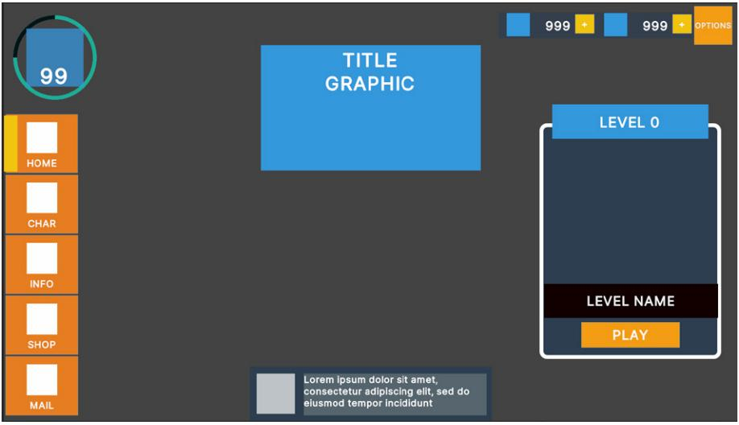

Use contrasting colors during wireframing

# Variable or fixed measuring units

In UI Builder, you'll encounter four parameters that define the distance and size of elements:

- **Auto:** This is the default option for size and position. The Layout system calculates the elements' values based on both the parent and child elements' information.
- **Percentage:** The unit equals a percentage of an element's container and changes dynamically with the parent's Width and Height. Working with percentages can provide scalability when dealing with multiple format sizes.

For example, within a 1920x1080 pixel parent container, a child element set to 50% of the size would be 960x540 pixels. Likewise, a left Margin of 10% and a top Margin of 20% represent the leftmost 192 pixels and topmost 216 pixels.

- **Pixels:** This option is useful for targeting a fixed resolution (e.g., 1920 x 1080 for full HD), or if you're specifically setting a value in pixels (e.g., a 5-pixel Padding boundary).
- **Initial:** This sets the property back to its default state (Unity's own default styling rules), ignoring the current styling values.

| 1 VisualElement 1 = = B |       |    |        |    | 2 VsuaElement       8 |       |    |        |    | 3 /UOMLTemplate sam |       |   |        |   |
|----------------------------|-------|----|--------|----|--------------------------|-------|----|--------|----|------------------------|-------|---|--------|---|
|                            |       |    |        |    |                          |       |    |        |    |                        |       |   |        |   |
|                            |       |    |        |    |                          |       |    |        |    |                        |       |   |        |   |
|                            |       |    |        |    |                          |       |    |        |    |                        |       |   |        |   |
|                            |       |    |        |    |                          |       |    |        |    |                        |       |   |        |   |
|                            |       |    |        |    |                          |       |    |        |    |                        |       |   |        |   |
| V Size                     |       |    |        |    | Y Size                   |       |    |        |    | V Size                 |       |   |        |   |
|                            | Width |    | Height |    |                          | Width |    | Height |    |                        | Width |   | Height |   |
| Size                       | auto  |    | auto   |    | Size                     | 461   | px | 226    | px | Size                   | 75    | % | 75     | % |
| ▼ Min - Max                |       |    |        |    | ▼ Min - Max              |       |    |        |    | ▼ Min - Max            |       |   |        |   |
|                            | Width |    | Height |    |                          | Width |    | Height |    |                        | Width |   | Height |   |
| Max                        | none  |    | none   |    | Max                      | none  |    | none   |    | Max                    | none  |   | none   |   |
|                            | Width |    | Height |    |                          | Width |    | Height |    |                        | Width |   | Height |   |
|                            | 588   | рх | 0      | px | Min                      | auto  |    | auto   |    | Min                    | auto  |   | auto   |   |

Examples of the default Size settings and Sizes defined in pixels and percentages

To apply a scaling rule to the entire UI at the same time, UI Toolkit offers settings similar to those in Unity UI. They are available in the [Panel Settings.](https://docs.unity3d.com/2022.2/Documentation/Manual/UIE-Runtime-Panel-Settings.html)

|                                 |                                          |  | Main Menu Panel Settings (Panel Settings)   |        | Open Checkout |
|---------------------------------|------------------------------------------|--|---------------------------------------------|--------|------------------|
|                                 | Theme Style Sheet                        |  | & Runtime Theme-Default (Theme Style Sheet) |        | 0                |
| Text Settings Target Texture |                                          |  | None (Panel Text Settings)                  |        | 0                |
|                                 |                                          |  | ജ None (Render Texture)                     |        | 0                |
|                                 | Target Display                           |  | Display 1                                   |        | œ                |
| 0 Sort Order                 |                                          |  |                                             |        |                  |
|                                 | Scale Mode                               |  | Scale With Screen Size                      |        | œ                |
|                                 | Scale Mode Parameters                    |  |                                             |        |                  |
|                                 | Screen Match Mode                        |  | Match Width Or Height                       |        |                  |
|                                 | Reference Resolution                     |  | X 1920 Y 1080                            |        |                  |
|                                 | Screen Match Mode Parameters             |  |                                             |        |                  |
|                                 | Match                                    |  |                                             |        | 0.595            |
| A                               | Dynamic Atlas Settings Clear Settings |  | Width                                       | Height |                  |

In the Panel Settings of UI Toolkit, you can find similar scaling options to the ones found in Unity UI.

#### **Tip: Pixels versus percentages**

Many fields in the Inspector can be set to measure in either **pixels (px)** or **percentages (%)** as a unit. Pixel values are absolute, while percentages are relative to an element's parent.

If you do not specify a unit of measurement, UI Toolkit assumes that the property value is expressed in pixels. You can combine different units to achieve your desired results. For example, use percentages for the bigger container elements, while relying on pixels for the child elements.

Working with percentages can be a good option if you are targeting screens of similar screen ratios but different resolutions (e.g., screens with full HD and 4K resolutions). They can also be helpful if you want to describe an element that works in both portrait or landscape mode relative to the screen size (think of an element that takes up 10% of the top-left corner). If you have an absolute Minimum (e.g., a Button or Margin that must be no smaller than a certain width), use pixels as your unit.

#### More resources

UI Toolkit uses a modified version of Yoga, an implementation of the Flexbox Layout engine. Because Flexbox and Yoga are existing standards in web and app development, a variety of resources are available online.

Take a look at these pages and articles:

- [UI Toolkit at runtime: Get the breakdown](https://blog.unity.com/technology/ui-toolkit-at-runtime-get-the-breakdown)
- [Yoga official documentation](https://yogalayout.com/)
- [CSS-Tricks guide to Flexbox](https://css-tricks.com/snippets/css/a-guide-to-flexbox/)

# UI TOOLKIT: STYLING

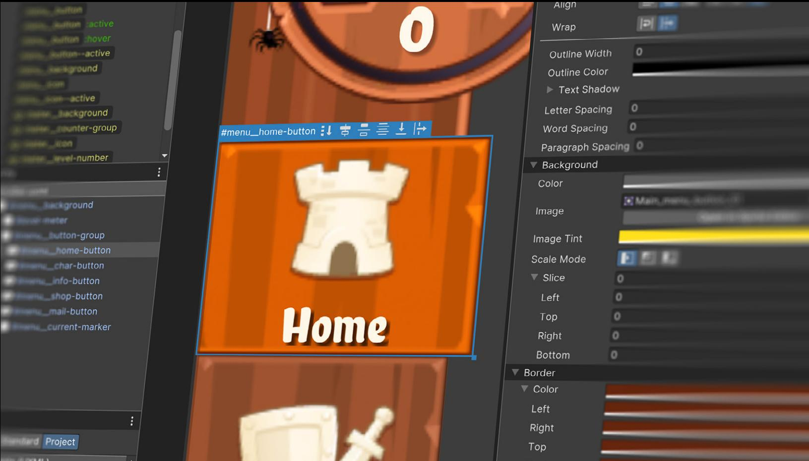

Creating the style of an in-game interface in UI Builder

Once you've mocked up some wireframe layouts with visual elements, you can begin styling them. Styling is where UI Toolkit exhibits its full power.

Adding style to visual elements is preferably done via [USS](https://docs.unity3d.com/Manual/UIE-USS-Selectors.html) files (**Assets > Create > UI Toolkit > StyleSheet**). They are the Unity equivalent to web CSS files, and use the same rule-based format. They also add flexibility to the design process.

USS files can define the size, color, font, line spacing, borders, and location of elements. Proper styling can render crisp, clean visual elements, reducing the need for so many textures.

#### UI Builder

The UI Builder interface allows artists and designers to visualize the UI as it's being built.

In the top-left Style Sheets pane, add a **Style Sheet** to the current **UI Document** (UXML) with the "**+**" drop-down menu to the left of the **Add new selector...** field. Modify the appearance of the visual elements by adding one or more USS files.

Add a USS file in the Style Sheet panel.

#### **Tip: Saving UI assets**

In UI Builder, save your changes from the **Viewport** menu (**File > Save**). This saves all open UXML and USS files.

Unlike Unity UI, the game can run in the Editor while you actively make changes in UI Toolkit. Look for the asterisk \* next to the file name in the UI Builder's Canvas header; this indicates unsaved changes.

| Viewport                 |                      |                     |           | Inspector                                                                                                          |                                                                        |                    |          |
|--------------------------|----------------------|---------------------|-----------|--------------------------------------------------------------------------------------------------------------------|------------------------------------------------------------------------|--------------------|----------|
| File - 100% - Fit Canvas |                      | Active Editor Theme | - Preview | T Canvas Size                                                                                                      |                                                                        |                    |          |
|                          | NewUXMLTemplate.uxml |                     |           | Size Match Game View Canvas Background 11 100 Image Opacity Scale Mode > Document Settings | Width 350 E None (Texture 2D) 다 이 대 Fit Canvas to Image | Height 450 0 | O 100 |
|                          |                      |                     |           |                                                                                                                    |                                                                        |                    |          |

The Canvas of a new UXML document: Use the Color and Image options to adjust its appearance.

### Canvas background

Enabling the Canvas background can help you visualize your element styling over a color or background image. Select the UXML file in the Hierarchy pane and then choose a Canvas background that approximates the final UI interface to judge style changes in context.

The Canvas background provides a few different options:

- **Background Color:** Represents a specific shade or hue of the game environment
- **Image:** Use this to choose a sprite or texture as the background (useful for replicating mockup screens or reference art)
- **Camera:** Displays the current gameplay in the background

# Viewport settings

To navigate the work area, adjust the zoom level (between 25%–500%), or choose the **Fit Canvas** option which automatically adjusts the zoom according to the current screen real estate.

Use **Preview** to visualize the UI without accidentally editing the selected elements. When active, the Viewport can also show styles applied for specific mouse events (e.g., hovering, focusing).

# USS Selectors

Style Sheets can share and apply styles across many elements and UI Documents (UXML). They do this via [USS Selectors](https://docs.unity3d.com/Manual/UIB-styling-ui-using-uss-selectors.html). You can add a new Selector in the field above in the Style Sheets.

Selectors query the visual tree for any elements that match a given search criteria. UI Toolkit then applies style changes to all matching elements.

USS Selector reference

USS Selectors can match elements by:

- **C# class name:** These Selectors work by Type (Button, Label, Scroller, etc.) The Selector matches the available Type names in the Library pane without any special characters. Class Selectors appear in white.
- **Assigned name property:** These Selectors can apply styling to all the elements of the same name. Name Selectors have a preceding hash "**#**" symbol and appear in blue.
- **USS Style Classes:** You can apply a Style Class Selector arbitrarily to any visual element. Style Class Selectors have a preceding dot "**.**" character and appear in yellow.

Instead of matching elements by name or C# class, use Style Class Selectors whenever possible. You can drag and drop Style Classes into the Viewport or Hierarchy, or assign the Style Class to a selected element from the Inspector.

Selectors also support [pseudo-classes](https://docs.unity3d.com/Manual/UIE-USS-Selectors-Pseudo-Classes.html) that can target elements in a specific state. Pseudo-classes are denoted by a colon "**:**" and modify existing Selectors. In the below example, a Button Selector detects an element in its :hover or :focus state, depending on pointer events.

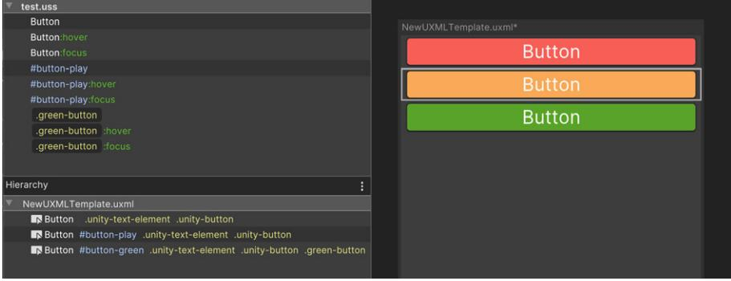

Buttons styled with different Selectors

Here, the test.uss Style Sheet illustrates how different Selectors can apply to a set of Button elements:

- The **C# Class Selector** called Button (in white) formats all Buttons in the Hierarchy with a red background.
- The **Name Selector** called #button-play (in blue) searches for all elements with the name "button-play." It then applies an orange background to those elements (replacing the style from the other Selector).
- The **Style Class Selector** called .green-button (in yellow) is manually added to the last button. This replaces the previous styling and colors the background green.
- Each of these Selectors has **pseudo-classes** for :hover and :focus (in green). They allow you to define distinct styles when hovering the mouse pointer or focusing on a button.

If one element has several matching Selectors, the Selector with the highest [specificity](https://docs.unity3d.com/Manual/UIE-USS-Selectors.html#selector-specificity) takes precedence. Name Selectors are more specific than Class Selectors, and Class Selectors are more specific than **C# Type Selectors**. You can learn more about Selector precedence in the [documentation](https://docs.unity3d.com/Manual/UIE-USS-Selectors.html#determining-selector-precedence).

#### **Tip: Selectors**

Click the vertical ellipsis () in the Hierarchy header to further visualize the UI elements.

Filter for different Selectors in the Hierarchy.

In the Hierarchy pane, additional information appears next to the element Type: The #options-bar Name Selector and .options-bar Style Class Selector appear when checked.

You might notice that some Selectors begin with the .unity- prefix. These are default styles that apply to all elements. Any defined Selectors will override these values.

| Text             |                   |             |
|------------------|-------------------|-------------|
| Font             | Aa Mikado Bold    | O Set    |
| Font Asset       | & Mikado Bold SDI | Unset to |
| Font Style       | I B            | Unset All   |
| Size             | 200               | px          |
| Color            |                   | P           |
| Align            | TEETH             |             |
| Wrap             | + ---             |             |
| Outline Width    | O                 | px          |
| Outline Color    |                   |             |
| Text Shadow > |                   |             |
|                  | Horizontal        | Vertical    |
| Offset           | ব 4 px      | px          |
| Blur Radius      | 8                 | px          |
| Color            |                   | 00          |

Overridden properties in the Selector can be Unset.

Once you have a Selector in the Style Sheet, you can modify the parameters in the Inspector. Any overridden properties appear with a white bar on the left side of the Inspector. Select **Unset** from the right-click context menu to remove the change. Select **Unset All** to remove all changes.

With numerous formatting options available, you can modify the basic appearance of elements and fonts. In Unity 2021 LTS or newer, UI Toolkit offers advanced styling that can reduce the need for custom-made sprites.

UI Builder can facilitate adding outlines, rounded corners, image adjustments, and border colors to your elements. Styling can also include bevel effects and the ability to change the cursor image.

UI Toolkit offers several styling effects that do not require additional textures.

#### **Tip: Styles in the Inspector**

In the Inspector, you can visualize the matching Selectors of a selected element.

The Selector at the bottom of the list has precedence. Unfold the details to see which style parameters are changing.

A selected visual element shows its matching Selectors in the Inspector.

Use the **Add Style Class to List** button to add an existing Style Class (starting with "**.**" in yellow) to the element.

In UI Builder, begin by creating elements using inline styles (see Override styles below). Feel free to experiment while the number of elements is still small.

As your UI becomes more complex, it will become easier to manage styles using Style Sheets. Use **Extract Inlined Styles to New Class** to create a new Style Class from the existing settings. This effectively converts the inline style into a USS Selector.

| / StyleSheet                        |  |  |  |  |  |  |  |
|-------------------------------------|--|--|--|--|--|--|--|
| V Style Class List                  |  |  |  |  |  |  |  |
| button-glossy-green                 |  |  |  |  |  |  |  |
| Add Style Class to List             |  |  |  |  |  |  |  |
| Extract Inlined Styles to New Class |  |  |  |  |  |  |  |
| .unity-text-element .unity-button   |  |  |  |  |  |  |  |
| > Matching Selectors                |  |  |  |  |  |  |  |

Convert the Inlined Styles into reusable Selectors from this menu in the element's Inspector.

#### **Overriding styles**

Rules were meant to be broken. Whenever you define a style class for UI elements, there will always be exceptions.

For example, if you have a group of Button elements, you don't need to create a new Selector for each one. This would defeat the purpose (convenience) of making styles reusable.

In lieu of this, you'd apply the same style to all of the buttons and then override the specific parts of each one that are unique (e.g., each Button element could override the **Background > Image** to use its own icon). These Overrides are called **UXML inline style** properties. A white line next to the property represents an Override.

#### **Tip: Inline styles take precedence over Selectors**

Inline styles always take precedence over Selectors. So if you're unsure as to why a style is not updating when a Selector is applied, it could be helpful to check the element to see if there are any Overrides.

Override the settings directly inline if it does not need to be part of a reusable style.

When modifying a Style Selector, be sure to select the **Style Class** in the **Style Sheet** panel – not the visual element from the Hierarchy. Otherwise, you will change the inline style for a specific element and not the Style Class itself.

You can double-click a Style Class in the Inspector to deselect an element and select the Style Selector instead.

If you edit a visual element directly inline instead of using its Selector, you have two options:

— Right-click on the property name or property group, then select **Unset**. **Unset All** removes all Overrides from the element.

| Background |               |                            |  |  |  |  |  |  |
|------------|---------------|----------------------------|--|--|--|--|--|--|
| Color      |               | 0                          |  |  |  |  |  |  |
|            | Set           | Main_menu_icor () Sprite ▼ |  |  |  |  |  |  |
| Imag       | Unset         | Open in Sprite Editor      |  |  |  |  |  |  |
| Imag       | Unset All     | 20                         |  |  |  |  |  |  |
| Scali      | View Variable |                            |  |  |  |  |  |  |

Right-click on a property to remove the Override or inline style using Unset or Unset All.

— Convert those Overrides into a new Selector with the **Extract Inlined Styles to New Class** option. Write the Selector name in the text field with the correct preceding character (if applicable).

#### **Tip: Inlined Styles from code**

Styles can be defined and overridden using C# code. Programmers implement what are called **C# Inlined Styles** when content is generated procedurally.

Imagine a game application where players could use their profile pictures from social media. A developer could automatically retrieve the photo from the social media API and then override the Selector's image in the player avatar element. This is an example of styling customization that can only be done via C#.

UI designers should work with their development teams to smoothly incorporate these advanced styling features into their project.

#### **Naming conventions**

Seeing as dev teams will refer to the same UXML and USS assets that make up your interface, it's important to use naming conventions for both visual elements and Style Sheets. Naming conventions help keep your hierarchy organized in UI Builder.

You can query Visual Tree elements by Type and/or Name to retrieve elements ("root" represents the base of the tree).

Programmers will often query the visual elements and Style Sheets using a string identifier. Naming conventions lead to less errors and more readable code overall.

Though not mandatory, we recommend the **Block Element Modifier** (BEM) naming convention for your visual elements and Style Sheets. At a glance, an element's BEM-style name can tell you what it does, where it appears, and how it relates to other elements around it.

#### **Examples of BEM naming:**

menu\_\_home-button menu\_\_shop-button menu\_\_shop-button--small button-label button-label--selected

These examples use hyphen delimiting (aka Kebab case), which is common for CSS naming. Teams can decide which naming scheme works best for them, but should aim to choose early in the project and stay consistent later on.

Read more about CSS naming conventions in [this article,](https://www.freecodecamp.org/news/css-naming-conventions-that-will-save-you-hours-of-debugging-35cea737d849/) as well as in the [UI Toolkit documentation](https://docs.unity3d.com/Manual/UIE-USS-WritingStyleSheets.html?utm_source=demand-gen&utm_medium=pdf&utm_campaign=authoring-optimizing-ui&utm_content=ui-design-ebook).

#### **Tips: Naming conventions**

Here are some guidelines for effective naming:

- Keep names short and clear (unambiguous).
- Avoid overly verbose or descriptive names.
- Share and maintain a naming convention guide for the entire team.
- Avoid names/modifiers that can change (e.g., use "button–quit" instead of "button–red" when the color scheme is not yet final).
- Extend these conventions to art assets, like sprites and textures associated with the UI Toolkit interface.

#### *Create a C# style guide*

If you or your team wants to refine key coding practices to make your project more scalable, check out our free e-book, *Create a C# style guide: Write cleaner code that scales*. Use this guide as needed to help standardize your code style and naming conventions.

[Download the e-book.](https://resources.unity.com/games/create-code-style-guide-e-book?ungated=true%3Futm_source&utm_medium=pdf&utm_campaign=authoring-optimizing-ui&utm_content=ui-design-ebook)

# Animation and effects

As of Unity 2021 LTS, UI Toolkit includes a feature called [USS transitions.](https://docs.unity3d.com/2021.3/Documentation/Manual/UIE-Transitions.html?utm_source=demand-gen&utm_medium=pdf&utm_campaign=authoring-optimizing-ui&utm_content=ui-design-ebook) These transitions allow you to create animations when changing styles.

**Note:** USS transitions can only be used with USS Selectors in a Style Sheet (not with inline styles).

With Flexbox properties, you can animate elements that become larger when they are selected (the other elements part of the bottom bar shrink to the available space). This image is from *Royal Match* by Dream Games, but a similar effect is used in the menu bar of the UI Toolkit sample project.

#### **Transition Animations**

When displaying a Transition Animation, do it with at least two styles. This way, they can represent the before and after states.

Think of the transition between pseudo-classes of a Button – the :hover pseudo-class over the .green-button Class Selector. Each style has its own size and color.

To define a transition in the mouse hover state, select the .greenbutton:hover Selector, then set the Transition Animations, located at the bottom of the Inspector. The result is a Button that animates with your pointer movements.

You can interpolate between styles with Transition Animations.

The Transition Animation interpolates between styles with the following options:

— **Property:** This determines what to interpolate. The default setting is **all**, but you can select a specific property in the drop-down list. In the above example, :hover state has a Property of Color and Transform.

As the mouse pointer hovers over the Button, the Button grows larger and changes to blue. See [this complete list](https://docs.unity3d.com/2021.3/Documentation/Manual/UIE-USS-Properties-Reference.html?utm_source=demand-gen&utm_medium=pdf&utm_campaign=authoring-optimizing-ui&utm_content=ui-design-ebook) of properties.

- **Duration:** This is the length of the transition, expressed in either seconds or milliseconds. For it to be visible, Duration must be set higher than 0.
- **Easing Function:** Select an Easing Function that can approximate natural motion (acceleration, deceleration, elasticity, etc.) This kind of function makes the animation appear more organic than a simple linear interpolation.

| easeInSine    | ease Out Sine  | easeInOutSine    | easeInQuad   | ease Out Quad | easeIn Out Quad  |
|---------------|----------------|------------------|--------------|---------------|------------------|
| easeInCubic   | easeOutCubic   | easeIn Out Cubic | easeInQuart  | easeOutQuart  | easeln Out Quart |
| easeInQuint   | easeOutQuint   | easeInOutQuint   | easeInExpo   | easeOutExpo   | easeInOutExpo    |
| easeInCirc    | easeOutCirc    | easeInOutCirc    | easeInBack   | easeOutBack   | easeInOutBack    |
| easeInElastic | easeOutElastic | easelnOutElastic | easeInBounce | easeOutBounce | easelnOutBounce  |

Use this cheat sheet to help you visualize the available functions (visualization courtesy of [https://easings.net/\).](https://easings.net/)

- — **Delay:** Defined in seconds or milliseconds, this specifies how long to wait before starting the transition.
- **Add Transition:** Each property of the new state can be animated individually, with different durations, delays, and easing effects.

Click the Add Transition button to chain another Transition Animation. This makes it possible to trigger several overlapping transitions at once, making them more natural and less mechanical.

#### **Tip: Transition events**

Callbacks for [Transition events](https://docs.unity3d.com/2022.1/Documentation/Manual/UIE-Transition-Events.html?utm_source=demand-gen&utm_medium=pdf&utm_campaign=authoring-optimizing-ui&utm_content=ui-design-ebook) can be added to the visual elements being animated. They serve to support more advanced workflows, such as sequencing or looping.

Here are some common Transition events with explanations for when they are sent:

- [TransitionRunEvent](https://docs.unity3d.com/2022.1/Documentation/ScriptReference/UIElements.TransitionRunEvent.html?utm_source=demand-gen&utm_medium=pdf&utm_campaign=authoring-optimizing-ui&utm_content=ui-design-ebook): Sent when a transition is created
- [TransitionStartEvent](https://docs.unity3d.com/2022.1/Documentation/ScriptReference/UIElements.TransitionStartEvent.html?utm_source=demand-gen&utm_medium=pdf&utm_campaign=authoring-optimizing-ui&utm_content=ui-design-ebook): Sent when a transition's delay phase ends and the transition begins
- [TransitionEndEvent](https://docs.unity3d.com/2022.1/Documentation/ScriptReference/UIElements.TransitionEndEvent.html?utm_source=demand-gen&utm_medium=pdf&utm_campaign=authoring-optimizing-ui&utm_content=ui-design-ebook): Sent when a transition ends
- [TransitionCancelEvent](https://docs.unity3d.com/2022.1/Documentation/ScriptReference/UIElements.TransitionCancelEvent.html?utm_source=demand-gen&utm_medium=pdf&utm_campaign=authoring-optimizing-ui&utm_content=ui-design-ebook): Sent when a transition is canceled

Learn more about USS Transitions in the [documentation.](https://docs.unity3d.com/2021.2/Documentation/Manual/UIE-Transitions.html)

#### **Camera Render Texture**

By default, UI Toolkit interfaces are rendered last. They always appear on top of the GameObjects in your scene as an overlay.

Integrating the UI with the game world might require some special setup. Imagine these scenarios:

- Your application has a 3D in-game monitor that needs to show UI.
- You want to show the GameObject on top of a UI Toolkit element.
- You need to apply post-processing or shader effects to the UI.

When facing these situations, you can use Render Textures (textures that Unity updates at runtime). They work through a camera that outputs its rendered frame to a texture rather than displaying the results onscreen.

To create a Render Texture, select **Asset > Create > Render Texture**.

| A Inspector          |                                |        |        | a : | 0 Inspector                                 |                                                | a :  |
|----------------------|--------------------------------|--------|--------|-----|---------------------------------------------|------------------------------------------------|------|
| B > UlDocument |                                |        | Static |     | New Panel Settings (Panel Settings) កម្ម |                                                | 0 学  |
| Tag Untagged      | Layer UI >                  |        |        |     |                                             |                                                | Open |
| 1 Transform       |                                |        | @ 花    |     | a Added                                     | Checkin Undo                                   |      |
| Position             | X 0                            | Y 0 | Z O    |     | Theme Style Sheet                           | & UnityDefaultRuntimeTheme (Theme Style Sheet) | O    |
| Rotation             | × 0                         | Y O | Z 0 |     | Toxt Sottings                               | None (Panel Text Settings)                     | 0    |
| Scale                | QXX 1                          | Y 1    | Z 1    |     | Target Texture                              | New Render Texture 1                           | 0    |
|                      |                                |        |        |     | A MALE CARL SECTION CALLED                  | THE CALLE BELLE                                | >    |
| U v Ul Document      |                                |        | @      | 2   | Sort Order                                  | 0                                              |      |
| Panel Settings       | PanelSettings (Panel Settings) |        |        | 0   | Scale Mode                                  | Constant Pixel Size                            | >    |
|                      | Fomploto (Vioual Tree Asset)   |        |        | O   | Scale Mode Parameters                       |                                                |      |
| Sort Order           |                                |        |        |     | Scale                                       | 0.8                                            |      |
|                      |                                |        |        |     | Dynamic Atlas Settings                      |                                                |      |
|                      | Add Component                  |        |        |     | Min Atlas Size                              | 64                                             |      |
|                      |                                |        |        |     | Max Atlas Size                              | 4096                                           |      |
|                      |                                |        |        |     | Max Sub Texture Size                        | 64                                             |      |
|                      |                                |        |        |     | Active Filters                              | Everything                                     |      |
|                      |                                |        |        |     | Clear Settings                              |                                                |      |
|                      |                                |        |        |     | Clear Color                                 | V                                              |      |
|                      |                                |        |        |     | Color Clear Value                           |                                                |      |
|                      |                                |        |        |     | Clear Depth Stencil                         | V                                              |      |
|                      |                                |        |        |     |                                             |                                                |      |

Adjust the Panel Settings asset in the UI Document to send the Target Texture to a new Render Texture.

Set that asset as the **Target Texture** in the current UI Document's **Panel Settings**. The UI outputs to the Render Texture, but not directly to the display.

Once you have the full range of applications available to a Render Texture, you can:

- Apply the Render Texture to a foreground visual element
- Show the Render Texture as the Raw Image of a Unity UI Canvas
- Use the Render Texture as a material texture on any 3D mesh

You have the ability to render a GameObject in front of a visual element or apply post-processing and shader effects that might not otherwise be visible.

| New Render Texture 1                  |                                                  |  |           |         |     |      |   |
|---------------------------------------|--------------------------------------------------|--|-----------|---------|-----|------|---|
| New Render Texture 1 (Render Texture) |                                                  |  |           |         | 0 花 |      |   |
|                                       | Open                                             |  |           |         |     |      |   |
| e Added                               |                                                  |  |           | Checkin |     | Undo |   |
| Dimension                             | 2D                                               |  |           |         |     | 9    |   |
| Size                                  | 960                                              |  | × 540     |         |     |      |   |
| Anti-aliasing                         | None                                             |  |           |         |     | >    |   |
| Enable Compatible Format              | >                                                |  |           |         |     |      |   |
| Color Format                          | R8G8B8A8 UNORM                                   |  |           |         |     |      |   |
| Depth Stencil Format                  | D24_UNORM_S8_UINT                                |  |           |         |     | 9    |   |
| Enable Mip Maps                       |                                                  |  |           |         |     |      |   |
| Auto generate Mip Maps                |                                                  |  |           |         |     |      |   |
| Dynamic Scaling                       |                                                  |  |           |         |     |      |   |
| New Render Texture 1                  |                                                  |  | RGB R G B |         |     |      | A |
|                                       | ਰੇਕੇ:ਟੇਰੇ                                        |  |           |         |     |      |   |
|                                       |                                                  |  |           |         |     |      |   |
|                                       |                                                  |  |           |         |     |      |   |
|                                       |                                                  |  |           |         |     |      |   |
|                                       |                                                  |  |           |         |     |      |   |
|                                       |                                                  |  |           |         |     |      |   |
|                                       |                                                  |  |           |         |     |      |   |
|                                       |                                                  |  |           |         |     |      |   |
|                                       |                                                  |  |           |         |     |      |   |
|                                       |                                                  |  |           |         |     |      |   |
|                                       | ae 960x540(NPOT) Linear R8G8B8A8_UNorm 4.0 MB |  |           |         |     |      |   |
|                                       |                                                  |  |           |         |     |      |   |

The Render Texture settings

Just be aware that Render Textures are expensive. Use them sparingly and work with a developer for performance optimization. In areas of the game where there are fullscreen interfaces without other gameplay elements running, adding extra effects this way shouldn't pose any major performance issues.

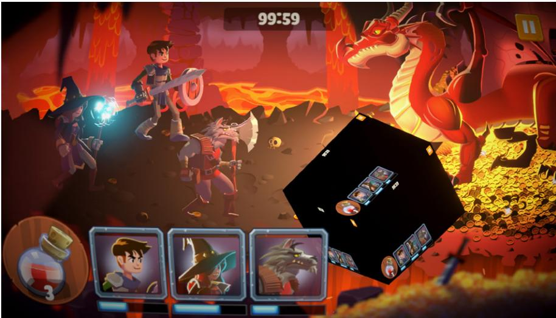

Render Textures can show off post-processing effects, such as Lens Distortion and Vignette. You can also apply the same textures to materials in a 3D mesh.

# Themes

Leverage UI Toolkit to customize your game interface with **Theme Style Sheets**  (TSS) via **Create > UI Toolkit > TSS theme file**. If you want to make a seasonal version of the UI or offer different color styles, TSS files can simplify this process.

TSS files are Asset files that operate like regular USS files. They provide a starting point for defining your own custom theme, made of USS Selectors as well as Property and Variable settings.

| @ Inspector                   | 3                                                                                                                  |  |  |  |  |  |
|-------------------------------|--------------------------------------------------------------------------------------------------------------------|--|--|--|--|--|
|                               | Halloween TSS (Theme Style Sheet) Import Settings (Theme Style Sheet Importer)                                     |  |  |  |  |  |
|                               | Open                                                                                                               |  |  |  |  |  |
| Halloween TSS                 |                                                                                                                    |  |  |  |  |  |
| Inherited Themes              |                                                                                                                    |  |  |  |  |  |
| = Unity Default Runtime Theme | Ch Unity Default Runtime (Theme Style Sheet) O                                                                     |  |  |  |  |  |
|                               |                                                                                                                    |  |  |  |  |  |
| Style Sheets                  |                                                                                                                    |  |  |  |  |  |
| Halloween Fonts               | 0 HalloweenFonts (Style Sheet)                                                                                  |  |  |  |  |  |
| Halloween Buttons             | HalloweenButtons (Style Sheet)                                                                                     |  |  |  |  |  |
|                               |                                                                                                                    |  |  |  |  |  |
|                               | Revert Apply                                                                                                       |  |  |  |  |  |
| Asset PostProcessors          |                                                                                                                    |  |  |  |  |  |
|                               | J UnityEditor.U2D.Animation.SpriteLibrarySourceAssetPostProcessor > UnityEditor.U2D.Animation.SpritePostProcess |  |  |  |  |  |
|                               |                                                                                                                    |  |  |  |  |  |
|                               |                                                                                                                    |  |  |  |  |  |

On-image sequence: First, the Halloween TSS inherits from the Unity Default Runtime TSS, then it adds theme-specific Style Sheets for Fonts and Buttons.

To fill out the rest of your theme, follow these steps:

- 1. Copy and rename any USS file you want to modify. So you might copy Buttons.uss and rename it to Halloween-Buttons.uss for a set of Halloween-themed buttons.
- 2. Replace the current USS file for its new, themed copy. Use the right-click menu and/or "**+**" menu to add the new USS and remove its original USS.
- 3. Make the modifications for the new theme and override all affected Selectors, Variables, and Styles. Save the changes in UI Builder.
- 4. Restore the original USS and remove the themed USS associated with the TSS file.

| StyleSheets -HalloweenFonts.uss |                      |                   |  |  |  |  |
|---------------------------------|----------------------|-------------------|--|--|--|--|
|                                 | -   Add new selector |                   |  |  |  |  |
|                                 | HalloweenFonts.uss   |                   |  |  |  |  |
|                                 | .green-button        | Copy              |  |  |  |  |
|                                 | .normal-button       | Paste             |  |  |  |  |
|                                 |                      |                   |  |  |  |  |
|                                 |                      | Rename            |  |  |  |  |
|                                 |                      | Duplicate         |  |  |  |  |
| Hierarchy                       |                      | Delete            |  |  |  |  |
|                                 |                      |                   |  |  |  |  |
| NewUXMLTemplate.uxml            |                      | Create New USS    |  |  |  |  |
|                                 |                      | Add Existing USS  |  |  |  |  |
|                                 |                      | Remove USS        |  |  |  |  |
|                                 |                      | Set as Active USS |  |  |  |  |

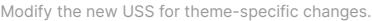

At runtime, [reference](https://forum.unity.com/threads/intended-use-of-theme-style-sheet.1081955/) your new theme in the **Theme Style Sheet** field of the **Panel Settings Inspector**.

#### More resources

These articles can help you create your first runtime UIs in UI Toolkit:

- [How to create a runtime UI](https://docs.unity3d.com/2022.2/Documentation/Manual/UIE-HowTo-CreateRuntimeUI.html?utm_source=demand-gen&utm_medium=pdf&utm_campaign=authoring-optimizing-ui&utm_content=ui-design-ebook)
- [Getting started with UI Toolkit at runtime](https://blog.unity.com/technology/ui-toolkit-at-runtime-get-the-breakdown)

# FONTS IN UNITY

As of Unity 2021 LTS, Unity UI and UI Toolkit are part of the Editor. However, they support slightly different Font systems.

UI Toolkit uses **TextCore**, a font rendering technology based on **[TextMesh Pro](https://docs.unity3d.com/Manual/com.unity.textmeshpro.html?utm_source=demand-gen&utm_medium=pdf&utm_campaign=authoring-optimizing-ui&utm_content=ui-design-ebook)**, which powers Unity UI. Both TextCore and TextMesh Pro offer advanced styling capabilities and can render text cleanly at various point sizes and resolutions. They take advantage of **[Signed Distance Field](https://docs.unity3d.com/Packages/com.unity.textmeshpro@3.2/manual/FontAssetsSDF.html?utm_source=demand-gen&utm_medium=pdf&utm_campaign=authoring-optimizing-ui&utm_content=ui-design-ebook)** (SDF) font rendering, which can generate font assets that look crisp even when transformed and magnified.

|                                  | Unity UI                                                         | UI Toolkit                                            |  |  |
|----------------------------------|------------------------------------------------------------------|-------------------------------------------------------|--|--|
| Source font file                 | .ttf, .otf, and .tts font files                                  |                                                       |  |  |
| Underlying system             | TextMeshPro (TMP)                                                | Text Core (based on TMP)                              |  |  |
| Assets menu                      | …TextMeshPro/Font Asset                                          | …Text/Font Asset                                      |  |  |
| Text assets                      | Font Asset Variant, Sprite Asset, Color Gradient, Style Sheet | Font Asset Variant, Sprite Asset, Text Style Sheet    |  |  |
| Advanced settings location | In the GameObject's TextMeshPro component (in the Inspector)  | In the Text Settings asset used by the Panel Settings |  |  |

While both Font systems have similarities, they need to be used with their respective UI systems.

Although there are plans to unify the two Font systems in the future, it is currently best practice to create separate Font assets for UI Toolkit and Unity UI.

Let's look at the different Font asset types and what they are used for.

#### Source font file

The most common font formats, **TTF** and **OTF** files, need to be converted into **Font assets** before they can be used in your Unity project. The imported source file shows information on each Font family and their rendering options.

To ensure that Font assets appear correctly, use these settings:

- **Characte**r set to **Dynamic**
- 

— **Include Font Data** enabled

Font Import settings

**Note:** Many of these other Import options are remnants of the legacy text system in Unity UI. There are plans to remove them.

To generate corresponding Font assets, select the source font file and then navigate to the **Assets > Create** menu. The resulting file has a different icon, depending on your choice of UI system.

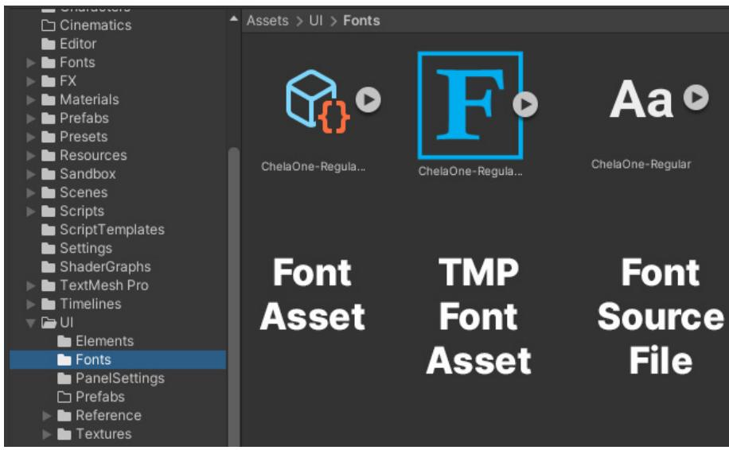

Different UI systems use different Font assets.

Using a Font asset made for TextMesh Pro in Unity UI (above) and a Font asset for UI Toolkit in UI Builder (below)

**Note:** The Font field in UI Builder is not necessary for runtime UI. Only the Font asset's field is required.

## Font asset settings

Once you have the source font file converted, select the Font asset and adjust its **Atlas Population Mode** in the **Generation Settings**. This imports a **Dynamic** or **Static** Font asset:

— **Static:** Use this option to prebake the Font asset as a texture during conversion. Click **Update Atlas Texture** in the **Face Info** field to launch the **[Font Asset Creator](https://docs.unity3d.com/Packages/com.unity.textmeshpro@4.0/manual/FontAssetsCreator.html?utm_source=demand-gen&utm_medium=pdf&utm_campaign=authoring-optimizing-ui&utm_content=ui-design-ebook)**.

| O Inspector                            |                      | B    |
|----------------------------------------|----------------------|------|
| Chela One-Regular SDF (TMP_Font Asset) |                      |      |
|                                        |                      | Open |
|                                        | Checkout             |      |
|                                        |                      |      |
| Face Info - v1.1.0                     | Update Atlas Texture |      |
| Family Name                            | Chela One            |      |
| Style Name                             | Regular              |      |
| Point Size                             | 178                  |      |
| Scale                                  | 1                    |      |
| Line Height                            | 209.506              |      |
| Ascent Line                            | 167.676              |      |
| Cap Line                               | 128                  |      |
| Mean Line                              | 95                   |      |
| Baseline                               | 0                    |      |
| Descent Line                           | -41.83               |      |
| Underline Offset                       | -17.8                |      |
| Underline Thickness                    | 8.9                  |      |
| Strikethrough Offset                   | 38                   |      |
| Superscript Offset                     | 167.676              |      |
| Superscript Size                       | 0.5                  |      |
| Subscript Offset                       | -41.83               |      |
| Subscript Size                         | 0.5                  |      |
| Tab Width                              | 40                   |      |
|                                        |                      |      |
| Generation Settings                    |                      |      |
| Source Font File                       | Aa ChelaOne-Regular  | O    |
| Atlas Population Mode                  | Static               | >    |
| Atlas Render Mode                      | SDFAA                | >    |
| Sampling Point Size                    | 178                  |      |
| Padding                                | 5                    |      |
| Atlas Width                            | 1024                 | >    |
| Atlas Height                           | 1024                 | >    |
| Multi Atlas Textures                   |                      |      |
| Clear Dynamic Data On Bu               |                      |      |

The Font asset settings for a TextMesh Pro font

|                                                                | Font Asset Creator                                                                                                                                                           |   |  |
|----------------------------------------------------------------|------------------------------------------------------------------------------------------------------------------------------------------------------------------------------|---|--|
| Font Asset Creator                                             |                                                                                                                                                                              |   |  |
| Font Settings [ChelaOne-Regular SDF]                           |                                                                                                                                                                              |   |  |
| Source Font File                                               | Aa ChelaOne-Regular                                                                                                                                                          | 0 |  |
| Sampling Point Size                                            | Auto Sizing                                                                                                                                                                  |   |  |
| Padding                                                        | 5                                                                                                                                                                            |   |  |
| Packing Method                                                 | Fast                                                                                                                                                                         |   |  |
| Atlas Resolution                                               | 1024 1024                                                                                                                                                                 |   |  |
| Character Set                                                  | Unicode Range (Hex)                                                                                                                                                          |   |  |
| Select Font Asset Character Sequence (Hex) 20-7E,A0,2026 | Enter a sequence of Unicode (hex) values to define the characters to be included in the font asset or retrieve one from another font asset. I ChelaOne-Regular SI O |   |  |
| Render Mode                                                    | SDFAA                                                                                                                                                                        |   |  |
| Get Kerning Pairs                                              |                                                                                                                                                                              |   |  |
|                                                                | Generate Font Atlas                                                                                                                                                          |   |  |
|                                                                |                                                                                                                                                                              |   |  |

The Font Asset Creator window

— Here, you can specify the Atlas Texture resolution, Padding, and characters to include with the static font. This can optimize resources if you only need a specific **Character Set** (e.g., symbols or letters and numbers only). Select **Generate Font Atlas** to bake the texture.

— **Dynamic:** This does not prebake the Atlas. Instead, a Dynamic Font asset starts with an empty Atlas and adds characters automatically as you use them.

Dynamic Font assets are more flexible, but also computationally more expensive. They maintain a link to the original font file, which must be included in the project and build.

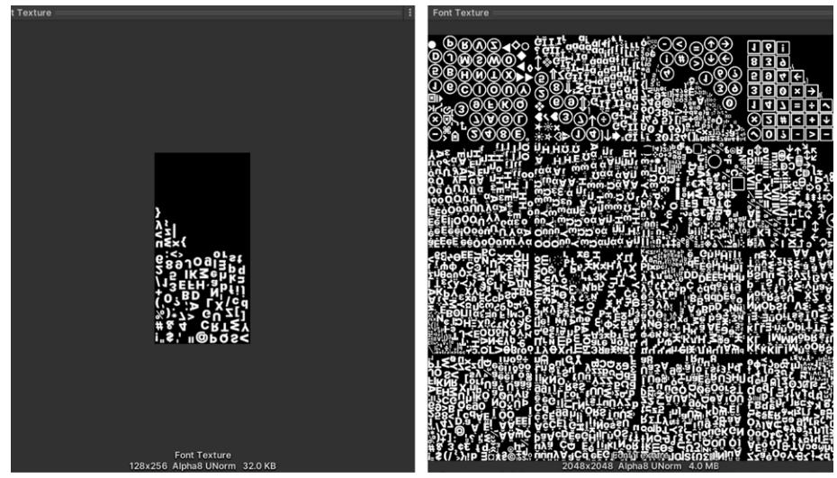

Source fonts and Atlases can increase the build size: See an Atlas with ASCII characters (left) vs an Atlas of a complete Unicode Character Set (right).

Once you've chosen Static or Dynamic Font assets, the other default values should work well. In most cases, you can leave them unchanged. If you are interested in optimizing further, however, read about the other settings in the [Font assets documentation](https://docs.unity3d.com/Packages/com.unity.textmeshpro@3.2/manual/FontAssets.html?utm_source=demand-gen&utm_medium=pdf&utm_campaign=authoring-optimizing-ui&utm_content=ui-design-ebook) and in [this Unity Learn article](https://learn.unity.com/tutorial/textmesh-pro-font-asset-creation-1#?utm_source=demand-gen&utm_medium=pdf&utm_campaign=authoring-optimizing-ui&utm_content=ui-design-ebook).

#### **Tip: Padding and Atlas Resolution**

Characters in the **Font Texture** need some padding between them (specified in pixels) so they can be rendered separately. Padding also creates room for the SDF gradient. The larger it is, the smoother the transition, which allows for high-quality rendering and effects like thick outlines.

If you are only using **ASCII** characters, an Atlas Resolution of 512 x 512 with a Padding of 5 is sufficient for most fonts. Fonts with more characters might need larger resolutions or multiple Atlases. Aim for the Padding size to be at a 1:10 ratio with the Sampling size.

#### **Rich Text**

[Rich Text](https://docs.unity3d.com/Packages/com.unity.textmeshpro@4.0/manual/RichText.html?utm_source=demand-gen&utm_medium=pdf&utm_campaign=authoring-optimizing-ui&utm_content=ui-design-ebook) alters the appearance and layout of text through the use of supplemental tags in the text field. You can use Rich Text tags with both visual elements (UI Toolkit) or in TextMesh Pro components (Unity UI).

Additionally, the **TMP Input** field is compatible with Rich Text tags. This enables their usage in runtime applications, for example, to customize the appearance of a username.

Rich Text tags can change the color or alignment of text without modifying its properties or styling. Use them to format the text in a dialogue system or visually reinforce what you want to communicate.

Go to **Extra Settings** to enable the Rich Text feature in UI Builder or inside a TextMesh Pro component. Doing so will format your text (including tags) appropriately. For instance, text between the **<b>** and closing **</b>** tags will show up as bold.

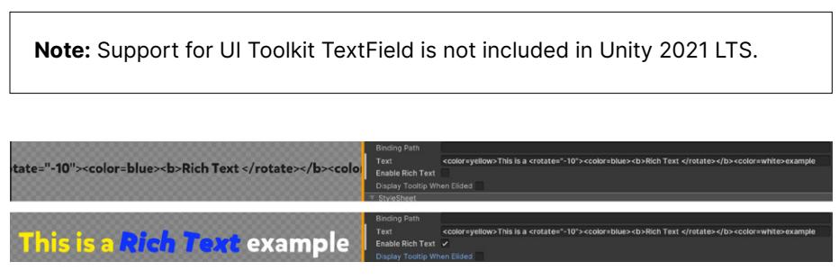

Enable Rich Text tags in UI Builder to make the tags modify your visual text properties.

Check out [this complete list](https://docs.unity3d.com/Packages/com.unity.textmeshpro@4.0/manual/RichText.html?utm_source=demand-gen&utm_medium=pdf&utm_campaign=authoring-optimizing-ui&utm_content=ui-design-ebook) of available Rich Text tags and parameters.

#### **Text Style Sheets**

If your application deals with a significant amount of text, you might want to consider creating a [Text Style Sheet](https://docs.unity3d.com/Packages/com.unity.textmeshpro@4.0/manual/StyleSheets.html?utm_source=demand-gen&utm_medium=pdf&utm_campaign=authoring-optimizing-ui&utm_content=ui-design-ebook) to manage its formatting. This lets you create custom text styles with the **<style>** Rich Text tag.

A reusable Text Style Sheet

Consider these benefits of Text Style Sheets:

- A custom style can include opening and closing Rich Text tags, plus leading and trailing text.
- You can conveniently update a Text Style Sheet, especially when compared to directly changing Rich Text formatting.
- Custom styles can reduce the amount of Rich Text tags. You can just use one tag, **<style= name>**, that applies all the necessary styling.

This makes it easier to change one Rich Text tag in a Text Style Sheet, and is less error prone than manually changing multiple **<style>** tags.

**Note:** In TextMesh Pro, Text Style Sheets are simply called [Style Sheets](https://docs.unity3d.com/Packages/com.unity.textmeshpro@4.0/manual/StyleSheets.html?utm_source=demand-gen&utm_medium=pdf&utm_campaign=authoring-optimizing-ui&utm_content=ui-design-ebook). UI Toolkit renames them to avoid confusion with USS Style Sheets.

#### **Tip: Text styling**

Text styling applied in UI Builder only reflects changes in the Game view. When making text style changes in UI Builder, be sure to save and then enter Play mode to preview the results

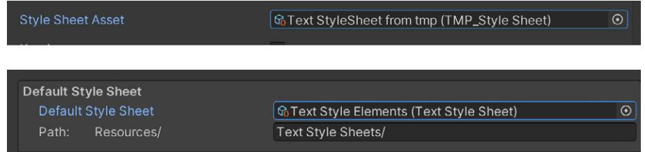

Locate the Style Sheet under the TextMesh Pro component of a Unity UI GameObject (top). In UI Toolkit, it can be found under the Text settings of the Panel Settings asset (bottom).

# Font Asset Variant

To make changes without employing an entirely new Font Atlas, create a Font Asset Variant via **Create > Text Mesh Pro > Font Asset Variant**. This Variant can hold an alternate version of the font's line metrics.

The Variant stores its own [Face Info](https://docs.unity3d.com/Packages/com.unity.textmeshpro@4.0/manual/FontAssetsProperties.html?utm_source=demand-gen&utm_medium=pdf&utm_campaign=authoring-optimizing-ui&utm_content=ui-design-ebook) settings – think line height and subscript position – but still refers to the original Atlas. As such, it can have its own styling, distinct from the original Font asset, without consuming extra space for textures.

# Sprite Asset

You can include sprites in your text via Rich Text tags (e.g., emojis). To use them, you need a [Sprite Asset.](https://docs.unity3d.com/Packages/com.unity.textmeshpro@3.2/manual/Sprites.html?utm_source=demand-gen&utm_medium=pdf&utm_campaign=authoring-optimizing-ui&utm_content=ui-design-ebook)

When importing multiple sprites, pack them into a single Atlas to reduce draw calls. Make sure that the Sprite Atlas has a suitable resolution for your target platform. Return to the [Asset preparation section](#page-30-0) for more on sprite resolutions.

A common use case for Sprite Assets are emojis or icons integrated into text strings: The images sequentially show importing the sprite source file, followed by slicing the sprites in the Sprite Editor, and finally, creating a Sprite Asset in UI Toolkit or TextMesh Pro.

Here's a common workflow to import sprites for this purpose:

- 1. Import the **Sprite Atlas** into Unity and select **Sprite Mode: Multiple**.
- 2. Slice the Atlas into several sprites from the **Sprite Editor**.
- 3. Generate the **Sprite Asset** for UI Toolkit or TextMesh Pro from the sliced file (select and then use the **Create** menu).
- 4. From the Inspector, you can adjust the **Face Info** and customize the appearance/names of each "glyph" in this new Sprite Asset. Any changes here will replace the default **Face Settings** from the Font Asset.

**Note:** In this context, **Update Sprite Asset** syncs the Sprite Asset to the latest Sprite Editor changes.

To use this asset with Unity UI, you must:

- 1. Select the **GameObject** with the **TextMesh Pro** component.
- 2. Locate the **Extra Settings**.

To use this asset with UI Toolkit, you must:

- 1. Select the **Panel Setting**s from the **UI Document**.
- 2. Open the **[Text Settings](https://docs.unity3d.com/Packages/com.unity.ui.builder@1.0/manual/uib-styling-ui-text.html?q=text%20settings?utm_source=demand-gen&utm_medium=pdf&utm_campaign=authoring-optimizing-ui&utm_content=ui-design-ebook)** asset (or create one, if there's none).
- 3. Link to the **Sprite Asset** using the file browser in the Text Settings file. Save and enter **Play mode** for the updated settings to take effect.

Location of the settings to make use of the Sprite Asset with UI Toolkit

Use the Rich Text tag (**<sprite index=0>** or **<sprite name="name">**) to add the sprite. The embedded sprite will respect other Text tags as well. Find more details in the [documentation.](https://docs.unity3d.com/Packages/com.unity.textmeshpro@3.2/manual/Sprites.html?utm_source=demand-gen&utm_medium=pdf&utm_campaign=authoring-optimizing-ui&utm_content=ui-design-ebook)

Add a Sprite Asset to a text field in UI Toolkit using [Rich Text tags](https://docs.unity3d.com/Packages/com.unity.textmeshpro@4.0/manual/RichText.html): Make sure that the Enable Rich Text box is checked (top). This same Rich Text tag can also add a sprite to TextMesh Pro text in a Unity UI Button (bottom).

# Color gradient

Use gradients of up to four colors with **TextMesh Pro GameObjects**. TextMesh uses vertex colors for its content, and gradients are applied individually per character.

**Note:** Color gradients are not yet compatible with UI Toolkit (underway).

E X P L O R I N G T H E U I T O O L K I T SAMPLE PROJECT The UI Toolkit sample project, now available on the [Unity Asset Store,](https://assetstore.unity.com/packages/essentials/tutorial-projects/ui-toolkit-sample-dragon-crashers-231178?utm_source=demand-gen&utm_medium=pdf&utm_campaign=authoring-optimizing-ui&utm_content=ui-design-ebook) demonstrates how you can leverage UI Toolkit for your own applications.

Created with UI artist Michael Desharnais, the demo involves a full-featured interface, including a front-end menu system, over a slice of the 2D project *Dragon Crashers*, a mini-RPG using the latest UI Toolkit workflow at runtime.

To try it out, import the Asset package into a new Unity project. Then open the main menu scene and start exploring the sample.

The menu bar on the left helps you navigate the modal main menu screens:

— The **home screen** serves as a landing pad when launching the application. You can use this screen to play the game or receive simulated chat messages.

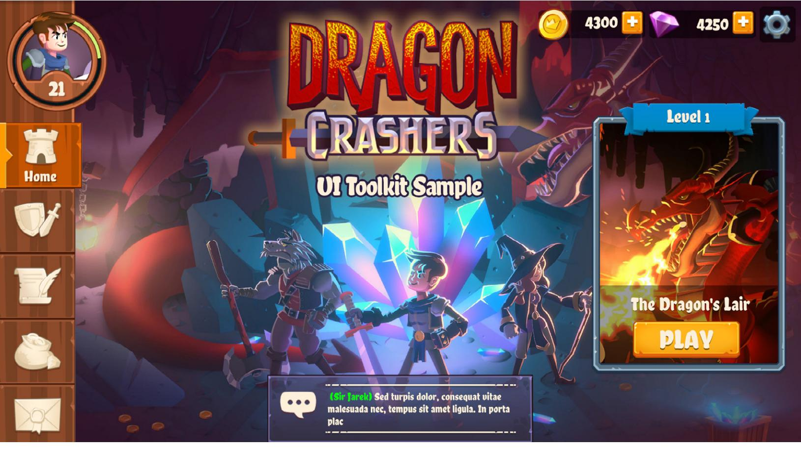

The home screen functions as the application's landing screen.

The character screen shows a preview of various RPG characters.

- The **character screen** involves a mix of GameObjects and UI elements. This is where you can explore each of the four *Dragon Crashers*  characters. Use the stats, skills, and bio tabs to read the specific character details, and click on the inventory slots to add or remove items. Level up each character in typical RPG fashion using acquired potions.
- The **resources screen** links to documentation, the forum, and other resources for making the most of UI Toolkit.

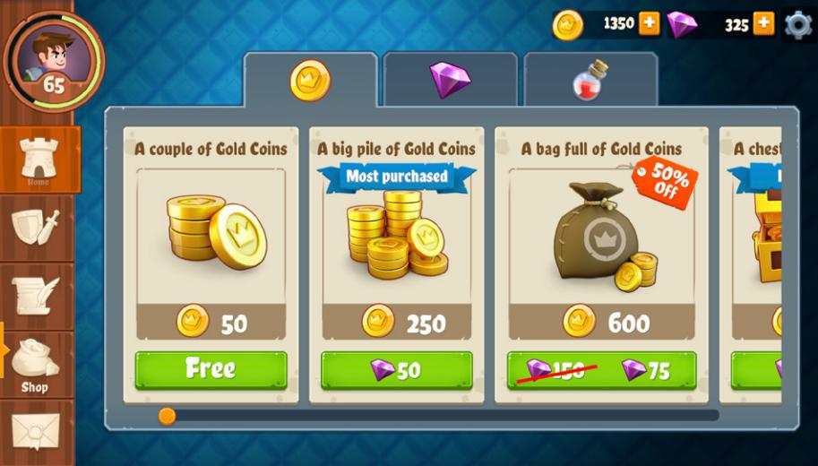

Buy currency or potions from the shop screen.

— The **shop screen** simulates an in-game store where you can purchase hard and soft currency, such as gold or gems, as well as virtual goods like healing potions.

Use the mail screen to catch up on your simulated email – you might even win a prize!

— The **mail screen** is a front-end reader of fictitious messages that uses a tabbed menu to separate the inbox and deleted messages.

The options bar

— Use the **options** bar in the top-right corner to open up a **settings screen**. You can also click the gold and gem buttons to go directly to each respective tab of the shop.

#### **Tip: Backend data**

In order to focus on UI design and implementation, the sample project simulates backend data, such as in-app purchases or mail messages, using ScriptableObjects. You can customize this stand-in data via the **Resources/ GameData** folder.

The Resources folder holds ScriptableObject data.

Remember that with UI Toolkit, UI layouts and styles are decoupled from the code. Rewriting backend data can occur independently from the UI design. If your development team replaces those systems, the interface should continue to function.

# The menu bar

This vertical column of buttons provides access to the five modal screens that comprise the main menu. They stay active while switching between screens, and animated markers and style transitions on the buttons indicate which screen is currently active.

The menu bar

At the top-left corner of the menu bar, there is a separate **Level Meter**  component that displays the user's current level as a **Radial Counter** (see the [Custom UI elements section](#page-127-0) below). A Render Texture stands in for a character portrait and allows you to use traditional GameObjects onscreen, complete with animations or other effects.

# The home screen

This title screen announces the game and includes certain UI elements. The first is a **Play Level** button that launches the game scene. The second is a **chat** window at the bottom of the screen that simulates messages from a chat room.

# The character screen

Meanwhile, the character screen involves a mix of GameObjects and UI elements. The preview area shows a 2D lit and rigged character over a tiled background.

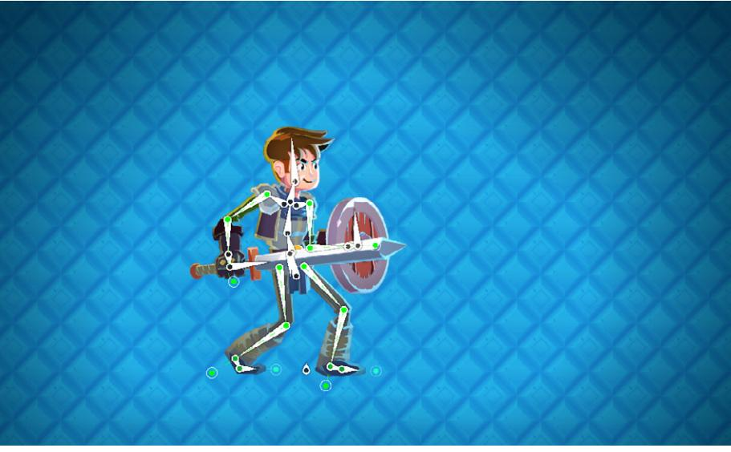

GameObjects make up the background.

By adding the UI Toolkit elements, the character screen becomes more dynamic.

UI Toolkit interface added

Let's look at some key elements of the UI Toolkit character screen:

- The screen previews four different characters from the **Resources/ GameData**. The arrow buttons cycle through the characters.
- Four inventory slots surround the character preview. Clicking an empty slot opens the **inventory screen** (more on that below), where you can select specific gear items. The **Auto-equip** button fills in the slot with the best gear from the pool of available items. The **Unequip** button clears all four slots.
- A label at the bottom of the screen indicates how many in-game power potions are needed for the character to level up. The **Level up** button uses an active Render Texture to indicate when it's available (otherwise, it's grayed out).
- The **statistics** window to the right is a tabbed menu containing vital statistics for each character. A **MonoBehaviour** drives the set of visual elements here to hide or display content based on a selected tab (see the [Custom UI elements](#page-127-0) section below).

The tabs unpack stats (general attack and defense power), skills (special abilities), and bio (text content). While these won't impact gameplay in the demo, their UI illustrates how you might organize data for an RPG in a similar interface.

### The inventory

Selecting one of the slots on the character screen opens a specialized **inventory screen**. This UI behaves like an overlay, making it the only active window. It is achieved with a fullscreen visual element in the background.

With its **Picking Mode** set to **Position**, it can stop all pointer events elsewhere. You can dismiss the inventory screen to save the selection to the character's data.

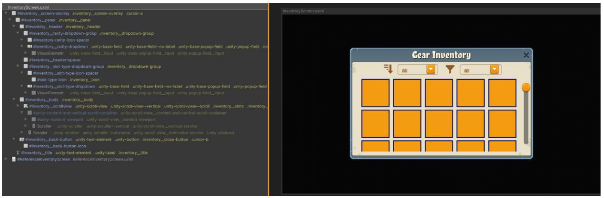

The inventory screen structure

The inventory, populated with ScriptableObject data

The inventory panel comprises several rows of empty slots. A script looks in the **Resources/GameData/Equipment** folder for specific ScriptableObjects, and then fills out the corresponding icons.

Drop-down controls allow the user to filter for **Rarity** (common, rare, etc.) and **Gear Type**, such as a weapon or helmet. They use custom code to apply their logic.

# The shop screen

The shop screen uses another tabbed menu to display three different shops, depending on their corresponding product category (gold, gems, or potions). Each shop item is a separate **[VisualTreeAsset](https://docs.unity3d.com/ScriptReference/UIElements.VisualTreeAsset.html?utm_source=demand-gen&utm_medium=pdf&utm_campaign=authoring-optimizing-ui&utm_content=ui-design-ebook)**, which UI Toolkit instantiates at runtime; one for each ScriptableObject in the Resources/GameData.

The shop screen

A custom styled scroll view can slide horizontally if too many shop items crowd the screen. Discounted cards are oversized with their own style and special decorative elements. The **Shop Item** component has its own setup logic to show or hide the appropriate icons and discount labels.

# The mail screen

The mail screen demonstrates a mini front-end of the in-game messaging system. A tabbed menu separates the inbox and deleted mailboxes.

A simulated mail screen

A VisualTreeAsset called **Mail Item** represents each message. The content in each mail item, in turn, corresponds to ScriptableObject data from Resources/GameData. The unread or deleted state of each mail item determines how it appears. Some mail items contain rewards or prizes, similar to free items from the shop screen.

#### **Tip: Cursors**

Add some extra flare to your UI with custom cursors. Use the Cursor property to replace the onscreen pointer with specific textures. The mouse pointer will then change as you hover over parts of the interface.

The demo project includes **Cursor A** and **Cursor B** images to differentiate between noninteractive and interactive elements. Assign Cursor properties to Name, Class, or Type Selectors using the UI Builder's Inspector.

Assign cursors in the UI Builder.

# The settings screen

The settings screen lets the user change themes, reset some demo counters, and adjust the sound volume. Its UI widgets correspond to values in the **Game Data Manager**, which saves data for reuse. While not all fields are functional in the demo, the settings screen shows how standard visual elements connect with game data.

The settings screen modifies the values of the Game Data Manager.

#### **Tip: Game Data Manager**

For demo purposes, you can also modify the Game Data Manager's fields directly at runtime. The values will save automatically when the application quits.

# The main menu

In the main menu, you can observe how to use existing **UI Documents** (UXML) as templates inside another UI Document. For example, the home screen, shop screen, and mail screen are all template instances within the main menu UI Document. Each subdocument of the UI has its own **UXML asset** saved within the project. This is analogous to how Prefabs work in Unity.

The main menu UI Document demonstrates how you can break a larger interface into smaller parts. Do this to work with each subdocument individually and then assemble them into one UI Document. Alternatively, you can use multiple UI Document components on your GameObjects and separately reference the UXML assets.

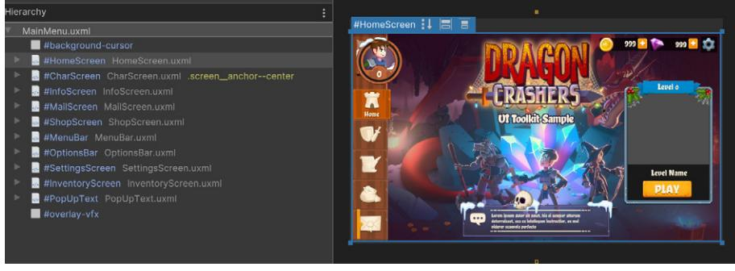

The main menu

#### **Tip: Using UXMLs as templates**

Follow these steps to use a UI Document as a template:

- 1. Under the **Library > Project** tab, find the **UXML asset** you wish to instantiate.
- 2. Drag it into the **Hierarchy** like an element in the Library.

A template instance appears in the Hierarchy as a special visual element called a **[TemplateContainer](https://docs.unity3d.com/ScriptReference/UIElements.TemplateContainer.html?utm_source=demand-gen&utm_medium=pdf&utm_campaign=authoring-optimizing-ui&utm_content=ui-design-ebook)**. The name of the UXML file is shown in gray. To make edits to this Hierarchy, you must edit the original UI Document.

The right-click context menu gives you some options:

- **Open in UI Builder:** This closes the current UI Document and opens the instanced UI Document.
- **Open Instance in Isolation:** This keeps the current UI Document in the background and loads the instanced UI Document.
- **Open Instance in Context:** This keeps the current UI Document as read-only and grayed out, while loading the instanced UI Document.

Much like working with Prefabs, making changes to the template UXML file propagates into its instances. You can also convert part of your existing Hierarchy into a Template Container using the context menu (**Right-click > Create Template**).

See [Using UXML instances as templates](https://docs.unity3d.com/Manual/UIB-structuring-ui-templates.html?utm_source=demand-gen&utm_medium=pdf&utm_campaign=authoring-optimizing-ui&utm_content=ui-design-ebook) for more information.

# The game screen

The game scene shows a stripped down, mini version of the *Dragon Crashers* project. The game plays automatically, with heroes coming out swinging at the enemy dragon.

The game screen

The game screen interface has been reworked from the original demo, with the revised version using UI Toolkit in a few notable places:

- A Pause button at the top-right corner opens a separate pause screen.
- As the heroes take damage from the dragon, you can drag the heal potion onto the injured characters to give them a boost.
- Character cards with mana bars are lined up at the bottom of the screen.
- Custom health bars float above each character's screen position and below the enemy boss character.
- Victory and Defeat screens appear based on the appropriate win or lose condition.

The Victory and Defeat screens

# Reference

If you have detailed mockups for your UI designs, use them as references when implementing interfaces in UI Builder. Select the **UXML object** in the Hierarchy and then make sure that the **Canvas Size** matches your artwork resolution – otherwise, it will squash or stretch incorrectly.

Michael Desharnais' original mockups are included in the **Assets/Reference**  folder. Look through them to understand the design process compared to the final implementation.

#### **Tip: Theme references**

Notice the various theme decorations on the home and settings screens. A few well-placed elements can add some festivity to your UI.

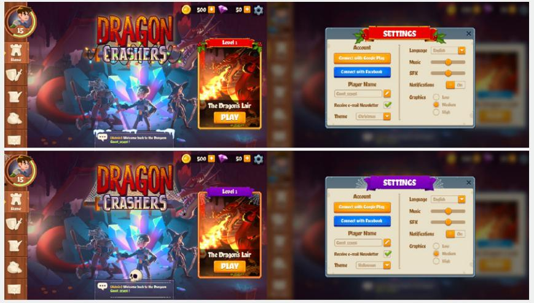

Theme reference

If you want to use the reference as a Canvas background, add the image as a **Texture 2D** file. The HD images can then serve as templates for your layout.

Reference image as a Canvas background

Alternatively, you can use fullscreen visual elements if you want the reference to act like an overlay. Follow these steps:

- 1. Create a separate **UI Document** object with a high **Sort Order**.
- 2. Populate the **Visual Tree** with one or more elements stretched to the Height and Width of the Game view. Switch their backgrounds to the reference art.
- 3. Save the preferred **Opacity** in UI Builder or use a custom **MonoBehaviour** to set this interactively. The demo includes a ReferenceScreen.cs script that changes the root element's Opacity property.
- 4. Verify that the **Picking Mode** is set to **Ignore**, so the reference does not interfere with the normal operation of your interface.
- 5. Using the reference as a background or overlay can help you match the original proportions and layout. Slide the **Opacity** control up and down to judge the placement of your visual elements.

Reference art as a background or overlay

# Custom UI elements

The UI Toolkit ships with a sizable standard library of containers and controls. With proper styling, they can meet most of your UI needs.

Designers, of course, are trained to think outside of the box. That's why UI Toolkit allows you to customize the standard library or extend it as needed.

The demo project showcases a few of these custom-built elements. Here are some examples for inspiration:

— **Tabbed menus**: You can show or hide content based on a selected tab. Each element from the top tabs listens for a **PointClickEvent** and then reveals the corresponding element in the area below. Tabbed menus can thereby repurpose the same screen real estate to store extra information (the statistics window part of the character screen is a good example of this).

See [Create a tabbed menu for runtime](https://docs.unity3d.com/Manual/UIE-create-tabbed-menu-for-runtime.html?utm_source=demand-gen&utm_medium=pdf&utm_campaign=authoring-optimizing-ui&utm_content=ui-design-ebook) on how to build this custom UI.

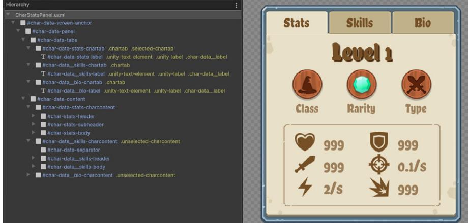

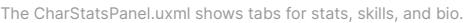

— **Slide toggle:** This custom visual element stands in for a boolean true or false value. Flip the toggle with a mouse, keyboard, or gamepad to give the user a slightly different feel from the standard library toggle.

— See [Create a slide toggle custom control](https://docs.unity3d.com/Manual/UIE-slide-toggle.html?utm_source=demand-gen&utm_medium=pdf&utm_campaign=authoring-optimizing-ui&utm_content=ui-design-ebook) on how to implement this custom widget.

| Settings                                                    |                                                                                               |  |  |  |
|-------------------------------------------------------------|-----------------------------------------------------------------------------------------------|--|--|--|
| Account Reset Player Level                               | Dropdown Itemi example Music                                                         |  |  |  |
| Reset Player Currency Player Name                        | volume SEX volume                                                                       |  |  |  |
| GUEST_123456 Just a checkbox example Theme Default | Slide Toggle On 111 Top 0 Radio Middle button example Bottom 10 |  |  |  |

The slide toggle is an alternative to the standard bool toggle.

— **Radial Counter:** This is a custom circular progress bar, representing a number between 0 and 100. It can be handy for tracking a percentage of completion. In the sample project, it stands in for the user's total level (experience, trophies, etc.) Use it to add emphasis if a standard progress bar isn't enough.

|                                       | Inspector                                                      |                     |  |  |  |
|---------------------------------------|----------------------------------------------------------------|---------------------|--|--|--|
| Unity Default Runtime  ▼ Preview   :  | T RadialCounter                                                |                     |  |  |  |
|                                       | Name                                                           | level-meter_counter |  |  |  |
|                                       | View Data Key                                                  |                     |  |  |  |
|                                       | Picking Mode                                                   | Position            |  |  |  |
| MenuBar.uxml* #level-meter_counter | Tooltip                                                        |                     |  |  |  |
|                                       | Usage Hints                                                    | None                |  |  |  |
|                                       | Tab Index                                                      | 0                   |  |  |  |
|                                       | Focusable                                                      |                     |  |  |  |
|                                       | Progress                                                       | 65                  |  |  |  |
|                                       | StyleSheet                                                     |                     |  |  |  |
|                                       | Style Class List 2                                          |                     |  |  |  |
|                                       |                                                                |                     |  |  |  |
|                                       | Add Style Class to List Extract Inlined Styles to New Class |                     |  |  |  |
|                                       |                                                                |                     |  |  |  |
|                                       | .radial-counter xp-meter_radial-counter x                      |                     |  |  |  |
|                                       | Matching Selectors V                                        |                     |  |  |  |
|                                       | .radial-counter A                                           |                     |  |  |  |
|                                       | > radial-counter                                               |                     |  |  |  |
| > .xp-meter_radial-counter            |                                                                |                     |  |  |  |

See [Create a radial progress indicator](https://docs.unity3d.com/Manual/UIE-radial-progress.html?utm_source=demand-gen&utm_medium=pdf&utm_campaign=authoring-optimizing-ui&utm_content=ui-design-ebook) on how to implement this custom widget.

The Radial Counter

**Note:** Some of the code examples can be accomplished with the addition of MonoBehaviours. Others define new visual elements with their own unique traits and properties.

### USS transitions

Adding transitions to your menu screens provides some visual polish. UI Toolkit makes this relatively easy with the [Transition Animations](https://docs.unity3d.com/Manual/UIE-Transitions.html) property in the Inspector.

As [mentioned earlier,](#page-97-0) you can adjust the Property, Duration, Easing, and Delay to set up the animation. Then simply change styles, and UI Toolkit applies the animated transition at runtime.

Set up different Selectors for different states of the element.

Add Transition Animations to each Selector state; Unity then applies the animation automatically.

For Button elements, this doesn't require additional code because pseudoclasses (:active, :inactive, :hover, etc.) can have their own Selectors. Any time the style changes, the transition automatically takes place. Your Buttons can grow, shrink, or turn invisible with standard UI Events.

For other elements, you'll need to use the RemoveFromClassList and AddToClassList methods from the UI Element APIs to change styles. You can see an example of this in the menu bar's HighlightElement method.

In the **MenuBar.uxml**, we set up Animation Transitions for the **Opacity** and **Scale**. When the script toggles between the .menu\_\_label and .menu\_\_label–active Selectors, the Button icons and text animate to **PointerClickEvents**.

The menu bar buttons and icons animate to PointerClickEvents.

#### **Tip: Beyond this book**

Walking through the full code samples is beyond the scope of this book, but developers might be interested in doing this to better comprehend the implementation of these UIs.

Most of the in-game screens follow a similar pattern. The project architecture generally favors the **[Model View Presenter](https://en.wikipedia.org/wiki/Model%E2%80%93view%E2%80%93presenter)** (MVP) pattern from the **Model View Controller** family of patterns. This divides each screen into three parts, representing the data, user interface, and logic. For example, the home screen consists of:

- **Level** or **Chat Data** as ScriptableObjects
- The HomeScreen.cs script that manages the user interface through the **USS** and **UXML** files
- The HomeScreenController.cs script that handles non-UI logic and acts as an intermediary between the data and the UI

This represents just one approach for using UI Toolkit with your projects. Feel free to examine the scripts on your own to learn more.

If you have any questions or comments on the sample project, you can post them to [this forum](https://forum.unity.com/threads/the-ui-toolkit-sample-project-dragon-crashers-is-now-available-on-the-asset-store.1332075/). For feedback on UI Toolkit, please use [this forum](https://forum.unity.com/forums/ui-toolkit.178/).

#### **Editor UIs**

We've mainly spoken about UI Toolkit for runtime UIs, but UI Toolkit also excels at creating Editor UIs. Editor UIs allow you to customize your tools and make game production more efficient. Use them to roll your own level design workflows, automate repetitive tasks, or generate data procedurally.

Read the [documentation](https://docs.unity3d.com/Manual/UIToolkits.html?utm_source=demand-gen&utm_medium=pdf&utm_campaign=authoring-optimizing-ui&utm_content=ui-design-ebook) for details on making Editor windows or go to the [Asset Store](https://assetstore.unity.com/tools?utm_source=demand-gen&utm_medium=pdf&utm_campaign=authoring-optimizing-ui&utm_content=ui-design-ebook) for numerous implementations of UI extensions and tools.

# **What's next for UI Toolkit**

In 2022, the UI Toolkit team has focused on making UI Toolkit production-ready for Editor UI. That said, it is now the recommended solution over IMGUI for making Unity Editor extensions.

In 2023, the team will be making more foundational improvements to increase both speed and extensibility when building UIs. These improvements will include data-binding workflows that are more designer-friendly (i.e., visual workflows for binding data to UI).

You can always find more information about the future of UI Toolkit on our **[Roadmap page](https://unity.com/roadmap/unity-platform/gameplay?utm_source=demand-gen&utm_medium=pdf&utm_campaign=authoring-optimizing-ui&utm_content=ui-design-ebook)** for gameplay and UI design.

#### **Game consulting services**

Unity Professional Training gives you the skills and knowledge to work more productively and collaborate efficiently in Unity. We offer an extensive training catalog designed for professionals in any industry, at any skill level, in multiple delivery formats.

All materials are created by our experienced Instructional Designers in partnership with our engineers and product teams. This means that you always receive the most up-to-date training on the latest Unity tech.

**[Learn more](https://unity.com/learn/professionals?utm_source=demand-gen&utm_medium=pdf&utm_campaign=authoring-optimizing-ui&utm_content=ui-design-ebook)** about how Unity Professional Training can support you and your team.

#### **More resources**

- **[Unity best practices](https://unity.com/how-to?utm_source=demand-gen&utm_medium=pdf&utm_campaign=authoring-optimizing-ui&utm_content=ui-design-ebook)** for more free advanced content
- **[Unity UI](https://docs.unity3d.com/Packages/com.unity.ugui@1.0/manual/index.html?utm_source=demand-gen&utm_medium=pdf&utm_campaign=authoring-optimizing-ui&utm_content=ui-design-ebook)** and **[UI Toolkit](https://docs.unity3d.com/Manual/UIElements.html?utm_source=demand-gen&utm_medium=pdf&utm_campaign=authoring-optimizing-ui&utm_content=ui-design-ebook)** documentation
- **[UI tutorials](https://learn.unity.com/search?k=%5B%22tag%3A5818e455090915002eeb1b8a%22%5D)** on Unity Learn

*TIMBERBORN* : M A D E W I T H UI TOOLKIT

An image from *Timberborn*, developed and published by [Mechanistry](https://mechanistry.com/), available in Early Access on Steam for PC and Mac platforms

A scalable, flexible, and performant user interface with consistent elements throughout the game: These were the requirements that the team at Mechanistry had for the UI system of their new game, *Timberborn*.

A city- and colony-building simulator populated by bipedal beavers isn't exactly an established genre, but that might change once *Timberborn* goes into full release. The game is set in a post-apocalyptic world where the player chooses from different factions of industrious beavers, each with unique architecture and gameplay traits. The evolved animals control rivers with dams and dynamite, build vertical settlements using wood and metal, and irrigate the land to survive deadly droughts.

Designer Bartłomiej Dawidów together with programmer Paweł Duda knew that the user interface would play a crucial role in presenting the complex systems, rich resources, and technology trees of *Timberborn* to their players. When early playtests of their game started back in 2018, UI Toolkit wasn't yet available for runtime applications, so the team initially started with Unity UI.

# Migrating from Unity UI to UI Toolkit

As more features and capabilities were added to UI Toolkit, the duo decided it was time to migrate the UI. This undertaking involved multiple stages:

- 1. Cleaning the UI code architecture to be modular and flexible, removing code smells, and performing a general cleanup of the UI-related code
- 2. Recreating all UI elements in the UI Toolkit
- 3. Redesigning the assets to be more visually appealing

The migration started in January 2021 and took almost nine months, split evenly between each step. There were some ups and downs – the team decided to move the final step to after the Early Access launch, for instance – but ultimately, all went well and the new UI was presented in time for the game's September release.

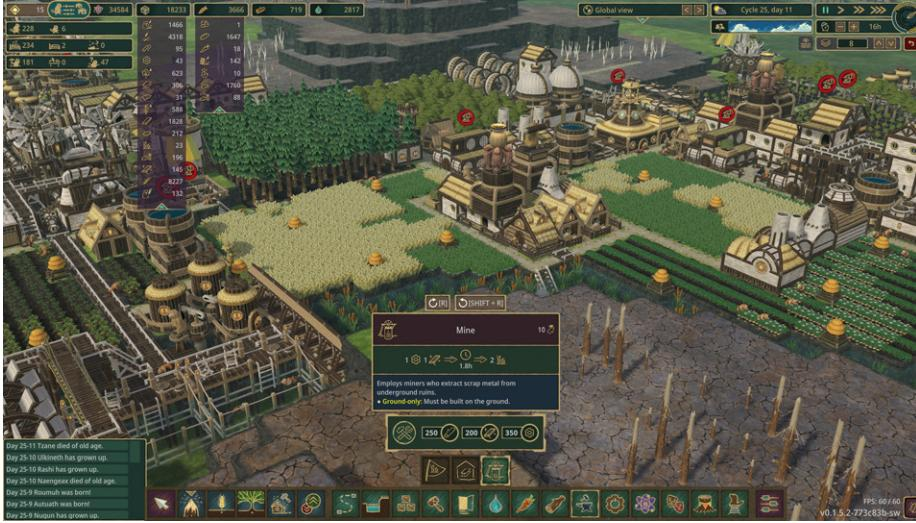

*Timberborn* in its current state of development

Unity UI is a proven solution for many games. Especially in games where the UI needs to scale and stay consistent across various menus and screens, UI Toolkit provides key benefits, including these ones highlighted by Bartłomiej and Paweł:

- **Responsive layouts:** In *Timberborn*, massive parts of the UI look like spreadsheets, so keeping them all in line is a major effort (not to mention that a single change could sometimes break the whole panel).
- **Moving elements around, reusing them, and creating templates:** Tasks like adding an overriding style are made simple in UI Toolkit as they don't require too much code.
- **Version control is straightforward with UXML and USS files:** Because these are human readable text files, changes can actually be spotted, which is conducive to merging changes and resolving conflicts. Creating the UI in their chosen code IDE was also a nice change.

# Coding and using UI Builder together

Another benefit of UI Toolkit for the team lies in UI Builder. In their words, it was "a huge help" for understanding behaviors, prototyping quickly, and creating custom controls in the initial stage of the project's migration.

Although they generally prefer to create their UI with code, the team uses UI Builder to check immediate changes (those composed from templates), and to validate the structure and get fast feedback (mainly during the early stages of creating new UXMLs). They also use it to fine-tune values in a near-complete UI, tweaking them by hand via USS (the vast majority of their styles are defined in USS).

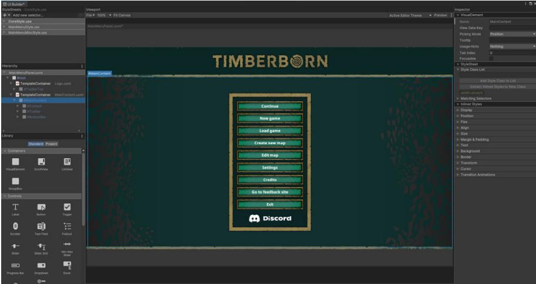

An example of the UI in *Timberborn*

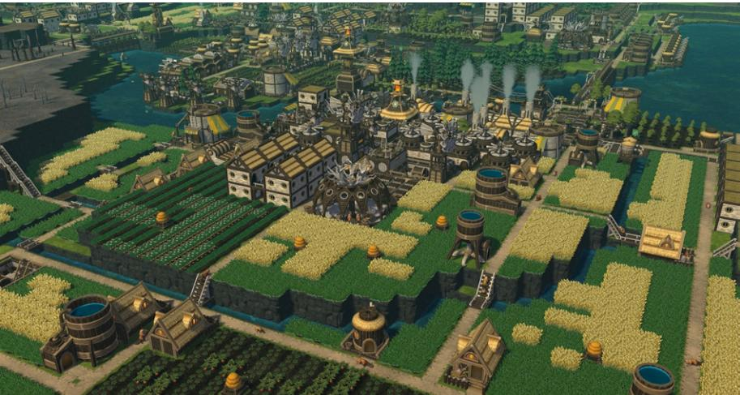

*Timberborn* uses the Universal Render Pipeline (URP) so that players can create graphically rich beaver cities.

We hope to share more behind-the-scenes details about Mechanistry's experience using UI Toolkit. In the meantime, you can enjoy the game in Early Access for PC and Mac at [Timberborn.com](http://www.timberborn.com).

[unity.com](https://unity.com/)